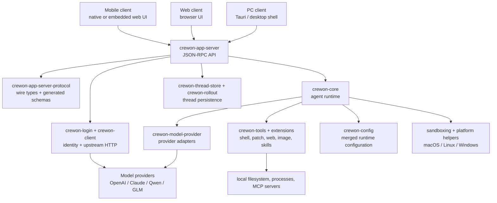

# Crewon Architecture

Crewon is being shaped as a shared agent backend for three product clients:

- PC client
- Web client
- Mobile client

Terminal CLI and TUI shells are not product surfaces. Legacy names and wire values can remain only
where they preserve old configuration, stored sessions, rollout files, or backend compatibility.
New product-facing code should use Crewon naming.

## System Shape

## Runtime Flow

1. A PC, web, or mobile client connects to `crewon-app-server`.
2. The client sends `initialize` with `clientInfo`; this sets client identity, user-agent suffix,
   and connection capabilities.
3. The client starts, resumes, forks, or reads a thread through app-server v2 APIs.
4. `crewon-core` runs the agent turn with config, tools, permissions, sandboxing, and model access.
   The existing Codex message protocol remains the compatibility baseline for normal model API
   calls while provider adapters expand toward Claude, Qwen, GLM, and other model capabilities.
5. Thread state is persisted through `crewon-thread-store` and rollout files.
6. The app-server streams JSON-RPC notifications back to the client for UI rendering.

## Directory Responsibilities

| Path                                                                                                   | Role                                                                                                                                                                                                     |
| ------------------------------------------------------------------------------------------------------ | -------------------------------------------------------------------------------------------------------------------------------------------------------------------------------------------------------- |
| `apps/crewon-ui`                                                                                       | Current PC-oriented UI shell built with Vite/Tauri. This is also the natural place to share web UI components while the web/mobile clients take shape.                                                   |
| `codex-rs/app-server`                                                                                  | Main backend process and JSON-RPC request processors for rich clients. This is the primary integration point for PC, web, and mobile.                                                                    |
| `codex-rs/app-server-protocol`                                                                         | App-server API types, schema generation, and TypeScript/JSON schema fixtures. New public API surface should land in v2.                                                                                  |
| `codex-rs/core`                                                                                        | Agent orchestration, turns, context, tools, approvals, sessions, and runtime behavior. Keep this focused; avoid adding unrelated product UI logic here.                                                  |
| `codex-rs/crewon-protocol`                                                                             | Shared core protocol types used by the runtime and app-server mapping layer. Some legacy wire values remain for stored thread compatibility.                                                             |
| `codex-rs/config`                                                                                      | Config parsing, schema generation, config layering, and user-config edit helpers. New interactive-client settings live under `[client]`; legacy `[tui]` is only an alias.                                |
| `codex-rs/crewon-login`                                                                                | Auth manager, OAuth callback server, token storage, default HTTP identity, and keyring/file auth storage. New keyring entries use `crewon\|...`; old `cli\|...` keys are read and cleaned for migration. |
| `codex-rs/crewon-client` and `codex-rs/crewon-api`                                                     | Upstream HTTP client and API glue used by login, core, and backend services.                                                                                                                             |
| `codex-rs/thread-store` and `codex-rs/rollout`                                                         | Local thread metadata, rollout persistence, indexing, and compatibility reads for older sessions.                                                                                                        |
| `codex-rs/crewon-tools`, `codex-rs/ext`, `codex-rs/core-skills`, `codex-rs/core-plugins`               | Tool and extension surfaces used by the agent runtime.                                                                                                                                                   |
| `codex-rs/crewon-mcp`, `codex-rs/mcp-server`, `codex-rs/rmcp-client`                                   | MCP integration and hosted MCP-compatible tooling.                                                                                                                                                       |
| `codex-rs/sandboxing`, `codex-rs/linux-sandbox`, `codex-rs/windows-sandbox-rs`, `codex-rs/exec-server` | Platform execution and sandbox support for local commands.                                                                                                                                               |
| `codex-rs/crewon-otel`, `codex-rs/analytics`, `codex-rs/feedback`                                      | Telemetry, analytics, and feedback plumbing.                                                                                                                                                             |
| `codex-rs/utils`                                                                                       | Small shared utility crates. Keep these UI-neutral and dependency-light.                                                                                                                                 |
| `docs`                                                                                                 | Repository development notes that remain after the product-doc cleanup. Avoid adding broad user-facing product docs here.                                                                                |
| `.crewon/skill`                                                                                        | Crewon-owned local project migration skills and repo-local skill discovery root. Keep this separate from `.codex`, which belongs to the Codex agent tooling used to work on the repository.              |

## Removed Product Surfaces

These surfaces are intentionally outside the active product architecture:

- `codex-rs/cli`
- `codex-rs/tui`
- `codex-cli`
- standalone SDK sample apps and runtime packages that existed only to wrap the old CLI flow
- app-server test/demo clients that are not needed by PC, web, or mobile

If a future command-line helper is needed, it should be treated as infrastructure or a narrowly
scoped developer tool, not as a fourth product client.

`crewon-app-server exec-server --listen ...` is one of those infrastructure helpers. It starts the
backend execution service used by remote environments and tests; it is not a user-facing Crewon CLI
surface.

## Compatibility Boundaries

Some old names are still expected during the migration:

- Serialized session source value `"cli"` for old rollout files and thread filters.
- Config aliases such as `[tui]` and `cli_auth_credentials_store`.
- OAuth compatibility parameters required by existing backend deployments.
- Codex message protocol names and error payloads that keep existing model API calls working.
- Local variable names such as `codex_home` where a broad rename would require a separate storage
  migration.
- Current workspace path names such as `codex-rs` until a coordinated repository move is planned.
- `.codex` directories and skills that belong to the Codex agent tooling used to work on this
  repository.
- GitHub workflow steps that invoke Codex Action as an implementation tool while exposing Crewon
  names in labels, triggers, comments, and public issue text.

The rule is: new writes and product-facing surfaces should prefer Crewon names; old names should be
kept only when they protect existing data, API compatibility, or backend rollout safety.

## Current Residual Audit

Use this table when deciding whether a remaining `codex` string should be changed now.

| Residual area                                                                                        | Status                                                                                                             |
| ---------------------------------------------------------------------------------------------------- | ------------------------------------------------------------------------------------------------------------------ |
| `.codex/**` in this repository                                                                       | Keep. This is Codex agent tooling used to work on the repository, not Crewon product state.                        |
| `.github/codex/**`                                                                                   | Keep. These are Codex Action automation prompts/config, not Crewon product assets.                                 |
| `.github/workflows/issue-labeler.yml` and `issue-deduplicator.yml`                                   | Crewon issue automation. These may use Codex Action as an implementation tool without exposing old product labels. |
| `.crewon/skill/**`                                                                                   | Crewon-owned migration skills. New migration rules belong here, not under `.codex/skills`.                         |
| `codex-rs` path references in Bazel, Cargo, CI, scripts, and docs                                    | Keep until a coordinated backend directory move updates build labels, workspace manifests, and CI together.        |
| `test_stdio_server` and similar MCP test helper binaries                                             | Keep only as test infrastructure. They are not PC/Web/Mobile product entrypoints or restored CLI/TUI UI.           |
| `crewon_app_server_protocol*.schemas.json` bundle filenames and `CrewonAppServerProtocol*` titles    | Crewon-owned generated schema surface.                                                                             |
| `crewon_*_event` analytics event names                                                               | Crewon-owned telemetry surface; new analytics events should not use `codex_*_event` names.                         |
| `CodexErrorInfo`, `codexErrorInfo`, `codexHome`, `.codex`, `CODEX_HOME`, `codex_home` storage names  | Keep as compatibility fields or storage aliases unless a designed migration updates readers and writers.           |
| `x-codex-*` model request headers and `client_metadata` keys                                         | Keep for model API compatibility, including `x-codex-installation-id` and `x-codex-turn-metadata`.                 |
| `product_surface=codex`, `OAI-Product-Sku: codex`, `/api/codex`, ChatGPT auth device URLs            | Keep while upstream backend contracts require those values.                                                        |
| `gpt-*-codex` model identifiers                                                                      | Keep. These are provider model names, not Crewon branding.                                                         |
| `openai-curated` and `openai-curated-remote` marketplace identifiers                                 | Keep unless the remote marketplace contract is migrated.                                                           |
| `codex-curated` personal marketplace files                                                           | Legacy read compatibility only. New plugin-share checkout writes `crewon-curated`.                                 |
| `CODEX_BAZEL_*` environment variables and `buildbuddy-openai` Bazel configs                          | Legacy CI fallback aliases only. New CI paths should prefer `CREWON_BAZEL_*` and `buildbuddy-private`.             |
| `tools/argument-comment-lint/argument-comment-lint` pointing at `openai/codex` release assets        | Keep until Crewon publishes equivalent prebuilt developer-tool artifacts.                                          |
| `openai/codex-action` workflow steps                                                                 | Keep as repository automation tooling. Public labels, comments, and workflow triggers should use Crewon names.     |
| Product docs, issue templates, UI demo copy, package names, app names, release artifacts, CLI/TUI UI | Change to Crewon or remove when the old surface is no longer part of PC/web/mobile.                                |

## Verification Notes

The current cleanup has been checked with:

- `cargo metadata --manifest-path codex-rs/Cargo.toml --no-deps --format-version 1`
- `bazel query //codex-rs/...`
- `just test -p crewon-app-server-protocol`
- `cargo metadata --manifest-path codex-rs/Cargo.toml --no-deps --format-version 1 | jq -r '.packages[] | [.name, (.targets[]?.name)] | @tsv' | rg '(^|\t)codex|codex($|\t)|codex-|-codex|_codex|codex_'`
- `bazel query //codex-rs/... | awk -F: '{print $2}' | rg '(^|-)codex|codex($|-|_)|_codex'`
- `rg 'Codex|codex|CODEX|CLI|TUI|command line|terminal|aide|Aide' README.md docs .github/ISSUE_TEMPLATE .github/pull_request_template.md SECURITY.md CHANGELOG.md`
- `rg 'OpenAI Codex|Codex CLI|codex CLI|Codex app|codex app|Codex TUI|codex tui|Codex terminal|codex terminal|codex command|codex package|Codex package|Codex binary|codex binary' --glob '!ARCHITECTURE.md'`
- `rg 'codex-cli|@openai/codex|openai_codex|codex_cli_bin|sdk/python|sdk/typescript|sdk/python-runtime' package.json pnpm-lock.yaml pnpm-workspace.yaml`
- `rg 'build_codex_package|codex_package|stage_npm_packages|run_tui_with_exec_server|start-codex-exec|debug-codex|install/install|python-runtime|python-sdk|sdk\\.yml|rust-release|codex-cli|codex-zsh' scripts .github/workflows .github/scripts justfile package.json`

Those checks show no active Cargo packages or Bazel labels for the removed terminal and sample
surfaces:

- `codex-rs/cli`
- `codex-rs/tui`
- `codex-rs/app-server-test-client`
- `codex-rs/app-server-daemon`
- `codex-rs/utils/cli`
- `codex-rs/ansi-escape`
- `codex-rs/v8-poc`
- `sdk/python-runtime`
- `sdk/python`
- `sdk/typescript`

## Cleanup Guardrails

The repository should no longer introduce:

- Product CLI or TUI entry points.
- User-facing docs, issue templates, UI demo copy, package names, or release scripts that use old
  product branding.
- New public API fields named `cli*` when `client*` describes the active PC/web/mobile surface.

The repository may temporarily keep:

- `cli` wire aliases when reading old sessions.
- `.codex` config/cache paths and local Codex tooling metadata.
- Backend endpoint paths such as `/api/codex` when upstream services still require them.
- Model identifiers such as `gpt-5.1-codex` because they refer to upstream model names, not the
  Crewon product identity.
