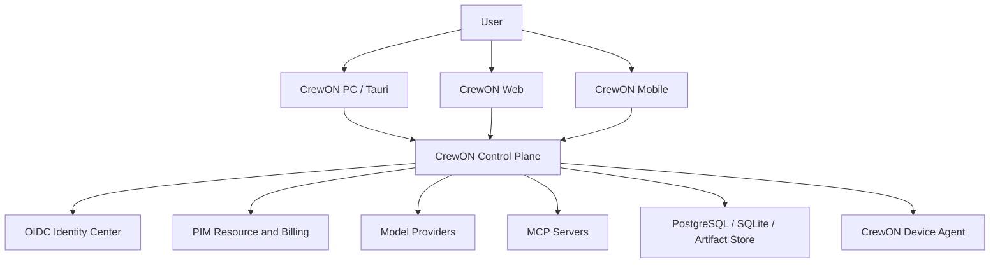
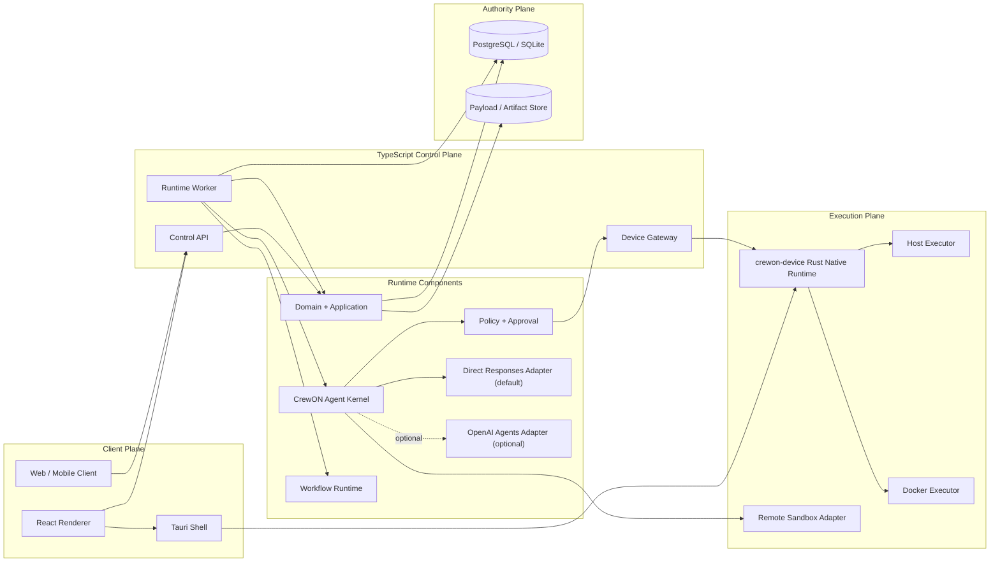

# CrewON 最终态架构

状态：Final Target Architecture  
决策日期：2026-08-08  
适用范围：CrewON PC、Web、Mobile、Standalone、Team/Cloud  
当前实现状态：目标规范，不代表仓库已经完成迁移

执行计划：[MIGRATION_PLAN.md](./MIGRATION_PLAN.md)

本文是 CrewON 重构完成后的唯一目标架构。`ARCHITECTURE.md` 记录当前实现；`ARCHITECTURE_NEXT.md` 和
`artifacts/architecture-next/poc-*` 只记录迁移历史，不再定义终态。实现、评审和验收发生冲突时，以本文和
Accepted ADR 为准。

关联决策：

- [ADR-002：统一 Run/Step/Attempt/Event](./artifacts/architecture-next/adr-002-run-step-event-domain.md)
- [ADR-003：REST、SSE 与 Device Protocol](./artifacts/architecture-next/adr-003-rest-sse-runner-protocol.md)
- [ADR-004：Authority、Store 与迁移](./artifacts/architecture-next/adr-004-authority-storage-and-migration.md)
- [ADR-005：开源依赖与供应链](./artifacts/architecture-next/adr-005-open-source-dependency-policy.md)
- [ADR-007：TypeScript 业务内核与最小 Rust Device Runtime](./artifacts/architecture-next/adr-007-hybrid-final-runtime-and-owned-agent-kernel.md)

OpenAI 能力边界依据：

- [Responses API migration guide](https://developers.openai.com/api/docs/guides/migrate-to-responses)
- [OpenAI Agents SDK for TypeScript](https://openai.github.io/openai-agents-js/)
- [Agents SDK Runner lifecycle](https://openai.github.io/openai-agents-js/guides/running-agents/)

## 1. 最终决策

CrewON 最终态采用以下不可再悬而未决的决策：

1. Rust 产品业务后端归零：`crewon-core`、`crewon-app-server` 中的 Agent、Thread、Workflow、Office、Provider、
   Memory、配置和持久化语义迁移到 TypeScript；最终不允许 Rust 拥有产品领域状态。
2. PC 保留 Tauri + React；Web 使用同一 React 产品能力；Mobile 使用同一 Control API 和事件协议。桌面壳只负责
   窗口、更新、协议唤起和最小 IPC，不成为业务后端。
3. Control API、CrewON Agent Kernel、Workflow、Office、Automation 和 Provider 编排使用 TypeScript，运行时为
   Node.js 24.x；仓库根目录 `.node-version` 是开发和 CI 的精确版本源。
4. 高权限本机执行保留独立、极小的 Rust `crewon-device` Native Runtime；它只承担 process、PTY、filesystem、
   patch、Git 和 sandbox/platform adapter，不拥有 Thread、Agent、Workflow、数据库或模型语义。
5. CrewON 自有 TypeScript Agent Kernel 是 Agent loop 权威，Direct Responses Adapter 是默认模型传输路径。
6. 开源 `@openai/agents` 是可选 Agent Adapter 和对照实现，不是默认运行时，也不得接管 CrewON session、审批、
   handoff、tool execution、持久化或 tracing 权威。
7. 必须同时保留 Direct Responses Adapter 和自托管模型 Provider Adapter；关闭 OpenAI API、Agents SDK 和全部
   Hosted Tools 后，核心文本、Tool、Workflow、审批和本地执行链路仍可运行。
8. PostgreSQL 是 Team/Cloud 唯一写 Authority；SQLite 是 Standalone 唯一写 Authority。一个 Run 创建后不得
   切换 Authority。
9. PostgreSQL 同时承担 durable queue、lease、outbox、event catch-up 和 scheduler coordination；最终态不要求
   Redis、Kafka、NATS 或 hosted queue。
10. REST 是命令和查询协议，SSE 是客户端事件协议，出站 WSS 是远程 Device Agent 协议；不得用一个万能
    WebSocket 混合三类语义。
11. Office、Workflow、Experts、Single Agent 和 Automation 共用 Run、Step、Attempt、Event、Approval
    状态机，不保留第二套调度器或存储。
12. 核心链路只允许可审计、OSI 开源并通过许可证 allowlist 的组件；商业 API 和 SaaS 只能作为可关闭 Adapter。

这套终态的核心特色不是换一种 Agent 框架，而是：

- CrewON 自己拥有 durable execution、权限、设备、审批、上下文和审计语义。
- 模型 Provider、OpenAI Agents SDK 和远程 Sandbox 都是可拔出的 Adapter。
- 本地电脑是受治理的执行节点，不是 UI 的隐式超级权限。
- 同一产品契约覆盖离线桌面、团队云端和 Web/Mobile 远程设备执行。

## 2. 目标与明确非目标

### 2.1 目标

- 普通产品需求只修改 TypeScript domain、application service 和 generated client；不得要求改 Rust 业务协议。
- PC、Web、Mobile 看到同一 Thread、Run、Approval、Artifact 和状态语义。
- Standalone 可以完全离线，使用 SQLite、本地模型、本地 MCP 和本地 Device Agent。
- Team/Cloud 可以横向扩展 Control API 和 Worker，并让授权 PC 作为远程执行节点。
- Agent、Workflow 和 Office 在进程崩溃、网络断开和人工审批后可以恢复。
- Provider、SDK、Sandbox、Identity、Secret Store 和 Artifact Store 均可替换。
- 完整主链路不依赖闭源框架、私有 npm 包或 hosted-only 基础设施。

### 2.2 非目标

- 不做语法级逐行翻译；对仍有产品价值的行为逐项建立 fixture、trace 和验收标准后等价迁移。
- 不兼容所有历史 Codex/CrewON 内部类型作为新写入格式。
- 不让任意 Plugin 在 API、Worker、Tauri Shell 或 Device Runtime 进程内动态加载代码。
- 不以完整 Event Sourcing 重建全部业务实体。
- 不宣称宿主机直接执行等同于强安全沙箱。
- 不提供跨 Authority 的“无缝继续执行”；迁移或转移必须创建有 provenance 的派生 Run。
- 不把 OpenAI Agents SDK、LangChain、LangGraph 或任一模型供应商升级为平台权威。

## 3. 系统不变量

以下规则在所有部署模式成立：

1. Identity、Tenant、Space、Actor、Credential owner 和 Device owner 只能由可信边界派生。
2. 每个 Aggregate 任一时刻只有一个写 Authority；禁止长期双写、shadow write 和失败后 fallback write。
3. UI 不保存 Provider Secret，不执行 Tool，不决定 retry、approval 或 terminal state。
4. Run 创建后固定 `authorityId`、`agentVersionId`、`workflowVersionId`、`policySnapshotId`、
   `resourceRevision`、`workspaceBindingId` 和预算。
5. 模型输出、Tool 输出、MCP 内容、文件、网页、Memory 和 Provider metadata 默认是不可信数据。
6. 所有模型上下文片段具有来源、信任级别、敏感级别、token hard cap、content hash 和 retention。
7. 单个注入片段不得超过 10K tokens；超限内容必须进入 Artifact/Payload Store，并只注入摘要和引用。
8. Worker 和 Device Agent 只接受 Authority 签发的有效 lease；过期 epoch 的结果只能审计，不能推进状态。
9. Approval 绑定不可变 Action Digest；参数、凭据、workspace、capability 或副作用等级改变后必须重新审批。
10. Command receipt、Snapshot、Event 和 Outbox 必须同事务提交。
11. 大正文进入 Transcript、Payload 或 Artifact；Run Event 只保存有界事实、引用和 digest。
12. Provider/SDK 原始错误不得直接进入 DOM、模型上下文或跨租户日志。
13. 任何商业 Provider、Hosted Tool、Marketplace 和远程 Sandbox 都可以关闭，产品仍能启动。
14. 未知能力、未知输入、未知 execution outcome 和未知权限一律 fail closed。

## 4. 系统上下文



边界说明：

- Identity Center 负责 Principal、External Identity、OIDC Session 和 Token Family。
- PIM 负责账号关联后的资源、Tenant/Space catalog、计费和业务 entitlement，不负责 Agent 编排。
- CrewON Control Plane 是 Thread、Run、Workflow、Approval、Device 和事件的产品权威。
- Device Agent 是受授权的执行节点，不是第二个产品后端。
- Model、MCP、PIM、Identity 和 Artifact Store 都通过 Port 接入。

## 5. 容器与进程拓扑



### 5.1 进程职责

| 进程           | 最终职责                                                            | 明确禁止                                 |
| -------------- | ------------------------------------------------------------------- | ---------------------------------------- |
| React Renderer | UI、输入、投影、SSE 消费                                            | Node API、Secret、Tool 执行、状态权威    |
| Tauri Shell    | 窗口、更新、协议唤起、最小 IPC、Device Runtime 生命周期             | Agent Loop、数据库、Provider、任意 Shell |
| Control API    | 身份、授权、REST、SSE、Command、Query                               | 长时 Agent 执行、本机 OS 操作            |
| Runtime Worker | Agent/Workflow 执行、lease、retry、reducer、reconcile               | 客户端 session、本机特权                 |
| Device Gateway | WSS 连接、设备认证、任务转发、receipt 回传                          | 产品状态决策、模型调用                   |
| crewon-device  | Workspace、Process、PTY、Filesystem、Patch、Git、Sandbox primitives | Thread/Workflow/Memory、模型、产品数据库 |

Control API、Runtime Worker 和 Device Gateway 是同一个 TypeScript modular monolith 的不同进程入口，
共享 packages，但可以独立部署和扩缩。不得为了“微服务化”复制领域逻辑。

### 5.2 Standalone

- Tauri 启动本地 Control API、单 Worker、SQLite 和用户态 `crewon-device` sidecar。
- Tauri 监督进程时生成短期 session/CSRF，只通过 typed IPC 注入 Renderer 内存；不进入 Vite 变量、URL、DOM、日志或持久存储。
- Renderer 一旦选择 Control Thread authority，连接失败必须 fail closed，不能按请求静默回退旧 Rust Thread/Goal authority。
- 本地协议使用 Unix Domain Socket；Windows 使用 Named Pipe。
- SQLite 只允许一个 active scheduler owner。
- Artifact 默认进入 CrewON application data 目录；Secret key 在 OS Keychain。
- 模型可以是远程 Provider，也可以是 Ollama/vLLM 等本地 Adapter。
- 不需要 PostgreSQL、Docker、Redis、云网关或 OpenAI API。

### 5.3 Team/Cloud

- Control API、Worker、Gateway 可横向扩展；PostgreSQL 是唯一 Authority。
- Device Agent 只建立出站 WSS，不暴露用户电脑入站端口。
- API 和 Worker 不共享内存状态；所有 durable state 在 PostgreSQL/Artifact Store。
- PostgreSQL LISTEN/NOTIFY 只作唤醒提示，丢失通知后仍可从表和 sequence 恢复。
- Cloud Executor 使用独立 `crewon-device` 容器或远程 Sandbox Adapter，不把 Docker socket 挂到 API/Worker。
- Web/Mobile 选择已授权 Device 或 Cloud Executor；Run 创建后 execution target 固定。

### 5.4 Device Runtime 安装

- 作为签名的 Rust sidecar 随 Tauri 安装，不依赖用户系统 Rust toolchain。
- macOS 使用用户级 LaunchAgent，Windows 使用当前用户会话 Agent，Linux 使用 systemd user service。
- 默认以普通用户运行；需要额外 OS 权限时由安装器和用户显式授权，不常驻 root/Administrator。
- Desktop 可以启动和诊断 Device Runtime，但不能绕过设备注册协议直接获得超级权限。

## 6. 代码结构与依赖方向

最终目录：

```text
apps/
  crewon-desktop/             Tauri shell and packaging
  crewon-ui/                  React product UI shared by desktop/web
  control-api/                REST, BFF session, SSE, command/query
  runtime-worker/             durable Agent and Workflow worker
  device-gateway/             outbound device WSS termination

packages/
  contracts/                  OpenAPI 3.1, JSON Schema, generated clients
  domain/                     pure values, state machines, reducers
  application/                commands, queries, authorization use cases
  agent-kernel/               CrewON-owned loop, state, budgets and canonical events
  agent-openai/               optional @openai/agents adapter
  agent-responses/            default direct Responses-compatible transport
  workflow-runtime/           DAG scheduler, gates, verification
  execution-contracts/        action, lease, receipt, device protocol
  model-providers/            provider catalog and model adapters
  resource-providers/         PIM and external resource adapters
  mcp-runtime/                MCP registry and out-of-process connections
  policy/                     deterministic policy and action digest
  context/                    bounded context and memory assembler
  store/                      PostgreSQL and SQLite adapters
  artifacts/                  filesystem and S3-compatible adapters
  identity/                   OIDC/BFF and standalone identity adapter
  observability/              OpenTelemetry, metrics, redaction
  test-contracts/             deterministic provider/device fixtures

crates/
  crewon-device-protocol/     shared wire types and strict validation only
  crewon-device/              protocol server and capability dispatcher
  crewon-process/             process tree, PTY and cancellation primitives
  crewon-filesystem/          bounded filesystem, patch and Git primitives
  crewon-sandbox/             macOS/Linux/Windows sandbox adapters
```

依赖方向：

```text
contracts <- apps
domain <- application
application <- store
domain <- agent-kernel, workflow-runtime, policy
application <- control-api, runtime-worker
agent-kernel <- agent-openai, agent-responses
execution-contracts <- device-gateway, runtime-worker
store <- control-api, runtime-worker

domain must not depend on apps, SDKs, providers, database or transport
agent-openai must not export SDK types or own durable state
Rust crates must not depend on domain, store, model provider or product protocol packages
renderer must not import Node, provider, store or execution packages
```

`crewon-device-protocol` 是 TypeScript `execution-contracts` wire schema 的窄 Rust consumer，只允许协议类型、
bounded validation 和 shared conformance fixture；不得成为第二套产品领域模型或配置中心。

`packages/application` 定义业务 Port；`packages/store` 只实现这些 Port。Control API 和 Worker 在 composition root
注入具体 Adapter，不允许 application 反向导入 SQLite、PostgreSQL、Node driver 或 query builder。

循环依赖、跨 feature 深层 import、UI 直连 Provider 和 Adapter 类型泄漏由 CI 阻断。

## 7. 核心领域模型

| 对象             | 唯一职责                                                            | 不负责            |
| ---------------- | ------------------------------------------------------------------- | ----------------- |
| Thread           | 用户可见会话、Message 和 Run 索引                                   | 调度、lease       |
| Message          | 用户/助手内容及内容引用                                             | Tool 执行状态     |
| Run              | 固定目标、策略、Authority 和预算的生命周期                          | 无限正文          |
| Step             | Model、Tool、Agent、Workflow Node、Gate 或 Verification 的逻辑步骤  | 自行重试          |
| Attempt          | Step 的一次有 lease 执行尝试                                        | 修改 Step 定义    |
| RunEvent         | 按 Run sequence 排序的有界事实                                      | 大正文存储        |
| AgentVersion     | 不可变指令、模型策略、Tool 和资源要求                               | 会话状态          |
| ThreadModelState | 最近一次模型身份、窗口、usage、history boundary 与 context revision | AgentVersion 定义 |
| WorkflowVersion  | 不可变 DAG、Gate、输入输出 schema                                   | UI 布局临时态     |
| Approval         | Actor 对一个 Action Digest 的决定                                   | 通配未来动作      |
| ActionIntent     | 执行前的规范化副作用声明                                            | 执行结果          |
| Device           | 身份、公钥、capability、状态和 owner                                | 产品业务数据      |
| WorkspaceBinding | opaque workspace、device、scope 和权限快照                          | 云端绝对路径      |
| ResourceBinding  | provider、resource、revision、credential ref                        | 动态跟随 latest   |
| MemoryRecord     | 有 provenance、scope、retention 的可检索记忆                        | Thread authority  |
| Artifact         | 内容、digest、provenance、retention 和外部位置                      | 运行状态          |

所有 ID 使用 UUIDv7 的 string wire representation。API 时间使用 UTC RFC3339；数据库使用 `timestamptz`。
Run 内事件使用单调递增 `int64 sequence`。

## 8. 状态机

### 8.1 Run

```text
queued
  -> running
  -> waitingApproval
  -> suspended
  -> reconciling
  -> completed | failed | canceled
```

- 只有 Authority reducer 可以改变状态。
- `completed`、`failed`、`canceled` 是 terminal。
- 外部副作用返回不确定时进入 `reconciling`，不能立即重试。
- Cancel 是 durable command；进程终止是 best effort execution，不得把两者混为一体。

### 8.2 Step 与 Attempt

- Step：`pending -> ready -> running -> waitingApproval -> completed|failed|skipped|canceled`。
- 每次 retry 创建新 Attempt，保留 `retryOfAttemptId`。
- Attempt lease 包含 epoch；旧 epoch 结果只写审计拒绝事件。
- Verification 是独立 Step，不能由被验证 Agent 自报成功替代。

### 8.3 Approval

```text
required -> approved | rejected | expired | superseded
```

Approval 决定必须记录 actor、policy snapshot、action digest、decision、comment 和时间。ActionIntent 任何安全相关字段
变化都使旧 Approval 进入 `superseded`。

## 9. 数据、Authority 与一致性

### 9.1 逻辑表

```text
principals
tenant_memberships
threads
messages
thread_goals
thread_goal_events
runs
run_steps
run_attempts
run_events
run_snapshots
approvals
action_intents
agent_versions
workflow_versions
memory_records
resource_bindings
workspace_bindings
devices
device_connections
execution_leases
execution_receipts
work_items
inbox_receipts
outbox
artifacts
payloads
credentials
legacy_imports
```

除 Standalone 专用本地表外，所有业务表包含 `tenant_id`。Tenant scope 在 application authorization 和 SQL
adapter 两层校验；PostgreSQL RLS 可作为 defense-in-depth，但不是唯一授权机制。

### 9.2 事务边界

一次业务命令在同一事务内写入：

1. idempotency/inbox receipt；
2. aggregate revision；
3. aggregate 对应的 canonical Event；
4. materialized snapshot；
5. work item 或 outbox。

HTTP 只有在事务提交后返回成功。外部网络调用和 Tool 副作用不在数据库事务内，通过 lease、receipt、
idempotency key 和 reconcile 协议闭环。

### 9.3 Queue 和调度

- Worker 通过 PostgreSQL `FOR UPDATE SKIP LOCKED` 领取 work item。
- Lease 使用数据库时间、owner、epoch 和 expiry，不使用进程本地时间判断权威。
- LISTEN/NOTIFY 只是低延迟 wake-up；定时 scan 是正确性路径。
- Outbox dispatcher 至少一次投递；消费者以 event/command ID 幂等。
- 不使用 sleep 驱动测试；测试时钟和 lease clock 可注入。

### 9.4 大内容

- Event payload 最大 64 KiB；超限内容写 Payload/Artifact 并返回 digest/ref。
- 单次 Tool 原始输出默认最大 1 MiB；更大输出流式进入 Artifact。
- 模型上下文只接收有界摘要、必要片段和引用。
- Secret、访问令牌、绝对本机路径和敏感 Provider metadata 不进入 RunEvent。

### 9.5 Standalone 与 Team

- SQLite 和 PostgreSQL 实现相同 `DomainStore` conformance tests。
- SQLite 不模拟多节点 lease，只允许单 active owner。
- Standalone 到 Team 的迁移创建新的 Authority aggregate 和 provenance；运行中的 Run 不搬迁。
- 旧 JSONL/SQLite 数据只通过一次性 importer 导入，导入后旧数据只读。

## 10. Control API 与客户端协议

### 10.1 REST

- Base path：`/api/v1`。
- OpenAPI 3.1 是 wire source of truth，生成 TypeScript/Kotlin/Swift client。
- Mutation 必须携带 `Idempotency-Key`；并发更新携带 `expectedRevision`。
- 列表使用 opaque cursor；不得使用不稳定 offset 作为 durable pagination。
- 普通请求不得提交 tenant、actor、credential owner 或本机绝对 workspace root。

核心资源：

```text
POST   /api/v1/threads
GET    /api/v1/threads
GET    /api/v1/threads/{threadId}
GET    /api/v1/threads/{threadId}/goal
PUT    /api/v1/threads/{threadId}/goal
DELETE /api/v1/threads/{threadId}/goal
GET    /api/v1/threads/{threadId}/goal/events
POST   /api/v1/threads/{threadId}/messages
POST   /api/v1/runs
GET    /api/v1/runs/{runId}
POST   /api/v1/runs/{runId}:cancel
GET    /api/v1/runs/{runId}/events
POST   /api/v1/approvals/{approvalId}:decide
GET    /api/v1/agents
GET    /api/v1/workflows
GET    /api/v1/resources
GET    /api/v1/devices
POST   /api/v1/devices/{deviceId}:authorize
```

Thread Goal 的 `timeUsedSeconds` 固定表示：Goal attribution 已打开的 durable Run 从 `run.started` 到 terminal 或 detach 的累计
整秒。queued 时间、两个 continuation Run 之间的 idle、queued 状态下的服务停机不计入；同一 started Run 中的审批等待、
reconcile 和 Worker recovery 间隔仍计入。该定义是对 Rust 进程内 idle `Instant` 计时的 intentional redesign，字段形状保持兼容，
历史导入值只作为 seed 保留，不回算或归零。

### 10.2 SSE

- PC、Web、Mobile 统一使用 SSE 接收产品事件。
- Event 具有 `eventId`、aggregate identity、独立 `sequence`、`type`、`occurredAt` 和有界 `data`。
- Run 与 Thread Goal 使用各自的 durable sequence；Goal clear 后新 Goal revision 可从 1 重建，但 Thread Goal event
  sequence 继续递增。
- `GET /threads/{threadId}/goal` 必须从同一个 Store 读点返回 `{goal,eventSequence}`；客户端从该 sequence 接 Goal SSE。
  禁止先读 Goal 再单独查询事件 max sequence，否则 snapshot 与 catch-up 之间存在无法恢复的竞态。
- `Last-Event-ID` 续读先查询持久化事件，再进入 live tail 或周期数据库 polling；进程内通知只能降低延迟，不能成为
  correctness path。
- Heartbeat 不占业务 sequence。
- 慢消费者不得形成无限内存队列：有队列的 live tail 达到 hard cap 后断开续读，直接数据库 catch-up 则遵守 TCP
  backpressure，只有成功写出后才推进 cursor。
- UI 只能从 Event/Snapshot 计算进度，不制造演示阶段或假百分比。

### 10.3 错误

稳定分类：

```text
authentication
authorization
notFound
conflict
validation
rateLimit
providerUnavailable
deviceUnavailable
unknownOutcome
internal
```

错误响应包含稳定 code、requestId 和安全用户消息。内部堆栈、Secret、Provider URL、身份映射和本机路径只进入
受控服务端日志。

## 11. CrewON Agent Kernel、Responses 与 OpenAI Agents SDK

### 11.1 Kernel Port

CrewON 领域只依赖：

```ts
interface AgentKernelPort {
  runSegment(
    contract: AgentSegmentContract,
    signal: AbortSignal,
  ): AsyncIterable<CanonicalAgentEvent>;
}
```

`CanonicalAgentEvent` 只包含 CrewON 类型：

```text
segment.started
model.sampling.retry
model.transport.fallback
model.output.delta
model.reasoning.summary
tool.requested
tool.completed
agent.delegation.requested
rate_limit.updated
usage.recorded
segment.checkpointed
segment.completed
segment.failed
```

### 11.2 默认实现：自有 Kernel + Direct Responses

`agent-kernel` 逐状态推进一个 bounded segment，拥有 prompt/context 组装、模型调用、Tool request 归一化、
审批暂停、budget、cancel、checkpoint 和 canonical event 语义。`agent-responses` 只负责 Responses-compatible
HTTP/WebSocket 传输、流解析、usage 和 provider error 映射；不得拥有 durable Agent 状态。

默认实现必须从现有 Rust 行为 fixture 和 event trace 迁移，而不是从 SDK 默认行为反推产品语义。优先保持：

- incremental context 与 cache-friendly history，不重写既有历史；
- `previous_response_id`/conversation 等续接策略单选，禁止重复提交上下文；
- Tool request、Tool result、approval、cancel、retry 和 compaction 的确定性顺序；
- Provider routing、stream fallback、idle timeout、usage 和错误分类；
- 每次模型调用、Tool 执行和状态提交都有可恢复 checkpoint。

### 11.3 可选 OpenAI Agents Adapter

`agent-openai` 使用开源 `@openai/agents` 作为可选实现、功能试验入口和 conformance 对照。官方 SDK 自带 Agent
loop、session、tool execution、handoff、approval 和 tracing；这些能力与 CrewON 的 durable 语义重叠，因此默认
链路不允许 SDK 隐式接管。Adapter 必须遵守：

- SDK `Agent`、`Runner`、`RunResult`、session、trace 和 response item 不得离开 package。
- Production 不使用 SDK session 作为历史 Authority；CrewON 显式提供 canonical history。
- SDK checkpoint 只能作为 `adapterName + adapterVersion + opaquePayload` 保存；失效后可由 canonical state 重建。
- SDK Tool 实现只能调用 CrewON Tool Broker，不能直接执行 Shell、文件、Provider mutation 或数据库写入。
- SDK handoff 若启用，必须映射为 durable Agent Step；不得在不可恢复的内存调用链中隐藏委派。
- SDK tracing 是可选 exporter；OpenTelemetry trace 是平台权威。
- Hosted Web/File/Shell/Computer 等工具默认关闭，只有 capability 和 policy 显式允许时启用。
- SDK 升级必须通过 canonical event、tool、handoff、approval、cancel、resume conformance suite。

### 11.4 Adapter 矩阵

最终发行物同时提供：

| Adapter                          | 用途                             | 核心要求                   |
| -------------------------------- | -------------------------------- | -------------------------- |
| CrewON Kernel + Direct Responses | 默认生产路径、精确协议和行为控制 | 流式、Tool、usage、cancel  |
| OpenAI Agents Adapter            | 可选能力试验和对照实现           | SDK 可关闭、类型不泄漏     |
| Self-hosted Provider Adapter     | Ollama/vLLM/兼容服务             | 无 OpenAI credential 运行  |
| Deterministic Fake Adapter       | contract/integration tests       | 无网络、无 sleep、可控事件 |

OpenAI API、Hosted Tools 和 OpenAI trace service 都不是启动依赖。至少一个完全自托管模型配置必须通过主链路
验收。

### 11.5 Agent Loop 权威

CrewON Kernel 划定 bounded segment，durable orchestration 始终由 Worker 掌握。可选 SDK 只能在该 segment 内被调用；
一旦产生 Tool、approval、handoff、budget、cancel 或 checkpoint 边界，Adapter 必须返回 canonical event 并释放控制权，
不能把后续步骤隐藏在 SDK 内存循环中：

```text
load immutable Run contract
assemble bounded context
invoke CrewON Agent Kernel for bounded segment
normalize provider/optional SDK events
validate Tool schema
create ActionIntent
evaluate Policy and Approval
dispatch through Tool Broker
persist result ref and next Step
stop on terminal, budget, cancel or suspension
```

可选 SDK 内部自动 retry 不得跨越有副作用的 Tool；网络 retry 和业务 Attempt 必须分层记录。

## 12. Execution Plane 与 Device Agent

### 12.1 ExecutionProviderPort

```ts
interface ExecutionProviderPort {
  execute(
    request: AuthorizedExecutionRequest,
    signal: AbortSignal,
  ): AsyncIterable<ExecutionEvent>;

  reconcile(receiptId: string): Promise<ExecutionReceipt>;
  cancel(executionId: string): Promise<CancelReceipt>;
}
```

实现：

- `DeviceAgentExecutor`：最终生产桌面和远程设备执行路径。
- `DockerExecutor`：本地强隔离和云 Executor。
- `AgentsSdkSandboxExecutor`：Unix-local/Docker 的可选 SDK Adapter，不是唯一执行路径。
- `RemoteSandboxExecutor`：商业或自托管远程 Sandbox，可关闭。
- `FakeExecutor`：确定性测试。

### 12.2 crewon-device 允许能力

- process spawn、stdin/stdout/stderr、进程树 cancel；
- PTY 创建、resize、输入和终止；
- bounded file read/write/list/stat/watch；
- atomic patch；
- Git status/diff/branch/commit 等显式 capability；
- browser automation process lifecycle；
- Docker/container session adapter；
- artifact hashing、分块上传和安全摘要；
- workspace root、输出量、时间、CPU/内存和子进程数量限制。

### 12.3 禁止能力

- 不持有 Thread、Agent、Workflow、Office、Memory 或模型上下文。
- 不访问产品 PostgreSQL/SQLite。
- 不调用模型 Provider。
- 不决定 retry、terminal state 或审批。
- 不接受未绑定的任意绝对路径。
- 不保存长期 OIDC、PIM 或模型 Provider token。
- 不从模型文本解释权限；只执行结构化、签名且 digest 匹配的 Action。

### 12.4 Device Protocol

每个请求包含：

```text
protocolVersion
deviceId
leaseId + leaseEpoch + expiresAt
runId + stepId + attemptId
workspaceBindingId
capability
actionDigest
authorization keyId + issuedAt + expiresAt + approvalProof + Ed25519 signature
arguments or payloadRef
limits
idempotencyKey
traceContext
```

每个响应包含：

```text
executionId
receiptId
sequence
status
bounded output or artifactRef
stdout/stderr digests
exit metadata
observedAt
```

- 本地使用 UDS/Named Pipe；远程使用 Device 主动建立的 WSS + mTLS/设备密钥。
- Protocol schema 在 `execution-contracts` 版本化，支持当前版和前一版滚动升级。
- 重放返回既有 receipt；无法确认副作用时返回 `unknownOutcome`。
- 云端只看 opaque workspace binding；绝对路径只存在 Device 本机加密存储。

### 12.5 Workspace 与宿主安全

- 注册 Workspace 时由本机用户选择 root，并生成不可猜测 binding。
- 执行前使用真实路径和文件句柄校验 root；拒绝 symlink/junction/path traversal 逃逸。
- Read-only、workspace-write、external-write、process、network、credential-use 分为不同 capability。
- 宿主直接执行标记为 `hostTrusted`，不是安全沙箱；高风险动作必须审批。
- 需要强隔离时使用 Docker/OCI 或远程 Sandbox，限制 mount、network、user、capability 和 seccomp。
- Secret 按单次调用注入子进程环境或文件描述符，完成后清理，不写入 prompt、event 或 artifact。

## 13. Workflow、Office、Experts 与 Automation

- Single：Run 通常引用一个 AgentVersion。
- Workflow：WorkflowVersion 定义 DAG；节点实例化 Step。
- Human Gate：创建 Approval 并释放 Worker，不占用内存等待。
- Office：版本化 Team/Workflow 定义和专用 UI projection；成员委派仍是 Agent Step。
- Experts：可以隐藏内部 Agent UI，但不能隐藏执行和审计记录。
- Automation：只根据 schedule 和 policy 创建 Run，不拥有第二套 reducer。

调度规则：

- Ready Step 由依赖满足、输入 schema 和 policy 共同决定。
- 并行节点各有 lease；聚合节点只消费已提交的 canonical output refs。
- Workflow output 必须通过 schema 和 Verification Step。
- 子 Agent 使用 `parentRunId/parentStepId` 或 child Step 建模，继承有界 policy，不继承任意权限。
- 循环必须有最大迭代、预算和退出条件；默认禁止无界动态 DAG。

## 14. Context、Memory 与 Artifact

### 14.1 Context

- 历史增量追加，不反复重写造成 cache miss。
- Context Fragment 是结构化对象，包含 source、trust、sensitivity、tokenEstimate、digest、retention。
- System policy、用户输入、资源、Memory、Tool 结果使用不同 trust channel。
- Tool/MCP/Web 内容中的指令不能升级为 system policy。
- Run contract 固定总 token、单 fragment、Tool output 和 reasoning budget。
- AgentVersion compiler 必须在 Store open 和 Provider prewarm 前，把 instructions、transport/model identity、context window、
  compaction/retry policy、governed-context digest 与有序 Tool schema 规范化为不可变 content digest；registry 对同一 ID
  append-only，任何 digest drift 启动失败。执行历史所引用的旧版本在 retention 窗口内必须可解析。
- AgentVersion 由 Control Plane 按 tenant 授权发布并持久化；重复发布相同 content 是幂等读取，禁止同 ID 换内容。Worker 必须
  使用 Run 的 `tenantId + agentVersionId` 精确解析并重新验证 source-derived digest；跨 tenant、当前版本 silent fallback 和只信
  数据库摘要字段都禁止。Run 创建前必须经过 runtime admission，未配置 Provider/Tool/Context 的版本不能生成不可执行 Run。
- Governed Context 必须固定 audience、provenance、trust、sensitivity、purpose、freshness、10K token hard cap
  与 content/source digest；只有可信 Application 数据使用 developer channel，Provider/Tool/Web/Memory 内容保持
  untrusted user channel，Secret 不得进入模型。
- 每次 terminal text completion 将 ThreadModelState 与 Run、Thread、Message、History、Attempt、Outbox 同事务提交。
- 切换到更小 context window 时，Worker 必须解析旧 AgentVersion runtime，用旧模型只压缩已完成历史前缀，保留新一轮
  用户输入后再交给新模型；旧 runtime 不可解析时 fail closed，不允许 silent fallback。

### 14.2 Memory

- MemoryRecord 与 Thread/Run 分离，按 principal/tenant/space/agent scope。
- 模型建议的 Memory 默认 `pending`；自动写入需明确 policy。
- 写入、检索、注入、引用、删除均有 provenance 和 audit event。
- Memory injection 返回 citation；敏感 Memory 不跨 tenant、space 或 actor scope。
- 用户删除触发索引和正文的可验证删除任务。

### 14.3 Artifact

- Standalone 默认 filesystem adapter；Team 默认 S3-compatible 或共享 filesystem adapter。
- Artifact 记录 digest、size、media type、owner、source run、retention、encryption 和 scan state。
- 客户端通过短期授权 URL 或流式 endpoint 访问，不暴露底层 bucket/path。
- 未扫描或来源不可信的可执行内容不能自动进入 Device workspace。

## 15. Provider、Resource、MCP、Skill 与 Plugin

### 15.1 Model Provider

Provider Adapter 规范化：

```text
streaming text
reasoning summary
tool calls
structured output
multimodal inputs
usage
finish reason
provider request id
```

Provider wire 类型只存在 Adapter。Capability discovery 必须 fail closed；模型不支持的能力不以降级假结果伪装成功。

### 15.2 Identity 与 PIM

- CrewON 是 Identity Center 的标准 OIDC client，使用 Authorization Code + PKCE 和 BFF session。
- Identity Center 负责 Principal、ExternalIdentity 和中央会话。
- PIM 是 Resource/Billing Provider；账号资源同步与 Agent 执行彻底分离。
- PIM resource ID、OIDC principal ID 和 CrewON actor ID 通过显式 binding 关联，不能互换 token。
- Standalone 使用本地 principal adapter，不伪造云端 tenant membership。

### 15.3 External Agent/Resource Provider

- UI 永不直连 Provider。
- Credential 只以 `CredentialRef` 进入 domain。
- Durable Provider Run 必须支持 start、read、events、cancel、reconcile 和 idempotency。
- 只提供一次性 HTTP wrapper 的 Provider 不能承诺 durable semantics。

### 15.4 MCP

- MCP Server 始终 out-of-process。
- Tool schema 注册时验证、canonicalize 并计算 digest。
- Tool 调用统一经过 Tool Broker、Policy 和 Approval。
- MCP 输出默认 untrusted；Secret 按调用注入，不进入模型上下文。
- MCP server crash 不拖垮 Worker；连接和工具目录有明确版本和健康状态。

### 15.5 Skill 与 Plugin

- Skill 是有 version、digest、source、license 和 signature policy 的只读能力包。
- Script 只有在显式 materialize 和执行授权后进入 sandbox/workspace。
- Plugin 是 manifest、静态资源、MCP/HTTP endpoint 声明和 UI extension schema，不是在核心进程内执行的代码。
- Marketplace 可选；本地目录和静态 registry 足以完成安装。
- 安装校验 path traversal、symlink、文件数、总大小、单文件大小、checksum、signature 和 license。

## 16. 身份、授权、Secret 与安全

### 16.1 Session

- Web/Desktop 使用 BFF HttpOnly、Secure、SameSite cookie；浏览器不持有长效 access token。
- Web BFF 负责把服务端 access token 注入 Control 请求；Renderer 只读取同源 session 状态和短期 CSRF。开发期 Vite BFF 不能作为
  production Identity adapter 的替代证据。
- Mutation 使用 CSRF 防护、Origin 校验和幂等键。
- Mobile 使用短期 access token + rotation refresh family，存储在平台 secure storage。
- Device 使用独立设备密钥和短期连接凭据，不复用用户浏览器 token。

### 16.2 Authorization

- Request 先解析 Principal，再派生 Tenant/Space/Actor。
- RBAC 决定资源操作；Policy 决定 Run/Tool/Device capability。
- 资源查询必须同时满足 membership、resource binding 和 credential ownership。
- 高风险动作要求最新 Approval；批量授权必须有明确 bounded scope 和 expiry。

### 16.3 Secret

- Domain 和 API 只出现 `CredentialRef`。
- Standalone master key 存 OS Keychain；Team 使用 KMS/OpenBao-compatible adapter 或部署方 KMS。
- 数据库中的 credential 使用 envelope encryption + AEAD；密钥轮换不改变 CredentialRef。
- 日志、trace、event、artifact、crash dump 和 UI DTO 统一 redaction。
- Provider key 只在 Worker/Tool Broker 的单次调用边界解密。

### 16.4 审计

必须审计：

- 登录、登出、session rotation；
- membership 和 role 变化；
- Provider/credential/resource binding；
- Device 注册、授权、撤销和 capability 变化；
- Approval 决定；
- 外部写操作和未知结果；
- Memory 注入/写入/删除；
- 管理员导出和数据删除。

审计记录 append-only、有 retention、tenant scope 和 digest chain；正文默认不进入审计。

## 17. 可靠性、恢复与升级

- API 无状态；Worker 和 Gateway 通过数据库 lease 协调。
- Worker crash 后 expired lease 进入 reconcile；不能直接重复外部副作用。
- Device reconnect 携带 last acknowledged sequence，Gateway 从 durable assignment 恢复。
- SSE reconnect 从对应 aggregate 的 durable event sequence 恢复，不依赖实例内存。
- Provider timeout 后记录 provider request ID；能查询则 reconcile，不能查询则 `unknownOutcome`。
- 所有协议支持滚动升级；数据库 migration 向前兼容至少一个应用版本。
- Desktop/Device Agent 更新是签名、原子替换和可回滚的；Control Plane 可拒绝过旧协议。
- 删除旧代码前必须有 legacy importer、数据 digest、read-only fallback 工具和删除验收，不保留运行时双写。

## 18. 可观测性、SLO 与灾难恢复

### 18.1 Telemetry

- OpenTelemetry 是 trace 标准；Prometheus 格式暴露 metrics。
- requestId、traceId、runId、stepId、attemptId、leaseId 和 executionId 可关联。
- Model、Tool、Approval、Queue、Device、Provider 和 Store 均有 span。
- 高基数用户内容、Secret、文件正文和绝对路径不得进入 label/attribute。

### 18.2 最终目标 SLO

| 指标                           | Team/Cloud 目标    |
| ------------------------------ | ------------------ |
| Control API 月可用性           | 99.9%              |
| 已接受 Command durable commit  | 100%，否则返回失败 |
| RunEvent sequence gap          | 0                  |
| 非 Provider API command p95    | < 300 ms           |
| 已提交 Event 到在线 SSE p95    | < 1 s              |
| Cancel command durable ack p95 | < 2 s              |
| Device 断线检测                | < 30 s             |
| 备份 RPO                       | <= 5 min           |
| 单区域恢复 RTO                 | <= 60 min          |

Standalone 不声明服务可用性 SLO，但必须在异常退出后恢复已提交状态，并明确无法确认的副作用。

### 18.3 Backup

- PostgreSQL 使用 WAL/PITR 和加密备份。
- Artifact Store 使用 versioning 或不可变备份策略。
- Credential backup 必须包含密钥恢复流程但不导出明文。
- Restore test 是发布 Gate；只有备份成功日志不算恢复证据。
- 最终态采用单区域高可用 + 跨区域灾备，不承诺 active-active multi-region 写入。

## 19. 开源与供应链

核心默认允许：

```text
MIT
Apache-2.0
BSD-2-Clause
BSD-3-Clause
PostgreSQL
MPL-2.0
```

核心默认拒绝：

```text
SSPL
BSL
FSL
Elastic License
Commons Clause
fair-code / Sustainable Use
modified Apache with product restrictions
custom branding restrictions
unknown or missing license
commercial-only runtime directory
```

GPL、AGPL、LGPL、EPL 等组件需要单独法律、链接和分发评审。

最终技术基线：

| 能力              | 选择                                          | 角色                       |
| ----------------- | --------------------------------------------- | -------------------------- |
| Business runtime  | Node.js 24.x + TypeScript                     | Control、Agent、Workflow   |
| Desktop           | Tauri + React                                 | 最小 Rust 壳，无业务语义   |
| API               | Fastify                                       | REST/BFF/SSE               |
| Schema            | OpenAPI 3.1 + JSON Schema                     | wire source of truth       |
| Validation        | Zod/JSON Schema validator                     | 边界验证                   |
| SQL               | Store Port + versioned SQL + native drivers   | SQLite/PostgreSQL adapters |
| Durable queue     | PostgreSQL lease/outbox                       | 无 hosted queue            |
| Agent             | CrewON TypeScript Agent Kernel                | 默认 Agent loop 权威       |
| Direct model      | Responses-compatible Adapter                  | 默认模型传输               |
| Optional agent    | @openai/agents Adapter                        | 可关闭、只在 Adapter 内    |
| MCP               | 官方开源 TypeScript SDK                       | out-of-process tools       |
| Desktop execution | Rust native primitives                        | 独立最小 Device Runtime    |
| Observability     | OpenTelemetry + Prometheus                    | 可自托管                   |
| Test              | Vitest + Testcontainers + deterministic fakes | 无 sleep contract tests    |

每个 release：

- 对 lockfile 和实际分发物执行 license allow/deny；
- 生成 CycloneDX 和 SPDX SBOM；
- 校验 source、checksum、prebuilt binary provenance 和 NOTICE；
- 扫描 Tauri、Node runtime、Rust crates、container 和 installer；
- 对 unknown/multiple/custom license fail closed；
- 对模型权重、embedding 模型和数据集单独审计。

OpenAI API、商业模型、S3 SaaS、Hosted Sandbox、APM 和 Marketplace 只能是可关闭 Adapter，不能作为“开源核心”
验收证据。

## 20. 测试与发布 Gate

### 20.1 测试层次

- Domain：纯 reducer/state machine property tests。
- Store：SQLite/PostgreSQL conformance tests。
- Agent：CrewON Kernel 和每个可选 Adapter 通过同一 canonical event suite。
- Device：host/docker/fake executor 通过同一 protocol suite。
- Contract：OpenAPI、SSE、Device Protocol backward compatibility。
- Integration：真实独立 API、Worker、DB、Device 进程；模型使用 deterministic fake。
- Provider smoke：真实 OpenAI-compatible 与至少一个 self-host 配置。
- E2E：PC/Web/Mobile 的 Thread、Tool、Approval、cancel、resume、artifact。
- Security：tenant escape、workspace escape、digest mismatch、stale lease、secret leakage、prompt injection。

### 20.2 必须通过的最终场景

1. 文本 Run 流式完成，断开 SSE 后按 sequence 续读。
2. 只读 Tool 通过 Device Agent 完成并生成有界结果。
3. 写 Tool 暂停等待审批，批准后执行；篡改参数后旧审批失效。
4. Worker 在 Tool 前、Tool 后、Event commit 前后崩溃均可恢复或进入 unknown outcome。
5. Device 离线、重连、stale lease、重复 request 和 cancel race 均不重复副作用。
6. Workflow 并行、Human Gate、失败重试、Verification 和恢复闭环。
7. CrewON Kernel 是默认路径；OpenAI Agents Adapter 若启用，必须产生一致 canonical semantics。
8. 关闭 OpenAI credential、Hosted Tools 和商业 Provider 后，自托管模型主链路仍成功。
9. Standalone 完全离线运行；Team 使用 PostgreSQL 多 Worker 通过 lease tests。
10. PC/Web/Mobile 不存在 Provider direct path、SDK type 或本机绝对路径泄漏。
11. SBOM 和许可证 Gate 覆盖实际桌面、服务端和 Device 发行物。
12. 备份恢复、签名升级和前一协议版本滚动升级通过。

### 20.3 不构成通过

- health endpoint 返回 200；
- UI 显示静态 Run 卡片；
- 只测试 SDK demo；
- 只测试 Device Agent 执行 `echo`；
- mocked HTTP 通过但没有独立进程和数据库；
- SQLite 通过却宣称 PostgreSQL 多 Worker 完成；
- Docker 启动却没有 workspace、approval 和 receipt 验证；
- 使用 hosted-only queue、storage、trace 或 sandbox 临时跑通；
- 保留旧 Rust 业务 fallback 并在新链路失败后静默调用。

## 21. 最终删除清单

达到终态时必须从产品构建、安装包、容器和运行脚本删除：

- `codex-rs` 中除批准 Native Runtime crate 外的全部产品运行二进制；
- Rust app-server JSON-RPC/WebSocket 客户端；
- Rust core Agent Loop、Provider、Tool、MCP、Workflow、Office 和 rollout runtime；
- UI 直连 Agent Platform/PIM execution path；
- Office 专用 scheduler JSON、第二套 reducer 和 fallback；
- `@catpaw/agent-sdk` 或任何私有 Agent SDK；
- 新链路失败后调用旧 app-server 的 silent fallback；
- 仅为旧运行时存在的 schema fixture 和 packaging 脚本。

Rust 运行时代码只允许保留：

- Tauri 最小 desktop shell；
- `crewon-device`、process/PTY、filesystem/patch/Git 和三平台 sandbox primitives；
- 版本化 Device Protocol 的生成类型和 conformance tests；
- 上述 crate 不得依赖产品 domain、store、model、MCP、Workflow 或 Provider crate。

迁移兼容代码只允许保留：

- 单独、只读、不可进入正常运行链路的 legacy importer；
- 迁移 provenance/digest schema；
- 有明确删除日期的历史数据读取工具。

## 22. 最终完成定义

只有同时满足以下条件，才能宣布“全面重构完成”：

- Rust 产品业务代码和 Go 自研组件为零；Rust 只存在于批准的 Tauri/Device Native Runtime allowlist。
- Tauri、Control API、Worker、Gateway 和 Device Runtime 使用版本化生成 contracts。
- 旧 `crewon-core`/`crewon-app-server` 不再是启动、运行、恢复、测试或发布依赖。
- 所有客户端只访问 Control API/SSE。
- CrewON Agent Kernel + Direct Responses 是默认路径；OpenAI Agents SDK 可关闭且 self-host path 通过。
- Device Runtime 是独立、最小权限、可撤销、可审计且无产品领域依赖的执行边界。
- PostgreSQL/SQLite Authority、lease、outbox、reconcile 和 backup restore 全部通过真实测试。
- Office/Workflow/Single/Experts/Automation 只使用统一 Run 模型。
- 无闭源或 hosted-only 组件是核心启动条件。
- 旧写 Authority 已冻结，旧数据完成可验证迁移，旧 runtime 已从发行物删除。

这一定义描述最终终点，不以 PoC、局部测试、兼容运行或“新路径可用但旧路径仍在”代替完成。
