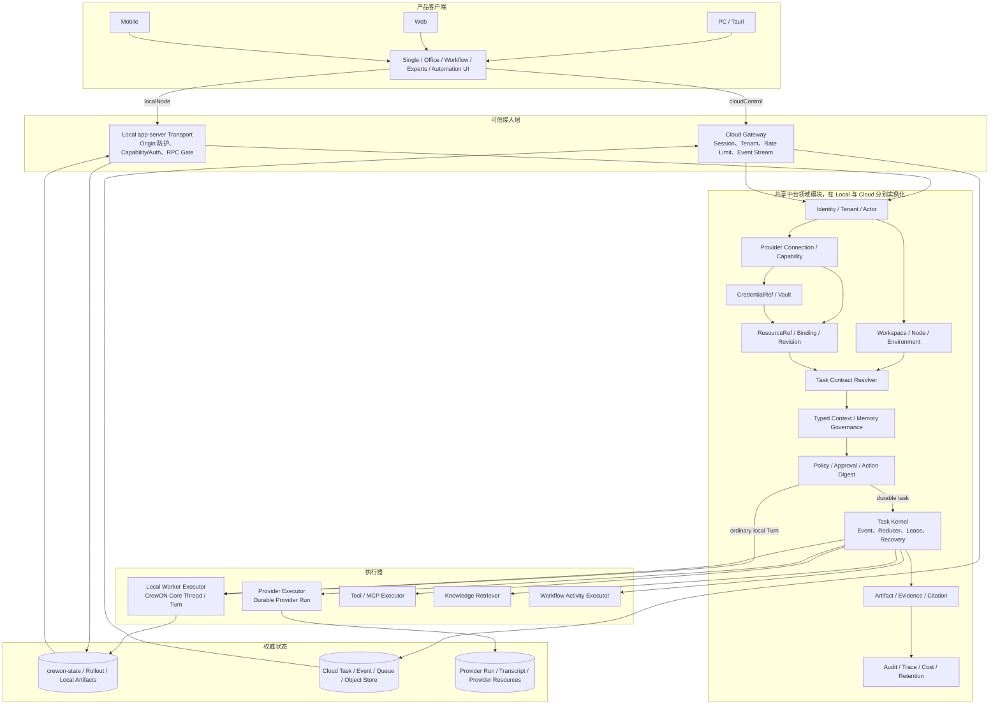

# CrewON 完整 Agent 中台安全与正确性基线

更新时间：2026-07-19  
状态：规范基线  
适用范围：CrewON PC、Web、Mobile、Local app-server、Cloud Task Control、Agent Platform 与其他 Provider  
执行手册：<code>artifacts/crewon-platform-wave-sdd-execution-guide.md</code>  
关联文档：

- `artifacts/crewon-terminal-architecture-design.md`
- `artifacts/crewon-terminal-module-detailed-design.md`
- `artifacts/crewon-system-architecture-current-future.md`

> [!IMPORTANT]
> 本文的身份、单写 Authority、Workspace、Credential、Context、Policy、Approval、Artifact、
> 审计和迁移不变量继续有效。`ARCHITECTURE_FINAL.md` 已确定目标实现语言、进程拓扑和传输：
> 新产品 API 使用 REST/SSE，设备执行使用独立 Device Protocol。本文中限定
> `app-server v2`、CrewON Core 或旧 Local/Cloud 物理实现的条目只适用于迁移期；发生冲突时，
> 以 Final Architecture 和 `artifacts/architecture-next/` 下已接受的 ADR 为准。

## 1. 文档定位

本文定义整个 CrewON Agent 中台必须共同遵守的安全、正确性和数据治理规则。Single、Office、Workflow、Experts、Automation、Schedule、Agent、Skill、MCP、Knowledge 和 Plugin 都是中台消费者，不能分别实现身份、权限、上下文、凭据、事件或恢复机制。

“完整中台”表示终态边界必须完整；“只做必要的事情”表示实现按最小纵向闭环推进，不提前建设没有真实消费者的微服务、插件系统或分布式基础设施。

## 2. 中台消费者

| 消费者              | 交互形态              | 是否必须进入 Task Runtime                                  |
| ------------------- | --------------------- | ---------------------------------------------------------- |
| 普通本地单聊        | Thread / Turn         | 否；但必须使用统一身份、Workspace、资源、Context 和 Policy |
| Durable Cloud Agent | 单聊或显式任务        | 是                                                         |
| Office              | 群聊、Leader、@成员   | 是                                                         |
| Workflow            | DAG、Node、Gate       | 是                                                         |
| Experts             | Leader 单聊、隐藏成员 | 是                                                         |
| Automation/Schedule | 后台触发、验证、提醒  | 需要恢复、重试或后台运行时必须进入                         |
| Skill/MCP/Knowledge | 资源或执行能力        | 本身不是 Task；通过 Resource Binding 和 Executor 被消费    |

普通单聊不强制迁入 Task Runtime，避免破坏已经稳定的 Thread/Turn 主链路；但它不能绕过中台的安全与资源能力。

## 3. 平台不变量

1. 身份、Tenant、Space、Actor、Credential owner 和服务端成员身份只能由可信服务端边界产生。
2. 一个 Aggregate 在任一时刻只有一个可写 Authority；禁止双写、shadow write 和失败后改走旧权威。
3. Provider 不能直接修改 CrewON Task；它只返回 Provider Event、结果、Artifact Ref 或 Intent。
4. UI 不保存 Provider Secret，不执行云 Agent/MCP/KB，也不成为 Reducer、权限决策者或调度器。
5. Local 与 Cloud 使用相同领域语义，但分别持有自己的 Task Authority；单个 Task 创建后不能切换。
6. Workspace、Resource、Context、Credential 和 Approval 都使用不可伪造的服务端引用，不能信任客户端路径或身份字段。
7. 模型可见数据有类型、来源、敏感级别和硬上限；Tool/Provider 输出默认是不可信数据，不是系统指令。
8. 所有重试、取消、恢复、接管和终态裁决由 Authority Task Kernel 决定，Executor 不自行创建 Attempt。
9. 执行事实可追踪且可恢复；大正文和敏感数据进入可删除 Payload/Artifact Store，而不是无限写入事件表。
10. 每个迁移都有单向状态、幂等标记和删除条件；不能以“以后清理”作为上线前提。

## 4. 完整中台逻辑架构



图中的 Platform 是共享领域能力，不是一个必须立即部署的单体服务。Local app-server 和 Cloud Task Control 可以复用相同领域 crate，但各自完成身份解析、Policy 和 Authority 持久化。

## 5. 身份、租户和 Actor

### 5.1 服务端派生

- `tenantId`、`spaceId`、`userId`、`actor`、`memberId` 和 Credential owner 从已认证 Session、Delegation 或服务端记录派生。
- Client Params 不接受权威 `actor`。可接受的 `purpose` 只是审计输入，不能参与身份判断。
- 未授权读取返回统一 not-found 或受控错误，避免枚举 Tenant、Run、Agent、Credential 和 Artifact。
- 所有 Repository 查询显式携带 Tenant/Space Scope，不能依赖上层已经过滤。

### 5.2 Provider Run 授权

Provider Run 的 start/read/listEvents/cancel/toolResults/decideApproval 都必须校验：

```text
service audience
tenantId + spaceId
subject + credential owner
resourceId + resource revision
required scopes + purpose
delegation expiry + jti replay state
providerRun ownership
```

`provider_runs` 的幂等唯一键至少是 `(tenantId, spaceId, idempotencyKey)`；Run ID 必须高熵，但高熵 ID 不能代替授权。

## 6. Provider、Credential 和 Resource

### 6.1 Provider Connection

- Connection 保存固定 Provider type、base URL policy、tenant/space、CredentialRef、Capability 和状态。
- UI 只获得 connectionId、显示信息和授权状态。
- Desktop Credential 使用 OS 受控凭据存储；Web Credential 使用 Cloud Vault；日志、事件和 DTO 不返回 Secret。
- Credential 必须支持过期、轮换、撤销和使用审计。

### 6.2 出站网络安全

- Provider 地址只能来自管理员配置或可信 Registry，不能来自模型输出或 Tool 参数。
- 默认仅允许 HTTPS；开发 loopback 是显式例外。
- URL 禁止用户名和密码；限制重定向、响应大小和超时。
- 对用户可配置 Provider，必须拒绝 link-local、云 metadata、未授权私网和 DNS rebinding。
- Provider Adapter 不实现通用任意 URL 代理。

### 6.3 Resource Binding

`ResourceRef` 固定 Provider、tenant/space、kind、resourceId、revision 和来源。Binding 固定 mode、executionLocation、CredentialRef、permission snapshot 和 content hash。

运行开始后资源 revision 不变；资源更新只影响新 Task。Skill Snapshot 导入必须验证压缩包路径、文件数、大小、checksum 和 Manifest，且安装后不自动执行脚本。

## 7. Workspace、Node 和 Environment

- Client 只提交 `workspaceKey`，不能提交任意 Root Path 作为权威路径。
- 服务端从 Registry 解析并 canonicalize Root，检查 symlink escape、权限和当前 Node。
- `WorkspaceBinding` 固定 `scope=single|office`、nodeId、permission snapshot 和 opaque rootRef。
- Single 与 Office 即使使用同一路径也保持不同作用域；Experts 属于 Single；Workflow 由 Definition 指定。
- Cloud 只保存 workspaceKey 和 node binding，不保存或下发本地绝对路径。
- Local Node 只能执行与当前 Lease、Workspace 和 Permission Profile 一致的 Worker Request。

## 8. Task、事件和恢复

Task Runtime 服务需要持久调度、重试、多 Worker 或后台恢复的执行。最小对象为 Task、Run、WorkerRun 和 Attempt。

- API 使用 `revision`；领域内部使用 `aggregateVersion`，边界 Adapter 显式映射。
- Task Contract 创建后不可修改；使用 `schemaVersion + contractHash`，改变目标或 Authority 创建派生 Task。
- Event Store 只保存编排事实和 Payload Ref；完整 Transcript 保留在 Thread Rollout 或 Provider Run。
- Snapshot 可重建；Cursor 只使用 Authority 分配的 taskStreamOffset。
- Claim 原子增加 leaseEpoch，fencing token 只保存 Hash；旧 Lease 事件进入审计但不能更新 Snapshot。
- Provider 结果未知时进入 reconciling，先读取原 Provider Run，禁止立即重试。
- terminal Event、Snapshot、Inbox receipt 和后续 Outbox 在同一事务提交。

第一版 Strategy 使用封闭 enum 和 exhaustive match，不建设动态插件 Registry。普通本地单聊继续使用 Thread/Turn；Durable Cloud Agent 和 Office 是 Task Runtime 的首批消费者。

## 9. Context 和 Memory

- 所有模型可见 Fragment 在 `core/context` 定义类型并实现 `ContextualUserFragment`。
- Fragment 固定 source、trustLevel、sensitivity、tokenCap、retention、contentHash 和 provenance。
- Provider、Tool、Knowledge 和用户文件内容默认视为 untrusted data；不能作为 system/developer 指令拼接。
- 单项 Fragment 不超过 10K tokens；总预算、共享摘要、检索数量和单 Worker 私有上下文分别设硬上限。
- Office/Experts 共享账本不包含成员完整私有 Transcript。
- 长期记忆是有限检索层；模型生成内容默认 pending，只有治理流程可设为 accepted。
- Context Export 使用显式选择、最小内容、短期对象、过期时间和审计，禁止上传 Workspace Root、Secret 和环境变量。

## 10. Policy、Approval 和 Tool

Policy 输入由服务端构造，至少包含 actor、tenant/space、Task、Workspace、Resource Binding、Credential、Tool Intent、purpose 和当前 revision。

Approval 必须绑定不可变 Action Digest：

```text
action type
tool/provider/resource identity + revision
arguments hash
workspaceKey + executionLocation
credentialRef
side-effect classification
purpose + actor
expiry + nonce
```

Digest 任一字段变化都重新审批。外部写入、发送、发布、推送、删除和破坏性动作默认需要 Gate；重复 Tool result 不得重复产生外部副作用或恢复 Provider Run。

Tool Bridge 在完整暂停/恢复协议和安全 Gate 实现前保持关闭，不能由前端回调或临时 WebSocket 代替。

## 11. Artifact、审计和删除

- Artifact Manifest 固定 producer、Task/Run/Attempt、workspace/resource revision、content hash、媒体类型、敏感级别和验证状态。
- Evidence、Citation 和 Risk 必须引用真实 Event、Artifact 或 Provider Ref，UI 不生成假进度和假完成。
- Trace 跨 Task、Run、Worker、Provider、Model、Tool、Knowledge 和 Approval 传播。
- 审计记录身份、授权决策、资源版本、CredentialRef、迁移、外部动作和失败原因，不记录 Secret 与无限正文。
- Retention 在 Task Contract 或产品默认策略中固定；用户删除、租户合规或 Provider 撤回可删除 Payload/Artifact 或销毁加密密钥，同时保留不含正文的必要审计事实。

## 12. API 和传输

- 新领域 API 只进入 app-server v2，使用 `<resource>/<method>`。
- Wire ID 为 String，时间为 Unix seconds，列表默认 cursor pagination。
- Client 可提交 execution target preference，最终 Authority、Strategy、Actor、Credential 和权限由服务端解析。
- 修改命令携带 aggregateId、expectedRevision、commandId 和 purpose；actor 不在 Params 中。
- 错误按 authentication、authorization、conflict、validation、rateLimit、providerUnavailable、unknownOutcome 和 internal 分类。
- Local Transport 复用现有 Origin 防护、loopback 规则和 WebSocket Auth；Cloud Gateway 执行 Session/Tenant 鉴权、限流和事件过滤。

## 13. Office 迁移安全

Office 使用单向状态机迁移：

```text
legacy → quiescing → importing → active
```

- 迁移前所有旧 Office 写入入口必须检查 migration fence。
- 无活动 Run 的 Office 可 lazy migrate；有活动 Run 时先停止新 dispatch，并等待、取消或 reconcile Worker。
- 导入事务写 Typed Office Aggregate、关联 Task、migration marker 和旧数据 Hash。
- active 后旧写入 fail-closed；不通过恢复整个 `state_5.sqlite` 回滚单个 Office。
- 迁移失败使用 per-aggregate journal 和旧归档前向修复；全量完成后删除旧 Scheduler、Reducer、写入和 importer。

## 14. 威胁与必要控制

| 威胁                   | 必要控制                                                  |
| ---------------------- | --------------------------------------------------------- |
| 跨 Tenant/Space 访问   | Repository scope、Run ownership、统一 not-found、授权测试 |
| Client 伪造身份        | server-derived actor/member/tenant/space                  |
| Credential 泄露        | Vault/OS store、CredentialRef、日志脱敏、轮换和撤销       |
| SSRF/DNS rebinding     | 可信 Provider 配置、HTTPS、地址分类、重定向和 DNS 校验    |
| Workspace 路径逃逸     | Registry、canonicalize、symlink/permission/node 校验      |
| Prompt/Tool 输出注入   | typed untrusted fragment、provenance、角色隔离、预算      |
| Approval TOCTOU        | immutable Action Digest、expiry、nonce                    |
| 重复外部副作用         | idempotency、Inbox/Outbox、Provider Run reconciliation    |
| 旧 Worker 覆盖新结果   | leaseEpoch、fencing token、terminal transition table      |
| 迁移期间双执行         | Office migration fence、quiescing、单一 Authority         |
| Event/Payload 无限增长 | item/byte/token cap、Payload Ref、Retention、pruning      |
| UI 绕过服务端          | UI 不执行 Provider 资源、不持有 Secret、所有写入走 API    |

## 15. 必要实现与延后实现

必须首先形成的完整中台内核：

1. v2 Contract、Identity/Tenant/Actor、Workspace Registry。
2. Provider Connection、CredentialRef、ResourceRef/Binding。
3. Task Kernel、`crewon-state` 持久化、Event/Snapshot/Inbox/Outbox。
4. Context、Policy、Approval、Artifact 和 Audit。
5. Local Executor 与 Agent Platform Durable Provider Executor。
6. 第一批真实消费者：Durable Cloud Agent、Office；普通 Single 接入共享安全/资源能力。

可以延后但不能绕过安全默认值：

- 多 Provider 插件 Registry。
- Cloud Authority、Postgres、Queue、跨设备 Node Lease。
- Cloud Agent 本地 Tool Bridge。
- Mobile 离线同步。
- 高级 Workflow DAG、复杂企业审批、Skill Fork 市场。

延后模块不创建空 crate、空表或临时 API；达到真实触发条件后再实现。

## 16. 发布 Gate

一个中台纵向切片只有满足以下条件才能上线：

1. 所有读取和写入都验证 Tenant/Space/Actor/Resource ownership。
2. Client 无法提交权威 Actor、Secret、Workspace Root 或最终 Strategy。
3. 一个 Aggregate 只有一个可写 Authority，断线和错误不会切换路径。
4. 正常、越权、重复、取消、unknown、恢复、迁移和旧 Lease 测试通过。
5. Context、Event、Payload、Artifact 和 Tool 输出有硬上限与删除策略。
6. UI 不直连执行 Provider 资源，不生成假运行状态。
7. 旧调用点、开关和写入代码在切换完成时删除。
8. 没有为了未来能力提前新增的服务、数据库、动态插件接口或兼容 Facade。
