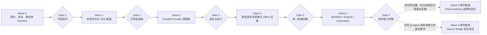
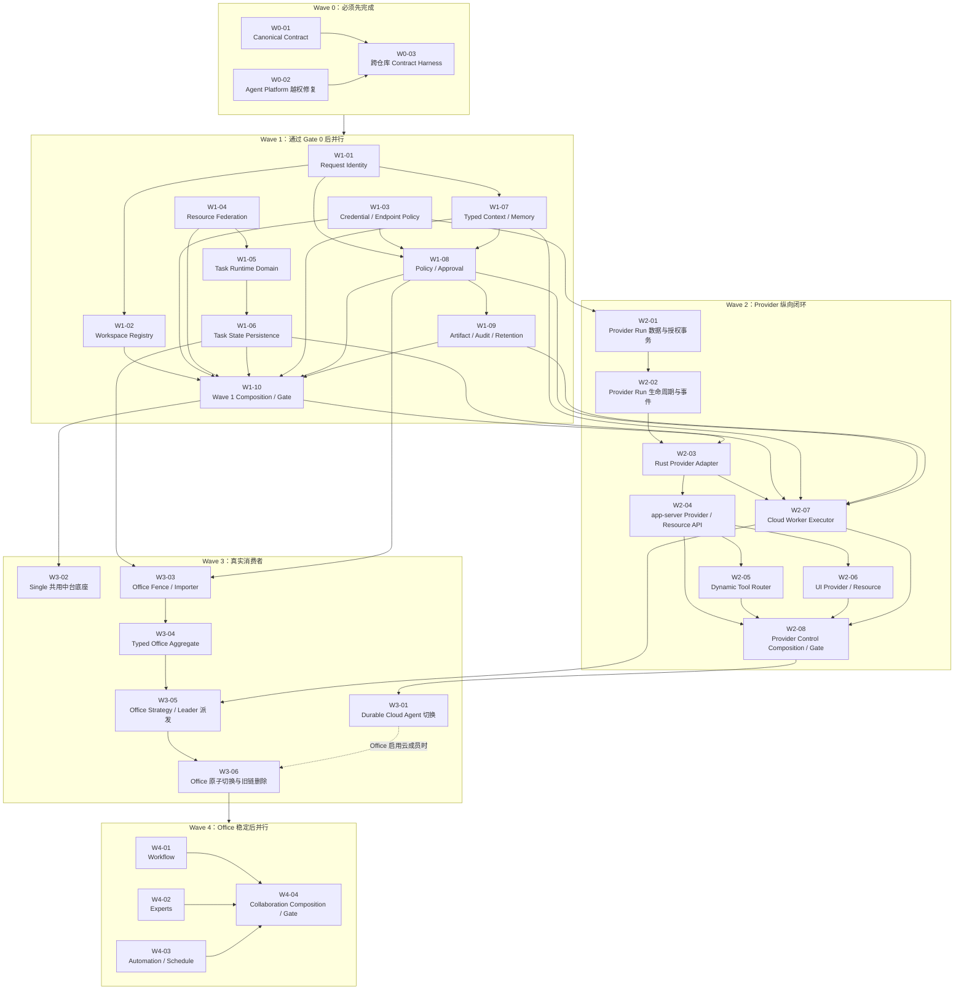
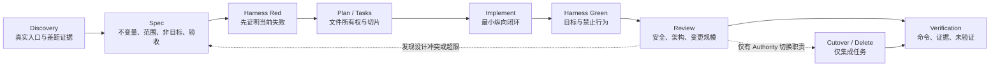

# CrewON 终态落地 Wave 与 SDD 执行手册

更新时间：2026-07-22  
状态：可执行实施基线  
适用仓库：<code>cuican-aide</code>、<code>agent-platform</code>  
上位设计：

- <code>artifacts/crewon-terminal-architecture-design.md</code>
- <code>artifacts/crewon-terminal-module-detailed-design.md</code>
- <code>artifacts/crewon-platform-security-correctness-baseline.md</code>
- <code>artifacts/crewon-system-architecture-current-future.md</code>

## 1. 文档定位

本文把终态设计转换为可直接执行、可并行开发、可独立评审的 Wave 和任务提示词。每个任务都是一个最小可合并 SDD 切片，不等于新建一个服务或长期模块。

目标不是把所有终态概念一次做完，而是按真实消费者推进必要的纵向闭环：

1. 先修复已知安全缺口并冻结共享契约。
2. 再建立本地平台底座和可恢复 Task Kernel。
3. 打通真实 Durable Provider Run，不包装现有 one-shot 接口。
4. 先迁移 Durable Cloud Agent、Single 共用底座和 Office。
5. Office 稳定后再落 Workflow、Experts、Automation/Schedule。
6. Cloud Authority 和 Secure Bridge 只有通过真实适用性 Gate 后才拆任务实现。

本文不允许用双写、静默 fallback、前端假状态、重复数据库、空 crate、空微服务或永久兼容层换取表面进度。

## 2. Wave 总览



### 2.1 并行执行地图



### 2.2 Wave 与 Gate

| Wave   | 可并行任务                                                               | 合并 Gate                                                                              | 不允许提前做                                 |
| ------ | ------------------------------------------------------------------------ | -------------------------------------------------------------------------------------- | -------------------------------------------- |
| Wave 0 | W0-01、W0-02；之后 W0-03                                                 | Schema/fixture 一致；跨 Space 越权被拒绝；契约破坏可被 Harness 检出                    | 新 Task 流量、旧链包装                       |
| Wave 1 | W1-01 至 W1-05、W1-07 可并行；W1-06、W1-08、W1-09 按依赖跟进；W1-10 收口 | 服务端身份与 Workspace 不可伪造；Task 可重启恢复；Context 有硬上限；Approval 防 TOCTOU | UI 决策、第二数据库、向 crewon-core 塞新领域 |
| Wave 2 | Agent Platform 与 Rust/UI 可按接口 fixture 并行；W2-08 收口              | Durable Run 授权原子；事件可续读；无 one-shot fallback；UI 无 Secret/直连执行          | Cloud Agent 生产切换                         |
| Wave 3 | W3-01、W3-02、W3-03 可并行；Office 依次完成 W3-03 至 W3-06               | 一个 Aggregate 一个写权威；旧写入和旧调用点删除；历史数据可审计迁移                    | Workflow/Experts 复制旧 Office Runtime       |
| Wave 4 | W4-01、W4-02、W4-03 可并行；W4-04 收口                                   | 三种消费者复用同一 Kernel/Context/Policy，但领域状态机独立                             | 新增第二套调度、记忆、资源或权限系统         |
| Wave 5 | 只执行 W5-00 适用性验证                                                  | 真实指标达到阈值并形成独立 ADR/SDD                                                     | 直接创建 Cloud Service、Queue、Postgres      |
| Wave 6 | 只执行 W6-00 安全验证                                                    | Provider 暂停/恢复、Action Digest、本地 Node Lease、Context Export 全部成立            | 直接开放云 Agent 调本地 Shell/Tool           |

Wave 表示集成、合并和生产切换顺序。后续 Wave 的 Discovery、Spec 或 isolated Harness 在其最小技术前置稳定后可以提前并行，但不得越过前一 Gate 接入生产 Authority。

## 3. 所有任务共同遵守的 SDD 执行契约

后续每个提示词都要求执行者先读本章。复制单个提示词到 Codex 任务时，不得删除这里定义的约束。

### 3.1 SDD 产物

生产代码修改前，先创建任务目录：

<code>artifacts/sdd/crewon-platform/&lt;task-id&gt;/</code>

至少包含：

| 文件                         | 必须回答的问题                                                                                         |
| ---------------------------- | ------------------------------------------------------------------------------------------------------ |
| <code>spec.md</code>         | 当前真实入口是什么；问题和不变量是什么；范围和非目标是什么；API/数据/权限/迁移如何变化；验收标准是什么 |
| <code>plan.md</code>         | 修改哪些文件；依赖谁；按什么顺序；风险、切换、删除和回滚边界是什么                                     |
| <code>tasks.md</code>        | 可独立验证的复选任务；Harness、实现、删除、文档、验证分别列出                                          |
| <code>verification.md</code> | 实际执行的命令、输出摘要、fixture/snapshot 证据、未验证项和原因                                        |

如果 Discovery 证明上位设计与真实代码冲突，先更新 <code>spec.md</code> 和上位设计并停止实现，不能用代码偷偷改变架构。

### 3.2 Harness-first

每个任务必须先建立能失败的 Harness，再写生产实现。Harness 默认必须 hermetic：

- Rust app-server：优先使用 <code>TestAppServer</code>、v2 suite 和临时目录。
- CrewON Core Agent 逻辑：使用 <code>core_test_support::responses</code>、<code>mount_sse_once</code>、<code>ResponseMock</code>、<code>wait_for_event</code>。
- State：使用临时目录初始化 <code>StateRuntime</code>，覆盖关闭、重开、并发、CAS、Fencing 和事务失败。
- UI：使用 Vitest、<code>FakeWebSocket</code>、组件测试和用户可见 <code>insta</code> snapshot。
- Agent Platform：使用 pytest fixture、临时数据库/事务和 mock provider；默认不依赖在线服务。
- 跨仓库：使用同一份版本化 JSON fixture/schema；禁止两边各手写一份“看起来一样”的类型。
- 网络安全：使用可控 DNS/HTTP mock 验证 redirect、私网、link-local、metadata、DNS rebinding、大小和超时。
- Credential：只使用 fake vault 或测试引用；日志、快照、fixture 中不得出现真实 Secret。
- Live smoke 只能作为可选补充，凭据从环境注入，创建的数据必须清理，失败不得冒充默认 Harness 通过。

Harness 至少同时证明：

1. 目标行为成立。
2. 一个关键越权或错误行为被拒绝。
3. 重试/重复输入不产生重复副作用。
4. 重启或连接中断后能恢复，或者明确证明该任务不拥有持久状态。

### 3.3 实现边界

- 先读仓库根 <code>AGENTS.md</code> 和路径下更具体的 <code>AGENTS.md</code>。
- 新 app-server API 只进入 v2，方法名使用单数资源 <code>&lt;resource&gt;/&lt;method&gt;</code>。
- UI 只渲染服务端 Projection；不保存 Secret、不提交 Actor/Tenant/Space/Root Path、不直接执行云 Agent/MCP/KB。
- 不向 <code>crewon-core</code> 增加 Task、Office、Provider 或 Workflow 领域模型。
- Rust 领域 crate 不依赖 UI、HTTP、SQL 或 app-server；Adapter 显式映射。
- 不双写、不 shadow write、不静默 fallback、不在新链失败后改走旧权威。
- 不创建没有当前消费者的空 crate、空表、空服务、动态 Registry 或插件抽象。
- 中心文件只在明确标注为 integration/cutover 的任务修改。
- 非机械变更总 diff 目标少于 800 行；复杂逻辑目标少于 500 行。预计超限时，完成 Discovery、Spec、Harness 设计和拆分方案后停止，不得硬塞。
- 保留用户工作树中的无关改动，不重置、不覆盖、不顺手清理。

### 3.4 验证与交付

按实际影响运行最小充分验证：

- Rust 协议变化：<code>just write-app-server-schema</code>、<code>just test -p crewon-app-server-protocol</code>。
- Rust crate：<code>just test -p &lt;package&gt;</code>；大型 Rust 变更末尾执行 <code>just fix -p &lt;package&gt;</code>。
- Common/Core/Protocol 变化若需要全量 <code>just test</code>，先取得用户批准。
- Rust 依赖变化：<code>just bazel-lock-update</code> 和 <code>just bazel-lock-check</code>。
- UI：<code>pnpm --filter @crewon/ui test</code>、相关 snapshot、<code>build</code>；需要时执行 <code>lint</code>。
- Agent Platform：运行目标 pytest 文件；不得用真实管理员账号作为默认 Harness。
- 所有仓库改动结束后，在 <code>codex-rs</code> 执行 <code>just fmt</code>，并且之后不再跑测试。

最终交付必须列出：

1. 已实现的行为和删除的旧行为。
2. Harness 和实际命令证据。
3. 数据、权限、上下文和 Authority 不变量如何得到证明。
4. 未验证项；没有证据时明确写“未验证”。
5. 下游任务是否已解锁，不能只说“代码完成”。

## 4. 任务索引与依赖

| 任务  | 最小前置                             | 主要所有权                            | 解锁                                  |
| ----- | ------------------------------------ | ------------------------------------- | ------------------------------------- |
| W0-01 | 安全/终态设计                        | app-server protocol/schema            | 所有契约消费者                        |
| W0-02 | 当前 Agent Platform API              | Agent Platform auth tests/API         | W0-03、W2-01                          |
| W0-03 | W0-01、W0-02                         | 跨仓库 fixtures                       | Wave 1/2 稳定并行                     |
| W1-01 | W0-01                                | app-server platform_control identity  | W1-02、W1-07、W1-08                   |
| W1-02 | W1-01                                | workspace registry                    | Single、Office、Context               |
| W1-03 | W0-01                                | credential/endpoint policy            | Policy、Provider                      |
| W1-04 | W0-01、W0-03                         | resource-federation crate             | Provider、Single、Office              |
| W1-05 | W0-01、W1-04                         | task-runtime domain                   | State、Cloud Worker、Office           |
| W1-06 | W1-05                                | crewon-state task persistence         | Durable consumers                     |
| W1-07 | W1-01、W1-02                         | core/context + adapter                | Policy、Single、Office                |
| W1-08 | W1-01、W1-03、W1-07                  | policy/approval                       | Provider、Office                      |
| W1-09 | W1-08                                | artifact/audit/retention              | 生产切换 Gate                         |
| W1-10 | W1-01 至 W1-09                       | Wave 1 composition/中心接线           | Wave 1 Gate、Rust Provider 集成       |
| W2-01 | W0-02、W0-03、W1-03                  | Agent Platform provider_run data/auth | W2-02                                 |
| W2-02 | W2-01                                | Agent Platform lifecycle/events       | Rust Adapter                          |
| W2-03 | W1-10、W2-02                         | Rust Agent Platform adapter           | app-server/Cloud Worker               |
| W2-04 | W1-10、W2-03                         | app-server v2 provider/resource       | UI/Tool Router                        |
| W2-05 | W1-04、W1-08、W2-04 + execution amendments | app-server dynamic tool router   | Provider Tool 使用                    |
| W2-06 | W0-01、W2-04                         | CrewON UI provider/resource           | Cloud Agent 切换                      |
| W2-07 | W1-05 至 W1-09、W2-03                | app-server CloudWorkerExecutor        | Durable consumers                     |
| W2-08 | W2-04 至 W2-07                       | Provider control composition/中心接线 | Wave 2 Gate                           |
| W3-01 | W2-08                                | Cloud Agent integration/cutover       | Office 云成员、旧链删除               |
| W3-02 | W1-10                                | Single integration                    | 普通单聊统一底座                      |
| W3-03 | W1-02、W1-05、W1-06、W1-08           | Office migration                      | Typed Aggregate                       |
| W3-04 | W3-03                                | Office domain aggregate               | Office Strategy                       |
| W3-05 | W2-07、W3-04                         | Office strategy/dispatch              | Office 切换                           |
| W3-06 | W3-05；Office 启用云成员时另需 W3-01 | Office integration/cutover            | Wave 4                                |
| W4-01 | W3-06                                | Workflow strategy                     | Workflow 产品                         |
| W4-02 | W3-06                                | Experts strategy                      | Experts 产品                          |
| W4-03 | W3-06                                | Automation/Schedule adapter           | 后台任务                              |
| W4-04 | W4-01 至 W4-03                       | collaboration composition/中心接线    | Wave 4 Gate                           |
| W5-00 | W4-04 + 真实指标                     | ADR/fitness harness                   | 可能的新 Cloud Authority SDD          |
| W6-00 | W4-04 + 真实需求                     | Threat model/security harness         | 可能的 Context Export/Tool Bridge SDD |

## 5. Wave 0：契约、安全与跨仓库 Harness

### W0-01 Canonical Platform Contract

```text
你正在执行 W0-01 Canonical Platform Contract。

开始前：
1. 阅读根 AGENTS.md，以及 artifacts/crewon-platform-wave-sdd-execution-guide.md 第 3 章。
2. 阅读终态架构、安全基线、模块详细设计和当前/未来架构文档。
3. 盘点 app-server v2 现有 identity、workspace、provider、resource、credential、task、approval、artifact、team、automation DTO 和生成 TS 的真实入口。

目标：
- 冻结最小共享 Wire Contract：服务端 RequestIdentity、WorkspaceRef、CredentialRef、ProviderRef/Capability、ResourceRef/Binding、Task/Event/Cursor/Authority、Approval/ActionDigest、Artifact/Audit、Team/Automation 引用和错误分类。
- 明确哪些字段只存在于服务端上下文，禁止进入 Client Params。
- 新 API 只进入 v2，遵守 camelCase、Params/Response/Notification、ts export、cursor pagination 和 experimental 规则。

Harness-first：
- 先增加 canonical JSON fixtures 和 schema snapshot，让一次字段删除、重命名、错误 optionality 或 union tag 漂移必然失败。
- 增加安全断言：Client Params 中不得出现 actorId、tenantId、spaceId、credentialOwner、workspaceRoot、最终 authority/strategy 等可伪造字段。
- 生成 TypeScript 并验证 Rust/TS/JSON 对同一 fixture 完整相等。

允许修改：
- app-server-protocol v2、schema fixtures、app-server API 文档和任务 SDD 目录。

禁止：
- 实现 Task Runtime、Store、Provider HTTP 调用或 UI。
- 为未来可能用到的字段预留 nullable 空洞。
- 修改 v1。

验收：
- just write-app-server-schema。
- just test -p crewon-app-server-protocol。
- 对外 API breaking-change review 有结论并写入 verification.md。

停止条件：
- 如果契约无法在不暴露客户端可伪造身份的前提下表达，停止实现并提交设计冲突。
- 如果预计复杂逻辑 diff 超过 500 行，将 DTO 按领域拆为多个后续任务，不把所有实现塞进中心 v2 文件。
```

### W0-02 Agent Platform 跨空间授权修复

```text
你正在执行 W0-02 Agent Platform 跨空间授权修复。

开始前阅读共同 SDD 契约，并在 agent-platform 中确认 agent open API、Space API Key、用户身份、Agent 所属 Space 和资源查询的真实入口。

目标：
- Space API Key 只能访问同一 tenant/space 内、且当前 subject 被授权的 Agent。
- start/read/stream/info 等入口使用同一授权规则；服务凭据不能替代用户/Space 资源授权。
- 越权响应不泄露资源是否存在，过期、撤销和错误 scope fail-closed。

Harness-first：
- 用 pytest fixture 创建两个 tenant/space、两个用户、两个 Agent、两个 API Key。
- 至少覆盖：同空间允许；跨空间 Agent 被一致拒绝；跨租户拒绝；过期/撤销 Key 拒绝；scope 不足拒绝；资源不存在与无权访问的外观一致。
- 测试默认使用临时数据库/事务和 fake auth，不使用硬编码管理员账号。

允许修改：
- Agent Platform 授权依赖、Agent Open API 查询和对应测试。

禁止：
- 改 AgentRuntime 模型循环。
- 顺手重构 Catalog/Workflow。
- 用前端过滤代替服务端授权。

验收：
- 目标 pytest 文件全部通过。
- 搜索所有 Agent Open API 入口，证明没有绕过统一授权依赖。
- verification.md 记录旧漏洞、修复后的授权矩阵和响应语义。

停止条件：
- 若当前数据模型无法证明 Agent 的 tenant/space ownership，停止并先提交最小数据约束 SDD，不通过字符串或请求参数猜归属。
```

### W0-03 跨仓库 Provider Contract Harness

```text
你正在执行 W0-03 跨仓库 Provider Contract Harness。

前置：W0-01 和 W0-02 已通过各自验收。先阅读共同 SDD 契约，并盘点 cuican-aide 与 agent-platform 已有 fixture/schema 生成能力。

目标：
- 建立唯一版本化 Provider Contract fixture，覆盖 capability、delegation/auth、start/read/events/cancel、approval、tool result、error 和 event ordering。
- 两个仓库都消费同一 canonical fixture；禁止复制后各自维护。
- Harness 能检测缺字段、多字段、rename、union tag、optional/nullable、错误码和 capability 漂移。

Harness-first：
- 先故意构造一份不兼容 fixture，证明 CrewON Rust 端和 Agent Platform Python 端都会失败。
- 再固定 canonical fixture，并验证双方序列化/反序列化和授权矩阵。
- 默认完全 hermetic；live smoke 独立标记，不进入默认兼容性 Gate。

允许修改：
- 共享 fixture 位置、双方 contract tests、生成/校验脚本和任务 SDD 文档。

禁止：
- 在两边手写同义但独立的 schema。
- 为让测试通过而忽略未知关键字段或吞掉未知事件。
- 启动真实 Provider Run。

验收：
- 单命令可在两个仓库分别执行 contract test。
- 缺失、重命名、额外关键字段、错误 union tag 均有失败证据。
- fixture 版本和兼容策略写入 spec.md。

停止条件：
- 如果无法确定 canonical fixture 的单一所有权位置，停止并提交 ADR；不得先复制两份。
```

## 6. Wave 1：本地平台与 Task 基座

### W1-01 Server-derived Request Identity

```text
你正在执行 W1-01 Server-derived Request Identity。

开始前阅读共同 SDD 契约，盘点 app-server transport initialize/session/auth/origin/capability 的真实身份来源。

目标：
- 在 app-server platform_control 下建立服务端 RequestIdentity，统一表达 actor、tenant、space、session、client capability 和审计主体。
- 身份只能从已验证 transport/session/auth 派生；领域 Processor 只接收已解析身份，不读取客户端同名字段。
- 保持本地 PC、Web 和未来 Cloud Gateway 的语义一致，但不实现 Cloud Gateway。

Harness-first：
- 使用 TestAppServer 建立多个连接/session，验证同一请求在不同可信 session 下得到不同服务端身份。
- 发送伪造 actorId、tenantId、spaceId、memberId，证明被 schema 拒绝或完全不参与身份决策。
- 连接重建后身份重新派生；旧连接 token/identity 不可复用。

允许修改：
- app-server platform_control 新模块和相关 tests；中心 composition 由 W1-10 接线。

禁止：
- 把身份状态存到 UI。
- 新建第二套登录系统。
- 将 Task/Office 规则塞入 identity 模块。

验收：
- targeted crewon-app-server tests 通过。
- RequestIdentity public API 有 trait/type 文档，并且依赖方向不指向业务 Processor。
- verification.md 列出所有身份来源和不可信输入。

停止条件：
- 如果现有 transport 不能提供某字段的可信来源，字段保持 absent/unknown 并 fail-closed；不得相信客户端补值。
```

### W1-02 Workspace Registry 与 Binding

```text
你正在执行 W1-02 Workspace Registry 与 Binding。

前置：W1-01。先阅读共同 SDD 契约，盘点 Thread、Command、Office、teamCwd/cwd、permission roots 和 Tauri/Web workspace 选择的真实入口。

目标：
- 建立服务端 Workspace Registry，以 workspaceKey 引用 canonical root、node/environment 和作用域。
- Single Workspace 与 Office Workspace 使用不同 binding identity；即使 canonical path 相同，也不能共享群聊上下文/记忆 scope。
- 解析、canonicalize、symlink、root escape、已删除目录和不可访问目录行为明确。

Harness-first：
- 临时目录创建两个 workspace、子目录和指向 root 外的 symlink。
- 验证合法 workspaceKey 解析成功，伪造绝对路径、相对逃逸、symlink escape、跨 session 未授权 key 被拒绝。
- 同一路径的 singleBinding 与 officeBinding 得到不同 binding id/scope。
- Registry 重启后已持久登记项行为符合 spec；若设计为会话级，则证明不会被错误恢复。

允许修改：
- app-server platform_control workspace 模块、独立 state adapter、v2 workspace API/测试；中心接线由 W1-10 完成。

禁止：
- Client Params 直接提交最终 root path。
- 切换 Office Workspace 时修改主页 Single Workspace。
- 创建第二个文件系统沙箱。

验收：
- TestAppServer workspace integration tests 通过。
- Web 与本地差异通过 capability 明确表达，不用 bool/None 猜测。
- API 文档和 verification.md 记录 workspaceKey 生命周期与授权边界。

停止条件：
- 如果路径所有权或授权无法从服务端证明，拒绝绑定并停止，不以目录存在代替授权。
```

### W1-03 CredentialRef 与 Provider Endpoint Policy

```text
你正在执行 W1-03 CredentialRef 与 Provider Endpoint Policy。

开始前阅读共同 SDD 契约，盘点现有 Agent Platform token、MCP OAuth、Account auth、OS credential store、Web cloud vault 和日志路径。

目标：
- 定义 CredentialRef、owner、provider、scope、expiry、rotation/revocation 和可用性状态；领域/API 只传引用，不传 Secret。
- Desktop 使用 OS Store adapter，Web 预留 Cloud Vault port；测试使用 FakeCredentialStore。
- Provider Endpoint Policy 统一校验 scheme、host、DNS、redirect、IP range、响应大小和超时。

Harness-first：
- FakeCredentialStore 覆盖 create/read/rotate/revoke、owner mismatch 和过期引用。
- 序列化、Debug、日志、错误和 snapshot 中证明 Secret 被脱敏。
- 可控 DNS/HTTP mock 覆盖 HTTPS 允许、HTTP 拒绝、loopback/private/link-local/metadata 拒绝、redirect 到私网拒绝、DNS rebinding 拒绝、响应上限和超时。

允许修改：
- 独立 credential/endpoint policy 模块、adapters 和测试；中心 composition 由 W1-10 完成。

禁止：
- 在 UI localStorage、SQLite 明文列、URL query、日志或 fixture 保存 Secret。
- 为方便测试放宽生产 endpoint policy。
- 把网络调用放进纯领域模块。

验收：
- targeted Rust tests 通过。
- Desktop/Web/Fake adapter 的职责与未实现边界写清。
- verification.md 包含 Secret 扫描和 SSRF 矩阵。

停止条件：
- 如果现有 Web 路径只能让浏览器持有服务 Secret，停止该接入并返回服务端连接设计，不做临时直连。
```

### W1-04 Resource Federation

```text
你正在执行 W1-04 Resource Federation。

前置：W0-01、W0-03。先阅读共同 SDD 契约和资源发现/执行/绑定术语。

目标：
- 建立最小 crewon-resource-federation 纯领域 crate。
- 定义 ResourceRef、ResourceRevision、ProviderRef、BindingMode、ExecutionLocation、Capability 和 Provider ports。
- 明确 remoteReference、localSnapshot、localFork、providerManaged；不再用 downloaded bool 表达运行语义。

Harness-first：
- 用表驱动测试完整比较 Resource/Binding/Capability 对象。
- 覆盖版本不匹配、binding mode 与 capability 冲突、执行位置不允许、不可变 snapshot 校验失败、未知 capability fail-closed。
- 加依赖边界检查，crate 不得依赖 reqwest、sqlx、app-server 或 crewon-core。

允许修改：
- 新领域 crate、对应测试/文档；workspace/Bazel 接线由 W1-10 完成。

禁止：
- 在领域 crate 中实现 HTTP、数据库、UI 或 Agent Platform 专属字段。
- 建立多 Provider 动态插件 Registry。
- 提前实现本地资源缓存下载器。

验收：
- just test -p crewon-resource-federation。
- 若改 Cargo 依赖，执行 bazel lock update/check。
- public trait/type 有用途文档；match exhaustive。

停止条件：
- 如果没有当前消费者需要某扩展点，从 API 删除，不为“未来可能”保留。
```

### W1-05 Task Runtime 纯领域

```text
你正在执行 W1-05 Task Runtime 纯领域。

前置：W0-01、W1-04。先阅读共同 SDD 契约，确认 Task Authority、Event、Attempt、Lease/Fencing、Inbox/Outbox、StrategyKind 和 WorkerExecutor 契约。

目标：
- 建立 crewon-task-runtime 纯领域 crate。
- 只实现当前 Durable Cloud Agent 与 Office 必需的 Task、Attempt、Event、Reducer、Command、Scheduler decision、Store ports 和封闭 StrategyKind。
- Reducer 为确定性纯函数；Authority 创建 Attempt，Executor 只返回事件/结果。

Harness-first：
- InMemoryFakeStore + 表驱动状态机，比较完整 Task Aggregate。
- 覆盖 accept/start/progress/suspend/resume/cancel/complete/fail、重复 command/event、乱序 worker sequence、unknown outcome、lease 过期和旧 fencing token。
- 用属性测试或模型测试证明终态不可回退、重复事件无重复副作用、一个 Task 只有一个 authority。

允许修改：
- 新 task-runtime crate 和测试；不接 app-server/SQL。

禁止：
- 依赖 crewon-core、reqwest、sqlx、UI 或具体 Provider。
- 使用动态 Strategy registry/trait object；第一版使用封闭 enum + exhaustive match。
- 在 Executor 内重试并新建 Attempt。

验收：
- just test -p crewon-task-runtime。
- 领域模块目标少于 500 行；超出时按 aggregate/reducer/ports 拆文件。
- verification.md 给出状态转移表和不变量测试对应关系。

停止条件：
- 如果当前需求不能用封闭 StrategyKind 表达，先给出真实第三方扩展证据，否则不扩大抽象。
```

### W1-06 crewon-state Task 持久化

```text
你正在执行 W1-06 crewon-state Task 持久化。

前置：W1-05。先阅读共同 SDD 契约，盘点 state_5、StateRuntime、现有 migrations/事务和 app-server store adapter 模式。

目标：
- 复用 crewon-state 同一 SQLite lifecycle，增加 Task、Attempt、Event、Cursor、Lease/Fencing、Inbox/Outbox 和 migration journal 所需最小 records/operations。
- Domain 与 Record 在 app-server adapter 显式映射；state crate 不拥有 Task Reducer。
- 单次状态提交、event append 和 outbox 写入必须原子。

Harness-first：
- 临时目录初始化 StateRuntime，执行写入、关闭、重开并比较完整对象。
- 覆盖并发 claim、CAS 冲突、旧 fencing token、重复 inbox/event、事务中途失败、outbox 恢复和 cursor gap。
- 证明不会创建第二个 SQLite 文件/lifecycle；迁移可从当前真实 schema 升级。

允许修改：
- crewon-state migrations/runtime 新模块、独立 app-server store adapter 和目标测试；中心接线由 W1-10 完成。

禁止：
- 把 Task 领域决策写进 SQL/state。
- 使用全局进程环境改变测试。
- 用双库或 shadow write 过渡。

验收：
- just test -p crewon-state，以及 adapter 所属 package targeted test。
- 若使用 compile-time migration 文件，更新 BUILD.bazel data。
- 大型 Rust 改动执行 just fix -p 对应 package，最后 just fmt。

停止条件：
- 如果一次变更预计超过复杂逻辑 500 行，先落 records+原子 append，claim/recovery 拆为后续同 Wave 子任务；不得提交半套双权威 Store。
```

### W1-07 Typed Context 与 Memory Governance

```text
你正在执行 W1-07 Typed Context 与 Memory Governance。

前置：W1-01、W1-02。先阅读共同 SDD 契约和 AGENTS.md 的 model visible context 规则。

目标：
- 所有注入模型的新增片段在 core/context 中定义 struct 并实现 ContextualUserFragment。
- 片段显式携带 provenance、trust、sensitivity、workspace binding、purpose、budget 和 freshness。
- 保持增量追加、不重写历史；单项硬上限 10K tokens，新增可能超过 1K tokens 的片段列为 P0 评审。
- Office 使用 shared run context、member-private context、finite long-term memory retrieval；Single/Experts 不复用 Office 群聊 scope。

Harness-first：
- 使用 core_test_support::responses 和 mount_sse_once 捕获实际 ResponsesRequest。
- 证明 trusted/untrusted 片段被正确标记，超限被确定性截断/拒绝，Tool/Provider 输出不能变成 system instruction。
- 比较连续 Turn 请求，证明旧历史未重写且注入顺序稳定，避免无意义 cache miss。
- 同一路径的 Single/Office/Experts context scope 不互相泄漏。

允许修改：
- core/context 新片段、独立 adapter 和 core suite integration tests。

禁止：
- 在主实现文件放 test-only helper。
- 无限聊天历史、无限 memory retrieval、一次性大段拼接字符串。
- 将 Office ledger 当作成员私有完整 Thread。

验收：
- targeted core integration tests 通过；如需完整 just test，先请求用户批准。
- ResponseMock 断言真实 outbound body，不只测 helper 返回值。
- verification.md 列出每种片段上限、信任级别和截断语义。

停止条件：
- 任一新增片段可能超过 1K tokens 且没有人工评审/硬上限时，停止合并。
```

### W1-08 Policy、Approval 与 Action Digest

```text
你正在执行 W1-08 Policy、Approval 与 Action Digest。

前置：W1-01、W1-03、W1-07。先阅读共同 SDD 契约，盘点现有 permission profile、approval、tool intent 和 Office approval 入口。

目标：
- 建立统一 PolicyDecision：allow、deny、approvalRequired。
- Approval 绑定不可变 ActionDigest，至少覆盖 actor、purpose、workspaceKey、resource/tool revision、argumentsHash、credentialRef、executionLocation、expiry 和 nonce。
- Provider 仍需独立执行自身资源授权；CrewON accessDecisionId 只是审计关联。

Harness-first：
- 对已批准动作逐字段突变，每个字段变化都必须失去批准并重新评估。
- 覆盖过期、nonce 重放、owner mismatch、workspace 改变、credential rotate/revoke、Tool revision 改变和参数 canonicalization。
- 证明 deny 不会通过 fallback 走旧执行器，重复批准/result 不产生重复外部副作用。

允许修改：
- 独立 policy/approval 模块、adapter 和目标集成测试；中心接线由 W1-10 完成。

禁止：
- 用 UI 确认状态作为授权事实。
- 只 hash 自然语言摘要。
- 将 Provider 的权限判断替换成 CrewON 预判。

验收：
- targeted Rust tests 通过。
- ActionDigest canonical encoding 有稳定 fixture。
- verification.md 包含 TOCTOU、重放和跨 Workspace 测试矩阵。

停止条件：
- 如果某执行路径不能提供完整 digest 输入，默认 approvalRequired/deny 并停止接入，不能省略字段继续执行。
```

### W1-09 Artifact、Audit 与 Retention

```text
你正在执行 W1-09 Artifact、Audit 与 Retention。

前置：W1-08。先阅读共同 SDD 契约，盘点现有 Office artifact、memory、日志、trace 和 payload 保存路径。

目标：
- 定义 ArtifactRef/Manifest、Evidence/Citation、AuditEvent、Trace/Cost 和 RetentionPolicy 的最小共享语义。
- 事件只保存可追踪元数据和 payload reference；大正文/敏感正文进入可删除 store。
- Artifact/Audit 与 actor、workspace、task/run、provider、resource revision、approval decision 可关联。

Harness-first：
- 临时 artifact/payload store 覆盖 create/read/delete/retention expiry、引用完整性和 restart。
- 删除 payload 后 Audit 元数据仍可证明发生过什么，但不得泄露正文/Secret。
- 日志和序列化扫描验证 credential、敏感 context、原始 tool payload 不被写入不受控事件。
- 重复 artifact/event 使用幂等 key，不创建重复产物。

允许修改：
- 独立 artifact/audit/retention 模块、state adapter 和测试；中心接线由 W1-10 完成。

禁止：
- 把大正文无限写入 Task event 表。
- 以“审计需要”为由永久保留 Secret 或完整敏感 Context。
- 创建独立于现有 state lifecycle 的数据库。

验收：
- targeted state/app-server tests 通过。
- Retention 删除、审计保留和用户清理语义写入 spec/verification。
- 下游 Provider/Office 可只依赖稳定引用，不依赖具体文件路径。

停止条件：
- 如果删除与审计不可同时满足，停止并提交数据分类/保留策略决策，不默认永久保存。
```

### W1-10 Wave 1 Composition 与 Gate

```text
你正在执行 W1-10 Wave 1 Composition 与 Gate。本任务是 Wave 1 唯一的中心接线任务，不新增领域语义。

前置：W1-01 至 W1-09 各自 Harness 通过。先阅读共同 SDD 契约，并核对每个上游 verification.md、public API 和文件所有权。

目标：
- 将 RequestIdentity、Workspace、Credential/Endpoint、Resource Federation、Task Runtime/State、Context、Policy/Approval、Artifact/Audit 以显式 adapter 接入 app-server composition。
- 完成新 crates 的 workspace/Bazel 接线和依赖方向检查。
- 建立 Wave 1 集成 Harness，证明共享底座可供 Single、Provider 和 Office 消费，但尚不切旧生产 Authority。

Harness-first：
- TestAppServer + temporary StateRuntime + fake credential/provider/resource，跑一条不产生真实外部副作用的端到端 contract。
- 覆盖伪造身份/workspace、credential revoke、context cap、approval digest、state restart、artifact retention。
- 依赖检查证明 crewon-core 不依赖 Task/Provider/Office，新领域 crate 不依赖 app-server/SQL/HTTP。

允许修改：
- workspace Cargo/Bazel、app-server composition/路由注册和 Wave 1 integration tests。

禁止：
- 在中心文件写领域逻辑。
- 修改上游 public contract 以“方便接线”；发现问题退回对应 Task ID。
- 切 Cloud Agent 或 Office 生产路径。

验收：
- 上游各 package targeted tests 已有证据；本任务只补 integration tests。
- 依赖变化执行 bazel lock update/check。
- 大型 Rust 接线执行 scoped fix，最后 just fmt；fmt 后不再运行测试。

停止条件：
- 任一上游没有 hermetic Harness、public API 不稳定或依赖方向违规时，退回上游，不在 composition 加临时 Facade。
```

## 7. Wave 2：Durable Provider 控制链

### W2-01 Agent Platform Provider Run 数据与授权事务

```text
你正在执行 W2-01 Agent Platform Provider Run 数据与授权事务。

前置：W0-02、W0-03、W1-03。先阅读共同 SDD 契约和 agent-platform 当前 AgentRuntime/Catalog/Open API 真实实现。

目标：
- 在 Agent Platform 建立最小 provider_run 数据模型：Run、Attempt/ExecutionRef、Event、Idempotency、Delegation jti、AuthorizationDecision 和 Outbox。
- startAgentRun 在同一授权事务内验证 tenant/space、subject、resource、scopes、credential owner、delegation expiry/jti，并原子提交 run.started 和 outbox。
- 所有 read/events/cancel/approval/tool-result API 都复用同一 ownership 授权矩阵。

Harness-first：
- pytest 临时 DB fixture 覆盖授权成功、跨 space/tenant、resource mismatch、scope 不足、expired/replayed jti、credential owner mismatch。
- 模拟事务在 Run、event、outbox 各阶段失败，证明全部回滚。
- 相同 idempotency key + 相同 digest 返回同一 Run；相同 key + 不同 digest 冲突。
- 所有查询入口对无权资源使用一致的不泄露语义。

允许修改：
- agent-platform provider_run 的 models/repository/service/auth dependency/migration/tests。

禁止：
- 直接修改 AgentRuntime 模型循环。
- 把 one-shot chat 包装成 durable 状态。
- 在开始事务外先“检查一次权限”再相信检查结果。

验收：
- 目标 pytest 全部通过。
- 数据约束和唯一索引能支撑幂等、sequence、jti replay protection。
- verification.md 给出事务边界和每个 API 的授权矩阵。

停止条件：
- 若预计复杂逻辑超过 500 行，先落数据+授权原子性，不同时实现 executor/events API；不得交付只有表没有授权 Harness 的空模块。
```

### W2-02 Agent Platform Provider Run 生命周期与事件

```text
你正在执行 W2-02 Agent Platform Provider Run 生命周期与事件。

前置：W2-01。先阅读共同 SDD 契约，确认 AgentRuntime 稳定调用入口和当前 SSE/Workflow/MCP/KB 执行语义。

目标：
- 实现 start/read/events/cancel，以及必要的 suspend/resume approval/tool-result 生命周期。
- Provider Run 调用现有 AgentRuntime 稳定入口，Provider Run 拥有持久 lifecycle，不复制模型循环。
- 事件具有稳定 sequence/cursor，可续读、可重放；cancel/terminal/unknown outcome 语义明确。
- Outbox worker 在重启后继续；重复投递不重复启动模型循环。

Harness-first：
- fake executor 控制 start/progress/suspend/complete/fail/timeout/unknown。
- 覆盖服务重启、worker crash、重复 outbox、重复 provider event、cursor 续读、gap、cancel race、终态后迟到事件。
- approval/tool-result 使用 digest/idempotency，重复提交不恢复两次。
- capability 不支持 durableRun/resumableEvents 时 admission fail-closed。

允许修改：
- provider_run executor/service/API/worker/event stream/tests；调用 AgentRuntime 的窄 adapter。

禁止：
- 重写 AgentRuntime。
- 用进程内 Future/内存 Promise 作为 Run 权威。
- 事件中无限保存模型正文或 Secret。

验收：
- 目标 pytest 和 contract tests 通过。
- restart/replay/cancel 有可复现证据。
- live smoke 如执行，必须独立、环境注入凭据并清理数据。

停止条件：
- 如果 AgentRuntime 没有可幂等调用的稳定入口，先提交窄 adapter 任务，不在 Provider Run 内复制 loop。
```

### W2-03 Rust Agent Platform Provider Adapter

> Completion amendment（2026-07-21）：W2-02C 已完成独立 discovery delegation、descriptor/capability 与 exact AgentVersion list/read；W2-03A 已把 Endpoint Policy/HTTP Guard 迁移为 `crewon-provider-transport` 单一 authority；W2-03B/C 已完成 authorization、strict discovery/CatalogProvider 与 durable Run start/read/events/cancel，Harness 为 adapter 31 项、transport 7 项，跨仓双契约哈希一致。当前 production descriptor/HTTP application 未暴露 approval/tool-result mutation capability，adapter 不提供伪实现，未声明事件 fail-closed。W2-04、W2-07 已解锁进入 Discovery；二者随后识别出的额外前置不回退 W2-03，但继续阻止实现和 W2-08。Wave 2 Gate 尚未通过。

```text
你正在执行 W2-03 Rust Agent Platform Provider Adapter。

前置：W1-10、W2-02。先阅读共同 SDD 契约和 canonical Provider fixture。

目标：
- 建立最小 crewon-provider-agent-platform adapter，只负责 Agent Platform HTTP/auth/capability/event/error 与 Resource Federation/Provider ports 的映射。
- 使用 CredentialRef 解析结果，不暴露 Secret；所有 endpoint 经过 Provider Endpoint Policy。
- unknown capability/event/error fail-closed，429/Retry-After/timeout/transport failure 映射为明确领域错误。

Harness-first：
- mock HTTP server 覆盖 catalog/capability/start/read/events/cancel；approval/tool-result 只有在后端真实声明 capability 和 route 后才能通过独立 amendment 接入。
- 断言请求 headers/body 不包含不应发送的 workspace root、成员私有 context 或长期 Secret。
- 覆盖 redirect、SSRF policy、429、5xx、timeout、malformed JSON、重复/未知 event、cursor。
- 对 canonical fixture 做完整对象 equality。

允许修改：
- W2-03A：新增 `crewon-provider-transport`、迁移现有 endpoint policy/HTTP guard 及 Harness、更新 app-server 直接调用并删除旧副本。
- W2-03B：新增 `crewon-provider-agent-platform` 和测试；业务 composition/Bazel 消费接线仍由 W2-08 完成。

禁止：
- 依赖 task-runtime、crewon-core、app-server 或 UI；Task 映射留给 composition adapter。
- 在 Agent Platform adapter 中复制 endpoint policy，或依赖 app-server 私有模块。
- 在 adapter 中实现重试策略、Task Reducer 或聊天 session。
- one-shot fallback。

验收：
- just test -p crewon-provider-agent-platform。
- Cargo/Bazel lock 按规则更新检查。
- public adapter trait/constructor 有明确用途文档，Secret 不出现在 Debug。
- 当前未声明 approval/tool-result capability 时不暴露 mutation 方法，收到对应事件 fail-closed。

停止条件：
- Provider capability 不满足 durableRun/resumableEvents 时返回不支持，不得模拟兼容。
```

### W2-04 app-server Provider / Resource v2 API

> Discovery amendment（2026-07-21）：当前 W1-01 actor/session 与 W1-02 Workspace binding 都是 connection-scoped，重连后必须变化；Credential owner 又由该 actor 派生。因此“跨连接恢复 + server-owned Credential/Workspace + 不信任客户端 authority”当前不可同时满足。W2-04 在 authenticated principal prerequisite 完成前暂停，禁止复用旧 session、放宽 owner 或让客户端重传 Secret。详见 `artifacts/sdd/crewon-platform/W2-04/`。

> Implementation amendment（2026-07-22）：authenticated principal、durable workspace、Provider connection State、projection/resource DTO，以及默认关闭的 production Agent Platform factory/config kernel 已完成。进一步 production review 证明 Agent Platform 自行解析真实云模型 Secret，而 CrewON 当前没有 Credential provisioning；要求客户端先提交 credentialId/revision 的 prototype 首连不可达，已连同 selection DTO 撤回。principal exchange 已补上 exact Provider identity mapping 持久化。下一最小切片改为 `W2-04-provider-access-grant` 的 Secret-free grant kernel/provisioning，完成后才重建 processor、startup 与 RPC。W2-05/W2-06/W2-08 不提前解锁。

> Access Grant Stage A amendment（2026-07-22）：`0044_provider_access_grants.sql` 与 State kernel 已完成，提供 Secret-free bounded record、active owner/source 双唯一、exact replay、expiry-aware active lookup、current lookup、CAS revoke、原子 replace、tamper/capacity fail-closed。targeted 7/7、state 190/190、app-server migration smoke 4/4 与 Bazel query 通过。

> Access Grant Stage B amendment（2026-07-22，W2-05/W2-07 scope 修订于 2026-07-23）：principal-session exchange 已在 exact mapping 持久化和 remote session issue 后创建/复用 server-owned Grant，绑定 verified owner、fresh source revision 与 issued session expiry；scope 固定为严格排序的 `provider.discovery`、`providerKnowledge:search`、`providerRun:cancel`、`providerRun:events`、`providerRun:read`、`providerRun:start`、`providerTool:call`，客户端不能提交或扩大。Grant 失败不向客户端返回 session authority。复合 resolver exact 校验 authenticated principal + fresh mapping + active exact-scope grant；W2-05 Dynamic Tool 和 W2-07 CloudWorker 在每次外部调用前又分别重验 connection/resource/credential/mapping revision。每次调用仍使用单资源/单操作短期 delegation，不把 Grant 直接发送给 Provider；approval/tool-result scope 在 capability 未开放前保持不存在。

> Provider Processor Stage C amendment（2026-07-22）：保持未注册的 connect/read processor core 已完成，唯一选择输入为 providerId/connectionId；live descriptor I/O 前后 exact 重验 composite authority，persisted connection 不能绕过 grant rotation/revoke、mapping drift、cross-owner 或 protocol drift。targeted 3/3、app-server 1067/1067 Green，1 skipped。final fmt 后 processor/Harness 共 630 行，projection/startup/RPC 拆到后续 review slice。

> Provider Projection Stage C amendment（2026-07-22）：预公开 `ProviderConnectionProjection` 已移除 CredentialRef，避免暴露内部 Grant 或伪造客户端 Credential。独立 adapter 显式映射 Provider/Resource capabilities，以不含 observedAt 的 canonical content hash 生成稳定 ETag；targeted 2/2、protocol 241/241、schema generation、app-server 1069/1069 Green，1 skipped。final fmt 后 adapter/Harness 共 362 行；下一切片只做 startup/restart/config-removal/readiness composition。

> Provider Startup Stage C amendment（2026-07-22）：私有 `PreparedProviderConnectionRuntime` 已接入 app-server transport accept 之前。默认关闭或配置移除时不要求依赖、不恢复旧 authority；显式启用必须复用 principal identity reader，在 page 100/总量 1024 的硬上限内刷新全部 active durable mappings，依赖缺失或 source/state/snapshot 失败均 fail-closed。targeted 3/3、最终 app-server 1072/1072 一次 Green，1 skipped、3 slow；final fmt 后 production/Harness 共 494 行。RPC 仍未注册，下一切片只做 provider/connect/read v2 schema/TestAppServer 接线。

> Provider RPC Stage D amendment（2026-07-23）：experimental `provider/connect` 与 `provider/read` 已注册到 app-server v2，分别只接受 `providerId` 和 server-owned `connectionId`。独立 request processor 消费 transport-derived `RequestIdentity` 与 startup-prepared runtime，错误映射不暴露 grant、source、owner、endpoint 或 scope；关闭配置时 fail-closed，不回退旧 Open API credential。真实 runtime Harness 覆盖 connect/read、伪造 provider 与 secret-free projection；TestAppServer 覆盖方法注册、experimental gate、客户端 authority 字段拒绝和 disabled runtime。targeted Provider 15/15、protocol 242/242、app-server 1077/1077 Green，1 skipped、1 slow、1 个既有 Office timing case retry Green；experimental/stable schema generation、scoped fix 与 final fmt 通过。Resource list/read 与 durable Resource Binding 仍是独立后续切片，W2-05/W2-06/W2-08 尚未解锁。

> Resource Catalog Stage E amendment（2026-07-23）：私有 live catalog factory/session 已复用 pinned connector、RS256 authorizer 与 `AgentPlatformProviderClient`；每次 list/read 只建立一个 session，并在同一 session 上持有 strict descriptor。共享 connection begin/finish 在 Provider I/O 前后 exact 重验 owner、fresh mapping、active grant 与 credential revision。experimental `resource/list` / `resource/read` 已通过独立 request processor 注册；limit 默认 20、硬上限 100，cursor opaque，read exact revision，客户端 authority 字段在 dispatch 前拒绝。Resource targeted 5/5、真实 RS256 request processor 1/1、protocol 242/242、app-server 1082/1082 Green，1 skipped、1 slow、2 个既有 timing case retry Green；experimental/stable schema、scoped fix 与 final fmt 通过。下一切片只做 durable Resource Binding 与 projection notification；W2-05/W2-06/W2-08 仍未解锁。

> Resource Binding Stage F amendment（2026-07-23）：0045 additive migration、strict hash-bound State record 与 create/read/reactivate/unbind lifecycle 已完成；session-owned Workspace binding 只作为当前连接 proof，durable record 只保存 path-free workspaceKey/scope。bind 使用一次 pinned live Catalog exact read，经 Federation capability resolver 生成 snapshot，再显式映射为 State；无 materializer 时 localSnapshot/localFork fail-closed。experimental `resource/bind`、`resource/unbind` 与 `resource/binding/updated` 已注册，通知只发给 initiating connection；unbind 是 authenticated owner 的 State-only cleanup。State 198/198、Workspace targeted 1/1、adapter/core 5/5、TestAppServer 3/3、protocol 242/242、app-server 1088/1088 Green，1 skipped，2 个既有 timing case retry Green。W2-04 implementation Gate Green，W2-05/W2-06 可进入各自 SDD；W2-08 仍等待 W2-05 至 W2-07，完整 workspace release evidence 等待用户授权。

```text
你正在执行 W2-04 app-server Provider / Resource v2 API。

前置：W1-10、W2-03。先阅读共同 SDD 契约，盘点现有 agent_platform_processor、Catalog、UI 直连和 app-server client。

目标：
- 提供 server-owned provider connection 与 resource list/read/bind/unbind/capabilities API。
- UI 只传 provider/resource/workspace 的服务端引用；app-server 解析 identity、credential、endpoint 和 policy。
- list 默认 cursor pagination；通知只表达连接/资源 projection，不泄露 Secret。

Harness-first：
- TestAppServer + fake provider adapter 覆盖 connect/list/read/bind/unbind、cursor、disconnect/reconnect、credential revoke 和 capability change。
- 伪造 actor/space/workspace root/credential owner 被拒绝。
- 多 session 不共享不应共享的 connection state；重连后可通过服务端状态恢复。
- Schema/TS fixture 与 W0-01 一致。

允许修改：
- app-server v2 protocol、独立 provider/resource processor/client adapter、API README、目标 tests；`message_processor` 只做机械 API dispatch/response/定向 notification，Task/Tool/UI 跨领域 composition 由 W2-08 接线。

禁止：
- 修改 v1。
- 把 Provider Secret 返回 UI。
- 在中心 message_processor 写业务逻辑；只允许最小路由接线。
- 同时删除旧 UI 路径；删除留给 cutover 任务。

验收：
- schema generation、protocol test、crewon-app-server targeted tests 通过。
- API 文档示例不包含真实 token。
- verification.md 证明 server-owned connection 和 cursor recovery。

停止条件：
- 如果中心文件改动不再是纯路由，抽出新 Processor 后再接线，不继续扩张中心模块。
```

### W2-05 Dynamic Tool Router

> Provider-only v1 Gate amendment（2026-07-23）：旧浏览器 PIM API 不具备 Provider v3 exact revision/delegation/idempotency authority，继续禁止 fallback。CrewON strict Provider Tool/Knowledge v3 client/executor、Agent Platform permission-gated immutable registration/discovery/execute/Audit、Provider raw Artifact read 与 digest-verified local import 已 Green；三份 canonical contract byte-for-byte + provenance SHA Green。Agent Platform 使用独立且默认关闭的 `PROVIDER_DYNAMIC_ENABLED`，关闭时 descriptor 保持 Agent-only，只有完整动态 composition 成功时才声明能力；本轮未部署或切流。进一步 review 确认当前 Provider descriptor 没有本地 package/download capability，把 Local materialization 作为当前 Gate 属于不可达设计；因此已删除无真实 materializer 支撑的 Local target/executor，Router、Credential resolver、State claim 对 LocalNode fail-closed，既有配置型本地 MCP 继续走静态 manager。W2-05 v1 Gate Green；W2-07 独立组件 Gate Green 后，W2-08 已解锁负责 supervisor/scheduler/outbox 中心接线，并必须与旧 UI PIM 删除原子切换。详见 `artifacts/sdd/crewon-platform/W2-05/`。

```text
你正在执行 W2-05 Dynamic Tool Router。

前置：W1-04、W1-08、W2-04，以及 Agent Platform Tool/Knowledge server、Provider Artifact import、State execution journal 三项 amendment。先阅读共同 SDD 契约和 W2-05 最新 Gate，盘点 pimDynamicTools 和 Agent Platform production contract/routes；本地 MCP 仅用于确认边界，不进入 Provider Router。

目标：
- app-server 根据 Resource Binding、ExecutionLocation、Capability、Policy 和 CredentialRef 路由 Tool/Knowledge 调用。
- v1 只接受 RemoteReference/ProviderManaged + Provider 的云 Tool/KB；LocalSnapshot/LocalFork + LocalNode fail-closed。
- Tool schema 和调用命名空间由服务端生成；UI 不成为执行器。
- Provider 路径使用完整 server-derived RequestIdentity 重验 principal、fresh mapping、fixed-scope Grant、connection/revision；外部 delegation 只绑定单资源、单操作和单 call。
- 既有配置型本地 MCP 继续走静态 `McpConnectionManager`；未来真实 package/download 需求必须另建 Local materialization SDD，不能只保存 locator 或 schema digest。

Harness-first：
- fake Provider，表驱动验证 remote/providerManaged 与 Local/其他 forbidden binding。
- 覆盖同名 Tool 冲突、resource revision 变化、credential revoke、approval digest 变化、重复 toolCallId、超时和未知结果。
- Provider mock HTTP 覆盖 strict descriptor/manifest/delegation/execute、digest drift、identity drift、Artifact reference 与 no fallback；Agent Platform 服务端使用相同 canonical fixture。
- 证明 Local binding 无法注册、解析 Credential 或写入 durable execution claim，且不影响已有静态 MCP 路径。
- 证明 UI 伪造 provider namespace、执行位置或 argumentsHash 不会改变路由决策。
- 写操作无 approval 时不执行；失败不 fallback 到另一执行位置。

允许修改：
- app-server 独立 dynamic tool router、Provider adapter 和 integration tests；中心接线由 W2-08 完成。

禁止：
- 重写 crewon-mcp 连接管理。
- 在前端生成最终 Tool Schema 或直接调用云 MCP/KB。
- 默认开放 Shell 到远端 Provider。
- 用旧 MCP/Knowledge proxy、旧 user token、latest resource、browser PIM 或 locator+schema digest 作为 fallback。

验收：
- targeted app-server/MCP integration tests 通过。
- `just test -p crewon-provider-agent-platform` 与 Agent Platform 对应 contract/server tests 通过，双方 canonical contract hash 一致。
- 每次调用可关联 actor/workspace/resource revision/approval/audit。
- verification.md 列出执行位置决策表和无 fallback 证据。

停止条件：
- 如果资源绑定不能唯一决定执行位置，拒绝调用并要求用户重新绑定，不做隐式优先级猜测。
- 如果 Agent Platform v3 contract/Artifact read 回归，停止 production composition；Local materialization 不得在 W2-08 中临时补做或恢复假 adapter。
```

### W2-06 CrewON UI Provider / Resource 接入

> Independent component Gate amendment（2026-07-23）：稳定 TypeScript schema 的 substring import pruning 已修为 identifier boundary，并新增 relative import completeness Harness；最小 `typescript-experimental-platform` overlay 由 Rust 生成，37 files / 268 lines，不污染 stable `ClientRequest`。CrewON UI 已增加 generated RPC method map、窄 AppServer transport、generation-safe recovery controller、bounded cursor/etag 单次补读、exact Workspace/Resource re-bind，以及真实 Provider/Resource picker 和 Composer tag 映射。FakeWebSocket/状态机/快照 Harness 覆盖 list/read/bind/unbind、断线迟到响应、reconnect、revoke、重复 cursor、etag gap、不可绑定 capability、browser storage 禁用与无重复文本/换行。protocol 246/246、UI 222 files / 1270 tests、production build Green；W2-06 独立组件 Gate 完成。`App.tsx` 接线与旧 `/agent-platform-api` 路径删除仍严格留给 W2-08，完整 Rust workspace test 等待用户授权。

```text
你正在执行 W2-06 CrewON UI Provider / Resource 接入。

前置：W0-01、W2-04。先阅读共同 SDD 契约和 CrewON UI 设计参考；涉及 UI 时必须遵守仓库 UI skill/设计稿要求。

目标：
- UI 使用生成的 app-server v2 类型展示 Provider 连接、Agent/Skill/MCP/Knowledge 资源和 Binding 状态。
- Composer 中 Skill/MCP/Knowledge 使用独立标签；文件/文件夹作为输入附件标签；粘贴图片沿用现有粘贴能力。
- Web 与本地文件/文件夹选择能力按 capability 优雅降级，但不能伪造本地绝对路径。
- cursor gap、断线和 app-server 重启自动补读/重连。

Harness-first：
- FakeWebSocket 覆盖 list/read/bind/unbind、cursor gap、断线重连、credential revoked 和 capability unavailable。
- 组件测试证明 Secret、actor、tenant、space、root path 不进入请求或 localStorage。
- 用户可见状态、下拉列表、资源标签和错误态增加/更新 insta snapshots。
- 选择 Skill/MCP/Knowledge 后只出现标签，不同时插入重复文本或多余换行。

允许修改：
- apps/crewon-ui 中独立 provider/resource/composer client、projection、components/tests/snapshots；App.tsx 接线由 W2-08 完成。

禁止：
- 浏览器直接登录/调用 Agent Platform 执行 API。
- 改变主页 Composer 的既有图片粘贴语义。
- 用 fake 数据冒充已连接/已绑定。

验收：
- pnpm --filter @crewon/ui test。
- pnpm --filter @crewon/ui build。
- snapshots 经人工查看，Web/PC 能力差异有明确空态/禁用态。

停止条件：
- 后端 API 缺失时 UI 显示真实未连接/不可用，不临时写 local-only 成功状态。
```

### W2-07 CloudWorkerExecutor 与 Provider Event 映射

> P2/P3 amendment（2026-07-21）：P1 Task Contract v2 `ExecutionSpecRef` 已完成；P2/P3 又完成 immutable CloudExecutionSpec、metadata-only Artifact resolver、Provider Run Journal create/reopen/CAS 和 expected Credential revision authorizer binding。Harness：Provider adapter 31、Policy 10、Artifact 9、State 166、app-server 1018（1 skipped）。P4 `WorkerOutcome::Cancelled`、CloudWorker composition 与外部 Agent Platform delegation revision claim 仍未完成，因此 W2-07/W2-08/W3-05 继续暂停。详见 `artifacts/sdd/crewon-platform/W2-07/`。

> Independent component Gate amendment（2026-07-23）：W2-07 已完成 secret-free durable Provider authority、task-scoped production client factory、start/read/events/cancel/reconcile 逐次重验，以及 limit 1..100 的 non-terminal restart recovery page。固定进程 CredentialOwner/client 已移除；CrewON 不保存 Agent Platform 模型 Secret。W2-07 只交付确定性单页 event pump 和 recovery input，常驻 supervisor、backoff、shutdown、restart scan、scheduler/outbox 注册由 W2-08 唯一拥有，避免循环依赖。W2-07 独立组件 Gate Green，W2-08 可开始默认关闭的中心 composition；W3-01 仍等待 Wave 2 Gate、部署 key provisioning 与真实云模型 release evidence。

```text
你正在执行 W2-07 CloudWorkerExecutor 与 Provider Event 映射。

前置：W1-05 至 W1-09、W2-03。先阅读共同 SDD 契约。

目标：
- 在 app-server composition 层实现 CloudWorkerExecutor，将 Task Command 映射为 Provider Run 调用，将 Provider event 映射为 Task event。
- Task Authority 决定 attempt/retry/cancel/reconcile；Provider Adapter 不拥有 Task 状态。
- credential、context export、resource bindings、approval/artifact/audit 都通过服务端引用传递。

Harness-first：
- InMemory Task Store + fake provider adapter，覆盖 start/progress/suspend/resume/complete/fail/cancel/unknown。
- 重复 provider sequence、乱序事件、cursor gap、连接中断、provider restart、app-server restart、旧 attempt 迟到事件。
- 证明同一 Provider 事件只产生一次 Task transition/outbox；未知 outcome 进入 reconcile，不自动重试造成重复副作用。
- 敏感/成员私有 context 不进入不允许的 Provider 请求。

允许修改：
- app-server 独立 cloud worker executor/adapter、targeted integration tests；中心 composition 由 W2-08 完成。
- State bounded non-terminal recovery query；不得在该查询内执行 start/cancel/Task transition。

禁止：
- 在 Adapter 内创建新的 Attempt。
- 使用内存 Promise 作为运行权威。
- 失败时改走旧 chat API。

验收：
- task-runtime、app-server targeted tests 通过。
- restart/replay/cancel 的完整对象断言通过。
- verification.md 提供 Provider Event 到 Task Event 映射表。
- 每次 Provider I/O 都重验 exact durable authority，并由本次 identity 创建 task-scoped client；没有固定进程 owner/client。
- recovery query 有稳定 cursor、1..100 limit 和 terminal exclusion Harness。

停止条件：
- 任何 Provider event 无法安全映射时进入 unknown/reconcile；不得吞掉或猜终态。
```

### W2-08 Provider Control Composition 与 Gate

> Stage A amendment（2026-07-23）：Provider Run supervisor 已以独立 `CREWON_PROVIDER_CONTROL_ENABLED` 默认关闭开关接入 app-server lifecycle。State Worker outbox filter、attempt-CAS defer/delivery、0047 durable Run poll/backoff、non-terminal recovery、terminal final-claim audit、timeout/单并发上限与 shutdown cancellation Harness 均 Green。Discovery 同时证明 chat Dynamic Tool event 只有 threadId/turnId/tool，没有 durable verified principal/Workspace/Resource context；因此 Wave 2 Gate 仍 Red，下一切片必须先完成 Thread Execution Context，禁止直接用当前连接身份执行或先删 UI PIM。

> Stage B/C/D amendment（2026-07-23）：0048 durable Thread Execution Context 已完成 first-claim、owner/workspace/exact binding revision、resume/fork/update/delete/rollback 与 cross-owner mutation guards；Provider MCP Tool/Knowledge 已投影为 server-owned Core Dynamic Tool，并在 app-server 内 fail-closed dispatch，非 Provider dynamic tool 继续走通用 client 协议。`App.tsx` 已接入 ProviderResourceSession/picker/composer，旧浏览器 `pimDynamicTools` executor/interceptor/tests 与两条旧 PIM execute API 调用点已原子删除。新增 platform-control request dispatch 模块和 boxed async dispatch 修复了中心 request future 的 4MB stack overflow，未通过扩大测试栈掩盖。完整 hermetic vertical 已用真实 request processors、temporary State、production RS256 Provider client 与 Fake Provider 串通 connect/read/list/resource-read/bind → Thread authority → knowledge dynamic success，并由此发现、修复 `remoteTool` / `remoteKnowledge` capability 被 projection 误判 incompatible 的逻辑漏洞。State 214、protocol 248、Provider adapter 61、transport 136、UI 222 files/1271 tests、相关 Core 4 项与 vertical 1/1 均 Green；app-server 1131 项批量 1130 passed，唯一既有 Ctrl-C timing 项隔离复验 Green。app-server/core/protocol/state/transport/provider scoped fix 与最终 `just fmt` 已完成。Wave 2 release Gate 仍 Red：完整 workspace `just test` 仍需用户授权；此前 W3-01 不解锁。

```text
你正在执行 W2-08 Provider Control Composition 与 Gate。本任务是 Wave 2 唯一的中心接线任务，不承担 Cloud Agent 生产切换。

前置：W2-04 至 W2-07 通过 Harness，W1-10 已完成。先阅读共同 SDD 契约和所有上游 verification.md。

目标：
- 完成 Provider Adapter、Provider/Resource API、Dynamic Tool Router、UI resource layer 和 CloudWorkerExecutor 的 workspace/Bazel、app-server route/composition、App.tsx 接线。
- 实现唯一受监督 Provider Run 生命周期：bounded restart scan、event pump 调度、backoff/并发上限、shutdown drain，以及 scheduler/outbox 注册；不得把这些生命周期拆回 W2-07。
- Dynamic Tool Router 接线与旧浏览器 `pimDynamicTools` 直连执行器原子切换；保留通用 client dynamic tool 协议，不混删无关能力。
- 建立完整 hermetic Provider Control 集成 Harness。
- 验证旧生产执行链仍被冻结且未被新模块调用；Cloud Agent 切换只由 W3-01 执行。

Harness-first：
- FakeWebSocket → TestAppServer → temporary StateRuntime → fake Agent Platform Provider 的端到端场景。
- 覆盖 connect/list/bind/start/events/cancel/restart/cursor gap/credential revoke/approval/tool route。
- 证明 UI 不持有 Secret、不直连 Provider；新链不调用 one-shot chat；旧链不接收新状态写入。
- 依赖和调用点扫描纳入 Harness。
- 扫描证明新 UI 不再调用旧 `/api/v1/mcp/tools/*/call` 或 `/api/v1/knowledge/search`，失败时也不回退这些路径。

允许修改：
- workspace Cargo/Bazel、app-server 中心路由/composition、App.tsx 和 Wave 2 integration tests。

禁止：
- 在中心文件补上游缺失的领域逻辑。
- 切换或删除 Cloud Agent 旧生产链。
- 为测试通过增加 fallback/fake success。

验收：
- 协议、Rust adapter/app-server、UI 和 Agent Platform 上游测试已有证据；本任务集成 Harness 通过。
- UI snapshots/build 通过；Rust scoped fix 后最后 just fmt。
- verification.md 明确 Wave 2 Gate 是否通过，以及 W3-01 的精确切换清单。
- Dynamic Tool 的生产前置全部 Green 后，旧浏览器 PIM executor 删除清单和通用 client dynamic tool 保留清单均有断言证据。

停止条件：
- 任一 durable authorization、restart/resume、cursor、idempotency 或 Secret 边界失败时，不解锁 W3-01。
```

## 8. Wave 3：首批真实消费者与 Office 原子切换

### W3-01 Durable Cloud Agent 纵向切换

> Discovery amendment（2026-07-24）：详细 SDD 已落在 `artifacts/sdd/crewon-platform/W3-01/`。Durable Cloud Agent 固定使用 `StrategyKind::Single`，不新增 Strategy；客户端继续使用标准 `turn/start`、`turn/interrupt`、`thread/read`，不新增 `cloudAgent/*` 或公开 Task mutation API。Thread Execution Context 必须增加 exact Agent `executionBinding`，首个 Cloud Turn 后不可原地换 Agent，Cloud Agent Thread 与 Core local Turn 不混写。Discovery 同时确认当前 CloudWorker 会丢弃 completed `outputArtifacts`，Provider journal 未绑定 canonical payload，Rust adapter 尚未接 Agent Platform 已存在的 context Artifact import 与 `/artifacts:read`；因此 W3-01 必须先完成 Provider result durability、context materialization、verified output import 和 restart-safe CloudAgentTurn projection。旧链删除只能在 A-D Harness、Wave 2 full workspace Gate 和 live key/model smoke 全 Green 后原子进行；禁用时显示 unavailable，不回退旧 chat。cutover 前必须先部署一个识别新 Thread source 且拒绝其 mutation 的 fence compatibility 版本，回滚只能指向该版本，不能回滚到任意更早 binary。

> Wave A1/A2A/A3 implementation amendment（2026-07-24）：`0049_provider_run_event_projection.sql`、`ProviderRunEventProjectionRecord` 和 CloudWorker typed mapper 已落地。八类 current Provider event 以 bounded canonical JSON + SHA-256 写入 journal event，同 cursor/status advance 原子提交；completed exact output Artifact refs不再在 Worker mapping中丢失。同 metadata/不同 payload现在稳定 Conflict，未来 unknown Provider payload fail-closed。migration只为 rollback fence保留 legacy `NULL/NULL` pair，partial pair由 trigger拒绝，新 binary不会把 legacy无 payload记录静默判成 Duplicate。State 216/216、CloudWorker 10/10与 focused projection Harness Green；app-server 1132项批量受既有时序/remote-store慢测影响未全 Green，低并发复验已排除本切片回归，具体边界记录在 W3-01 verification。当前仍无 bounded event projection read API、Run Artifact transfer/import、CloudAgentTurn projector或生产切流。

> Wave A2B/A4 implementation amendment（2026-07-24）：State已增加以 local journal key为入口、同一 SQLite snapshot内按 sequence/limit读取的 bounded event page；重启后 exact typed payload可重读，legacy metadata-only、gap、越界 tail与hash/digest drift全部fail-closed。独立 `ProviderRunArtifactClient` 已按 Agent Platform真实实现接入 context `PUT /artifacts/{id}/revisions/{revision}` 与 output `POST /artifacts:read`：每次I/O重新取得 exact Run Start/Read authority，上传校验task/ref/media/UTF-8/SHA-256/64 KiB/expiry窗口和稳定idempotency key，读取校验单值headers、exact ref、body digest与allowlist media；正文不进入Debug/error，unknown outcome不在adapter内重试。State 218/218、Provider adapter 64/64、CloudWorker 10/10 Green。当前仍未实现local Artifact/Audit importer、CloudWorker pre-start materialization、Projector finalize或任何生产切流；review/land按 A-02B、A-04 import、A-04 read拆分，避免单个非机械提交超过800行。

> Wave A5 implementation amendment（2026-07-24）：Provider Run read content现在同时绑定 exact Agent/task read authority，local importer不能把不同Agent authority的内容混配。A-05 使用稳定source/import digest把verified output提交到既有Artifact Store：Manifest与原子creation Audit绑定Task/Run/Attempt，第二条幂等metadata-only association Audit绑定Thread/Turn，两条事实共享server-owned actor/workspace、exact Agent revision与Trace；发生在completed event的durable observedAt并允许与Provider边界一致的30秒时钟偏差，retention从Provider v3 artifact createdAt派生固定7日边界。commit后Audit瞬时失败可用同一identity恢复，正文不进入Debug/error/Manifest/Audit。`crewon-artifact` 10/10、Provider adapter 64/64、A-05 importer 3/3、CloudWorker 10/10 Green；尚未接CloudAgentTurn projector/finalizing、CloudWorker context pre-start或生产切流。review按A-04 read authority hardening、A-05a生产实现约542 LoC、A-05b Harness 281 LoC拆分；A-05a/A-05b必须同一合并批次落地主线，但分别review以保持单元低于800行。

> Wave A6 implementation amendment（2026-07-24）：CloudWorker不再把approvalRequired/toolResultRequired当作可无限重试的Unsupported错误。approvalRequired提交`Suspended(ApprovalRequired)`，toolResultRequired以及没有本地提交authority的toolResultAccepted提交本地`Suspended(ProviderPaused)`；exact typed event projection与cursor先durable advance，然后立即停止消费同一页的后续事件，因而不会篡改或丢失Provider原始事实。Provider supervision due query保留starting/running/reconciling，明确排除suspended；Task生成的AwaitResume属于authority decision，不进入Worker outbox delivery查询，因此无poll/backoff循环。State 218/218、CloudWorker 13/13 Green（最终复验后确认）；仍未新增approval/tool-result执行能力，也未切流。

> Wave B implementation amendment（2026-07-24）：Thread Execution Context已增加optional exact Agent `executionBinding`与`0050_thread_execution_binding.sql`。State要求该binding同时存在于resource set，并逐次重验active exact revision、owner/workspace、`Agent + ProviderManaged + Provider execution location`；无execution binding的旧record继续使用v1 canonical hash domain，有binding才进入v2。app-server v2 update只接受server-owned `executionBindingId`并返回exact id/revision，stable/experimental schema与248项protocol fixtures Green。生命周期新增两条fail-closed边界：已有Core Turn不能附加Cloud Agent，Cloud-bound Thread在durable coordinator接入前不能误走本地Core route。UI按设计把Provider Agent放入execution target selector，选择后绑定exact ResourceRef并提交binding id；Agent不进入`+` palette或composer tag，`provider-agent:*`不生成legacy raw agent authority。State 220/220、execution context/lifecycle 9/9、Wave 2 vertical 1/1、UI 223 files/1276 tests Green。首个Cloud Task后binding immutable仍必须等待Wave C原子CloudAgentTurn/Task mapping，当前未切发送链、未删旧链、未启用生产开关；UI lint仅剩四个既有settings fixture类型漂移。

> Wave C create-side amendment（2026-07-24）：C-01至C-05已完成。`0051_cloud_agent_turns.sql`与bounded CloudAgentTurn model显式区分DurableTask/LegacyImport，并以`(threadId, clientUserMessageId)`、Task、单Thread active Turn约束幂等和串行化。私有coordinator复用真实`TaskAggregate + StrategyKind::Single`，以deterministic ids构造queued Task、accepted event/outbox、immutable CloudExecutionSpec和Turn；State在同一`BEGIN IMMEDIATE`事务内提交这些事实，并再次重验Thread context、exact Resource Binding、connection、active unexpired Grant及匹配source revision的fresh identity，关闭授权检查与提交之间的TOCTOU窗口。prompt与GovernedContext fragments按每client/role稳定identity提交verified WorkspaceSensitive Artifact，内容变化形成Conflict而不是无界创建新Artifact；duplicate replay复用原createdAt。late Turn insert失败会回滚Task/event/outbox/spec/summary，grant撤销后的duplicate也fail-closed。标准`turn/start`只在exact Agent binding且`CREWON_PROVIDER_CONTROL_ENABLED`与独立`CREWON_DURABLE_CLOUD_AGENT_ENABLED`均有效时进入新链；无binding保持Core，Cloud错误不fallback。第一切片只接受一个plain text且无override，附件/图片/Skill/MCP/Knowledge tag均显式拒绝。State 227/227、CloudAgentTurn State 7/7、最新app-server CloudAgentTurn 6/6、Provider production Gate 4/4 Green；scoped state/app-server fix与最终fmt完成。app-server低并发包级重试仍由既有in-process用例连续两次60秒timeout阻断。C-06 known-failure consumer、Wave D projector/read/resume/cancel和生产启用仍未完成，因此旧链未删、两个Gate默认关闭。

> Wave C Single Authority amendment（2026-07-24）：C-06已完成，并修复了设计落地时发现的必要执行缺口：仅创建`EnqueueAttempt`而没有消费者会让新Task永久停在queued。新增Cloud Agent专属bounded authority query只join DurableTask origin的CloudAgentTurn，因而不会消费Office或其他消费者Task。它以stable command/event/outbox/worker-run identity把`EnqueueAttempt`提交为一次7日bounded lease的fenced`ClaimAttempt`，Task commit成功后才CAS标记source outbox delivered；commit后、delivery前崩溃由Inbox receipt在restart后恢复，不重复Attempt或dispatch。Provider known failed/cancelled进入`AwaitRetryDecision`后确定性`FailTask`且不产生`ScheduleRetry`；unknown outcome仍由既有`ReconcileAttempt`处理同一Run。Authority只在durable Cloud Agent Gate开启时与Provider supervisor并行启动，二者职责仍分离。Authority 4/4、Cloud Agent focused 13/13、State 227/227 Green；scoped state/app-server fix与最终fmt完成。Wave C现已scoped Green，下一切片进入Wave D projector/read/resume/cancel，生产Gate继续关闭。

> Wave D projector/finalizing amendment（2026-07-24）：D-01/D-02已完成。`0052_cloud_agent_turn_projection.sql`只为DurableTask Turn保存exact Provider journal/event correlation、bounded attempts/availableAt与terminal finalization audit，不引入通用projector framework。`CloudAgentTurnProjector`通过bounded候选查询和State contiguous event page推进`lastProviderSequence`；gap、payload drift、缺失projection全部停住。completed先与Task Completed事实共同原子进入`finalizing`，再对每个exact output ref逐次重验current binding/connection/grant/identity/credential与Task/Attempt/Worker Run authority，调用`/artifacts:read`并用既有importer幂等提交local Artifact/Audit。当前只允许恰好一个text Report/File作为primary，其他合法Evidence/ToolResult持久关联；全部local commit后Turn与output refs同事务完成。import commit后故障由restart重跑ExistingSame；transient采用1/5/30/60秒durable backoff且最多5次，永久或耗尽转`resultUnavailable`，绝不返回空completed。known failure必须等待Single Authority先把Task终结，避免旧Task未terminal就释放Thread。State 228/228、Cloud Agent focused 17/17、Projector 4/4 Green；在该checkpoint，D-03至D-07尚未完成，生产Gate继续关闭。

> Wave D notification/read amendment（2026-07-24）：D-03/D-04已完成。State新增1..100的bounded CloudAgentTurn page，以`(createdAt, turnId)`稳定排序并验证exact anchor；标准projection对全量read再设512 Turn硬上限，Artifact正文限制64 KiB并重新核对available状态、Manifest verification/execution authority、media type、byteLen与SHA-256。`turn/start`创建成功后发送deterministic `{turnId}:user`标准生命周期；terminal durable commit只投递`threadId/turnId/revision` metadata notice，app-server为每个initialized connection派生fresh identity、重验owner与exact revision后才发送agent item/turn/status，队列丢失不影响durable recovery。`thread/read`、`thread/turns/list`与cold/running resume initial page统一从CloudAgentTurn + verified local Artifact恢复；Cloud path不重放Core token usage，也不接受history/path override。State 229/229、Cloud Agent focused 22/22、projector 5/5、thread resume 41/41、thread read 17/17 Green；包级全量结果与最终fix/fmt记录在W3-01 verification。D-05至D-07 sidebar/cancel/capability仍未完成，两个生产Gate继续默认关闭。

> Wave D sidebar metadata amendment（2026-07-24）：D-05已完成。CloudAgentThreadSummary以1..100 bounded page暴露未同步revision，app-server从exact queued prompt或completed verified output生成去空白、1024-byte硬上限preview；summary revision CAS、`threads.preview`/`updated_at_ms`与metadata sync ack在同一`BEGIN IMMEDIATE`事务提交，Thread缺失整笔回滚，较旧Cloud event不会倒退现有updatedAt。`turn/start`和terminal notice后做best-effort同步，标准`thread/list`/`thread/search`前做strict bounded ensure，无法补齐即返回unavailable。Cloud summary存在时Local ThreadStore list统一使用已backfill SQLite索引形成单一cursor序；search在分页前合并SQLite title/preview与rollout content并按Thread去重；read保留Cloud-owned preview/updatedAt，JSONL继续只负责history replay，name/archive/git等原所有权不变。State 230/230、ThreadStore 81/81、metadata projector 2/2 Green；app-server完整基线1163/1163，3个既有时序项由nextest重试后通过，1项配置skip；最终readiness guard后复验ThreadStore全包与projector focused。D-06/D-07 cancel/capability仍未完成，完整workspace/live Gate继续Red。

> Wave D cancel authority amendment（2026-07-24）：D-06已完成。标准`turn/interrupt`对exact CloudAgentTurn走独立cancel coordinator：fresh RequestIdentity重新校验owner、Conversation Workspace、execution binding、Turn/Task映射、`StrategyKind::Single`与`LocalAppServer` authority，随后用由thread/turn/task稳定派生的command/event/outbox identity提交一次`CancelTask`。Task commit先于Provider side effect；运行态由既有Outbox/CloudWorker交付exact `cancelAttempt`，queued态不伪造Provider cancel。重复、并发、restart retry复用Inbox receipt；Provider completion先赢CAS时返回terminal no-op；cross-owner拒绝，但Grant撤销不阻止owner先关闭本地Task authority。取消还补齐两个必要supersession fence：未claim的enqueue在Task terminal后被Authority无副作用确认；旧dispatch/reconcile在terminal Task后不再调用Provider，而Cancelled Task当前cancelAttempt仍可restart交付。claim已commit但source enqueue未ack时发生取消，restart仍先按原receipt确认source，不重复Attempt。空turnId startup interrupt与无Cloud authority Thread继续原Core路径。cancel coordinator 5/5、Authority focused 5/5、stale dispatch/cancel 1/1、Core interrupt 4/4、app-server完整基线1170/1170 Green；4项既有时序测试由nextest重试后通过，1项配置skip。D-07仍需完成queued cancel/revoke/gap/unknown/failure/cancel的统一可见terminal mapping及steer/inject/compact/fork capability guard；两个生产Gate继续默认关闭。

> Wave D capability/visible-state amendment（2026-07-24）：D-07已完成。新增bounded State cancellation candidate scan，以exact CloudAgentTurn↔DurableTask映射和`LocalAppServer`/`Single`/`cancelled`权威事实，在同一事务中把queued/running/suspended Turn投影为cancelled并推进Thread summary revision；queued cancel不要求并不存在的Provider journal。重复投影为Duplicate，restart后不重复notice，completion/cancel竞争仍由Task terminal CAS唯一决定。known failure继续等待Single Authority；unknown outcome保持同一Run reconciling，cursor gap停止且不推进，两者不为UI伪造terminal；credential/grant revoke在下一次受保护I/O fail-closed。Cloud execution binding下的fork/compact/inject/steer全部返回明确capability unsupported；guard放在既有source/thread解析之后和Core mutation之前，避免改变无binding Core线程的参数错误优先级与行为。State cancellation Harness 2/2、projector 6/6、capability focused 1/1以及Core compact/inject/steer兼容用例Green。Wave D backend scoped完成，但两个生产Gate仍默认关闭；UI隐藏不可用action、旧链原子删除、完整hermetic/full-workspace/live Gate继续由Wave E/F负责。

> Wave E legacy/fence amendment（2026-07-24）：E-01、E-02a与E-02b已完成。`0053_cloud_agent_legacy_import.sql`以pending/completed journal冻结source digest、exact binding、Turn数量与importedAt；fixed-root reader只读取旧三元组哈希文件，拒绝任意path、symlink/canonical escape与打开前后inode漂移，并限制1000 files/1MB/20 messages/10k chars/10k approximate tokens。prompt/output以Verified + UserManaged Artifact和稳定Audit/Trace identity写入；重启时复用同一pending journal，完整Turn batch、mapping与summary同事务提交。尾部孤立user为`failed/legacyResponseMissing`，其他乱序整体拒绝，不伪造响应、不创建Task、不注入模型上下文。兼容版本识别reserved source `crewon_cloud_agent_provider_binding_v1`，自身不能创建它；已存在source拒绝内容/执行/binding/delete/archive/unarchive mutation，只保留list/read/name/git等不移动rollout的操作。真实binary演练发现现有unarchive依赖Core rollout user event，而Cloud标准Turn可只存在State，因此原“可逆metadata lifecycle”假设被删除。artifact SHA `3c4d3028d8a8aebc072baa3b4d9e7adac4b82765b70ebe4a4a434b84e5d71cc9`已通过临时canonical `CREWON_HOME`、随机loopback WebSocket、普通Thread对照和同SHA二次启动rollback Harness；reserved read/list/name Green，turn/fork/delete/archive/unarchive稳定fail-closed。State 234/234；app-server全包在最终模块拆分前1178/1178（1 skipped，1既有flaky重试Green），拆分后legacy focused 3/3再次Green，收紧后fence 2/2与binary Harness Green。E-03可进入default-off UI标准链路开发，但生产切流、旧链删除与开关启用仍受full workspace/hermetic/live Gate冻结。

> Wave E UI standard-actions amendment（2026-07-24）：E-03已完成。CrewON UI删除Agent Platform专用send/session history/cancel分支、`agentPlatformThreadHistory` fake Turn、appServer Run Promise与orphan chat notification缓存；旧chat notifications不再进入UI notification union。Provider Agent继续由Provider Resource Binding准备exact Thread Execution Context，首次从普通Thread选择Provider Agent时强制创建新authority Thread，避免无binding的Core Turn误执行；同一已绑定Thread后续只使用标准`turn/start`、`thread/read`与`turn/interrupt`。旧raw `agentPlatformAgentId`入口在创建Thread前fail-closed且不写本地Turn，目录标记本身留给E-05删除。UI focused 101/101、全量222 files/1276 tests与Vite production bundle Green；统一lint/build只被四个本切片外既有`allowedApprovalsReviewers` fixture类型漂移阻断。浏览器自动走查因本机URL访问策略未完成，不记视觉Green。E-04 backend旧协议删除、E-05 raw路由删除、E-06 snapshots与E-07 repository scan仍未完成，生产Gate继续关闭。

> Wave E atomic deletion amendment（2026-07-25）：E-04至E-07已完成。app-server删除旧chat/start/cancel/session read/session clear 5个RPC、4个chat notification、SSE stream、in-memory run、connection cancellation、local session write/clear、中心dispatch和generated schema；`agentPlatform/auth`与`agentPlatform/agent/info`仅作为登录/resource-management metadata接口保留。一次性legacy importer使用私有bounded migration wire struct，仍只读固定旧目录。UI删除`agentPlatformAgentId`、raw thread source helper、Platform direct picker和云Agent配置自动同步；在线执行只由`provider-agent:*` opaque target与exact Provider Resource Binding建立authority，`agent-platform:agents:*`仅保留为资源目录卡片ID。新增Cloud completed标准会话snapshot，无执行系统气泡/runId，final result为普通agent message；英文页头本地化修正。`verify-w3-01-cloud-agent-cutover.sh`对old RPC/types/Promise/fake history/raw authority/fallback、legacy目录allowlist和Provider Binding调用点全部Green。协议248/248、processor 7/7、app-server 1163/1163、UI 222 files/1269 tests与Vite bundle Green；client notification focused 1/1 Green，但client全包仍有一个既有shutdown时序失败。四个既有settings fixture类型错误、浏览器自动视觉策略、full workspace/hermetic/live/Bazel Gate仍未解除，production flags继续关闭。

```text
你正在执行 W3-01 Durable Cloud Agent 纵向切换。

前置：Wave 2 Gate 全部通过。先阅读共同 SDD 契约，盘点 UI agentPlatformClient、appServer Run Promise、agent_platform_processor chat/session 和远端 SSE 的所有调用点。

目标：
- 选择一个真实云 Agent 场景完成 UI → app-server → Task Runtime/State → CloudWorkerExecutor → Agent Platform Durable Run → event/result → UI 的完整闭环。
- 历史会话/结果从新权威返回；断线、app-server 重启和 Provider 重启后可恢复。
- Gate 通过后原子切换，并删除旧 CrewON chat/session/内存 Run Promise 和对应 UI 执行调用点。

Harness-first：
- 完全 hermetic E2E：FakeWebSocket/TestAppServer/Fake Provider 或两进程 contract harness，覆盖成功、流式事件、断线续读、取消、重复发送、重启恢复、越权、credential revoke。
- 可选 live smoke 使用测试账号/环境变量，执行后清理。
- 在删除前增加调用点清单；切换后用 rg 和测试证明生产路径没有旧 API。

允许修改：
- Cloud Agent 新纵向链路、integration/cutover 文件、旧执行链删除、相关 UI snapshots。

禁止：
- 双写新旧会话。
- 新链失败后 fallback 到 one-shot chat。
- 保留“暂时以后删”的生产调用点。

验收：
- Rust/UI/Agent Platform 目标测试与 E2E harness 通过。
- 重启后同一 Run 继续，重复事件无重复气泡/产物。
- verification.md 列出删除的文件/调用点、剩余旧能力为何仍是独立产品能力。

停止条件：
- 任何一项 restart、resume、authorization 或 event idempotency 未通过，都不得切生产调用点。
```

### W3-02 普通 Single 接入共享中台底座

```text
你正在执行 W3-02 普通 Single 接入共享中台底座。

前置：Wave 1 Gate。先阅读共同 SDD 契约和当前 Thread/Turn 主链路。

目标：
- 普通本地单聊继续以 CrewON Core Thread/Turn 为权威，不迁入 Task Runtime。
- 但统一使用 RequestIdentity、Single Workspace Binding、CredentialRef、Resource Binding、Typed Context、Policy/Approval、Artifact/Audit。
- 保持现有流式、工具调用、上下文缓存和恢复语义。

Harness-first：
- core suite + TestAppServer 验证普通 Turn 的真实 outbound request、workspace/resource binding、approval、artifact/audit。
- 回归流式响应、工具调用、取消、恢复、图片/文件/Skill/MCP/Knowledge composer tags。
- 同一路径的 Single 与 Office/Experts scope 不共享群聊 ledger/记忆。
- 伪造 workspace root、actor、credential owner 被拒绝。

允许修改：
- Single integration adapters、必要 protocol/client 接线和 tests。

禁止：
- 将普通 Single 强制创建 Task。
- 重写历史上下文或引入频繁 cache miss。
- 改变现有主页 Composer 的无关交互。

验收：
- targeted core/app-server/UI tests 通过。
- ResponseMock 证明真实请求使用新共享底座。
- verification.md 明确哪些能力共用、哪些仍由 Thread/Turn 独立拥有。

停止条件：
- 如果共享底座要求破坏 Thread/Turn 恢复兼容性，先提交兼容迁移设计，不直接切换。
```

### W3-03 Office Migration Fence、Quiescing 与 Importer

```text
你正在执行 W3-03 Office Migration Fence、Quiescing 与 Importer。

前置：W1-02、W1-05、W1-06、W1-08。先阅读共同 SDD 契约，盘点 Office create/read/message/run、office_auto_dispatch、scheduler、JSON/SQLite records 和所有写入入口。

目标：
- 建立每 Aggregate 单向 migration journal、写 fence、活动 Run quiescing 和幂等 importer。
- 迁移前旧权威继续独立运行；标记迁移后所有旧写入/dispatch 都被阻断。
- Import 保留 recordId/revision、成员/runtime identity、workspace binding、私有 Thread 引用、shared ledger 摘要和可审计 hash。

Harness-first：
- 使用真实历史 Office fixtures，覆盖未运行、运行中、部分失败、待审批、已完成、损坏记录。
- 在读取、quiesce、写新状态、写完成标记各阶段模拟 crash，重跑必须安全。
- 并发旧 dispatch/写入遇到 fence 必须失败；不能覆盖新状态。
- 对迁移前后规范化对象做完整 equality，并校验 hash/journal。

允许修改：
- 新 importer/fence/quiescing 模块、migration tests；旧热点只加入最小 fence。

禁止：
- 双写旧 JSON/SQLite 与新 Task Store。
- 全库回滚覆盖已迁 Aggregate。
- 在此任务实现新 Office Strategy/UI。

验收：
- targeted state/app-server migration tests 通过。
- 每个旧写入入口均在清单中有 fence 证据。
- verification.md 给出可重跑、失败修复和删除 importer 的条件。

停止条件：
- 活动旧 Run 无法安全 quiesce 时，不迁该 Aggregate；记录原因并继续其他可迁记录，不强行复制运行中内存状态。
```

### W3-04 Typed Office Aggregate

```text
你正在执行 W3-04 Typed Office Aggregate。

前置：W3-03。先阅读共同 SDD 契约和现有 Office 领域语义。

目标：
- 在独立领域模块建立 Typed Office Aggregate：office identity、workspace binding、leader/member roles、member runtime identity、shared bounded ledger、private thread refs、task assignments、approval/artifact refs 和 lifecycle。
- 保留 recordId/revision CAS；所有 command/event 通过确定性 reducer。
- Office 是群聊边界；不把成员私有完整上下文广播到群聊。

Harness-first：
- 表驱动 aggregate command/event 测试，比较完整对象。
- 覆盖 create/configure/add/remove member、leader change、message/@mention、assignment link、partial failure、approval、artifact、close/reopen。
- revision 冲突、重复 command/event、未知 member、跨 Office member identity、私有 context leakage 必须失败。
- 从 W3-03 importer fixture 构造 Aggregate，并证明语义对等。

允许修改：
- 新 Office domain aggregate/reducer/tests。

禁止：
- HTTP/SQL/UI/app-server 依赖。
- 在 Aggregate 内执行 Agent、调用 Tool 或调度线程。
- 将 UI 展示状态当作领域状态。

验收：
- domain targeted tests 通过。
- 模块按 aggregate/commands/events/reducer 拆分且复杂文件目标少于 500 行。
- verification.md 给出不变量与测试映射。

停止条件：
- 若现有旧状态没有可靠语义映射，保留明确 legacy payload ref 供人工修复，不猜测成新状态。
```

### W3-05 Office Strategy、Leader 与 @派发

```text
你正在执行 W3-05 Office Strategy、Leader 与 @派发。

前置：W2-07、W3-04。先阅读共同 SDD 契约。

目标：
- 实现 Office Strategy：群聊消息进入 Leader；用户或 Leader 通过 @成员 形成明确 assignment/dispatch。
- Leader 可以拆解、派发、收集、验证和再派发，但不能绕过 Policy/Approval 或直接修改 Worker 私有 Thread。
- @保留群聊语义：群聊可见的是派发意图、必要进展和结果摘要，不展示内部启动/完成噪音或后端记录。
- 本地与云成员都通过 WorkerExecutor 契约执行。

Harness-first：
- fake local/cloud workers + Task Runtime/Office Aggregate，验证用户 @成员、用户 @Leader、Leader @成员、多成员并行、部分失败、取消、重试、审批、迟到结果。
- 断言 Leader 派发生成真实 assignment/task 关联，不是只生成一条聊天文本。
- 重启 scheduler/app-server 后未完成 assignment 恢复；重复 @/event 不重复派发。
- 私有成员 context、Tool 原始输出和后端执行记录不出现在群聊 Projection。

允许修改：
- 独立 Office strategy/scheduler adapter、integration tests。

禁止：
- 恢复旧 office_auto_dispatch 作为永久 fallback。
- 在 UI 解析 @后直接启动 Agent。
- 展示“已启动团队执行/执行完成”等内部状态气泡。

验收：
- task-runtime/app-server Office integration tests 通过。
- 本地成员和云成员至少各有一个 hermetic 成功场景。
- verification.md 给出 @文本 → mention → assignment → worker → result projection 全链路。

停止条件：
- Leader 的模型输出若不能解析为受约束 dispatch intent，保持群聊回复或请求澄清，不执行自由格式 Tool/成员调用。
```

### W3-06 Office 原子切换与旧 Runtime 删除

```text
你正在执行 W3-06 Office 原子切换与旧 Runtime 删除。

前置：W3-05。若本次 Office admission 包含云成员，再要求 W3-01 通过；纯本地 Office 不被云链路不必要阻塞。先阅读共同 SDD 契约，建立旧 Office 调用点/写入点/运行态/UI projection 删除清单。

目标：
- 对已迁 Aggregate 将 API、scheduler、notification、UI projection 全部切到 Typed Office + Task Runtime。
- 完成全量迁移 Gate 后删除旧 scheduler/reducer/写入、旧 UI、后端记录/运行台展示和 importer。
- 保留用户需要的群聊、成员、记忆/产物 projection；工作空间样式与主页体系一致，但 scope 独立。

Harness-first：
- 历史 migration fixtures + TestAppServer + UI snapshots 做端到端对等。
- 覆盖迁移记录读写、未迁记录 admission、重启、重复 dispatch、cancel、approval、部分失败、workspace 切换、自动重连。
- 切换后使用 rg/调用图和故障注入证明旧写入、旧 scheduler、旧 UI 不可达。
- UI 不展示执行流程、运行台、后端记录和内部启动/完成气泡。

允许修改：
- Office integration/cutover 中心文件、旧链删除、UI projection/snapshots、文档。

禁止：
- 保留永久双路径开关。
- 新链失败后读写旧记录。
- 只隐藏旧 UI 而保留生产旧写入。

验收：
- Office targeted Rust/UI tests、snapshots、build 通过。
- migration journal 全部完成且旧写入清单为零后才删除 importer。
- verification.md 列出删除证据、剩余 feature flag 的明确删除版本；理想结果为零。

停止条件：
- 任一 Aggregate 未满足 quiesce/import Gate 时不做全量旧链删除；保持该记录旧权威且禁止新任务流量，不双写。
```

## 9. Wave 4：Workflow、Experts 与 Automation/Schedule

### W4-01 Workflow Strategy

```text
你正在执行 W4-01 Workflow Strategy。

前置：W3-06。先阅读共同 SDD 契约，盘点当前 Agent Platform Workflow 和 CrewON 产品需要的 DAG/Node/Gate/Artifact 语义。

目标：
- Workflow 复用 Task/Event/Worker/Context/Policy/Artifact/Audit 底座，但拥有独立的版本化 DAG、Node、Edge、Gate 和节点状态机。
- Run 创建后绑定不可变 workflow revision；节点输入输出用 typed reference，不通过无限聊天历史传递。
- Gate 支持人工确认/审批；重试只针对可重试节点 attempt，不重跑已产生外部副作用的节点。

Harness-first：
- 确定性 DAG fixtures 覆盖串行、并行、join、条件、人工 Gate、节点失败/重试/取消、provider unknown 和重启恢复。
- 属性/模型测试证明无环、依赖满足前不调度、节点终态不回退、重复 event 不重复触发下游。
- 外部副作用节点使用 ActionDigest/idempotency；workflow revision 改变不能影响在途 Run。

允许修改：
- 独立 workflow domain/strategy/adapter/tests 和隔离 UI projection；中心接线由 W4-04 完成。

禁止：
- 复用 Office 群聊/Leader 状态机表达 DAG。
- 新建第二套 Worker、Policy、Artifact 或 Scheduler。
- 在第一版实现可编程插件节点系统。

验收：
- domain/task/app-server targeted tests 通过。
- DAG/version/gate/retry 规则写入 spec 和 verification。
- 用户可见 UI 变化有 snapshot。

停止条件：
- 如果首个真实 Workflow 不需要某节点类型或动态能力，不实现它。
```

### W4-02 Experts Strategy

```text
你正在执行 W4-02 Experts Strategy。

前置：W3-06。先阅读共同 SDD 契约，并牢记 Experts 属于 Single 对话边界，不属于 Office 群聊 Workspace/Memory scope。

目标：
- 用户只与 Experts Leader 单聊；Leader 可以调度隐藏专家 Worker，汇总、交叉验证并返回一个主会话结果。
- Experts 复用 Task/Event/Worker/Policy/Artifact/Audit，但拥有独立 deliberation/consensus/provenance 状态。
- 专家私有过程默认不直接展示；用户可见必要来源、分歧摘要、置信边界和产物。

Harness-first：
- fake leader + multiple experts 覆盖并行咨询、分歧、超时、部分失败、二次追问、取消、重启恢复。
- 证明 Experts 使用 Single Workspace Binding；同一路径 Office ledger/群聊 memory 不可见。
- Leader 不能伪造专家完成；每个结论可关联真实 worker event/artifact/citation。
- UI 只渲染主会话，不生成 Office 成员群聊气泡。

允许修改：
- 独立 experts domain/strategy/adapter、隔离 Single UI projection/tests；中心接线由 W4-04 完成。

禁止：
- 复用 Office Aggregate 只换名称。
- 暴露成员私有完整 chain/context。
- 建立第二套会话输入框；复用主页 Composer 能力并按产品要求裁剪。

验收：
- task/app-server/core/UI targeted tests 与 snapshots 通过。
- verification.md 证明 Workspace/Context scope、worker evidence 和用户可见 projection。

停止条件：
- 如果没有真实的多专家消费者场景，先只实现最小两专家验证闭环，不扩展动态专家市场/插件系统。
```

### W4-03 Automation / Schedule Adapter

```text
你正在执行 W4-03 Automation / Schedule Adapter。

前置：W3-06。先阅读共同 SDD 契约，盘点现有 automation/schedule、提醒和后台触发入口。

目标：
- 需要恢复、重试或后台运行的 Automation/Schedule 通过 Task Runtime 创建明确 Task；简单本地 UI 提醒不被过度迁移。
- Trigger、ScheduleRevision、IdempotencyKey、NextRun、MisfirePolicy、RetryPolicy、Retention 和执行主体明确。
- 同一触发窗口最多创建一个 Task；重启后补偿行为确定。

Harness-first：
- 使用 deterministic clock/fake scheduler 覆盖准时触发、重启、missed window、重复 tick、时区/DST、取消、修改 schedule revision、执行失败和 retention cleanup。
- 证明重复 tick/重启不会重复产生外部副作用。
- 后台 Task 使用服务端 identity/credential/workspace binding；过期授权 fail-closed。

允许修改：
- automation/schedule adapter、Task integration、tests 和隔离 projection；中心接线由 W4-04 完成。

禁止：
- 使用真实 sleep/time 作为默认测试。
- 把所有日程提醒都强制变成 Durable Task。
- 创建第二套 retry/recovery 状态机。

验收：
- targeted scheduler/task/app-server tests 通过。
- verification.md 列出哪些自动化进入 Task Runtime、哪些保持轻量提醒及理由。

停止条件：
- 无法明确执行主体或凭据有效期时不后台执行，只提醒用户重新授权。
```

### W4-04 Collaboration Consumers Composition 与 Gate

```text
你正在执行 W4-04 Collaboration Consumers Composition 与 Gate。本任务是 Wave 4 唯一的中心接线和发布 Gate。

前置：W4-01 至 W4-03 的领域、adapter、fixture、isolated projection 和 verification 均完成。

目标：
- 将 Workflow、Experts、Automation/Schedule 接入同一 Task/Worker/Context/Policy/Artifact/Audit 底座。
- 完成 app-server 路由/composition、workspace/Bazel 和 App.tsx/scene catalog 的中心接线。
- 验证三种消费者只共享底座，不共享错误的领域状态机或 Workspace/Memory scope。

Harness-first：
- 用同一 fake local/cloud worker 和 temporary StateRuntime 分别运行一个 Workflow、Experts、Automation 场景。
- 证明 Workflow DAG、Experts Single scope、Automation trigger idempotency 互不污染。
- 统一验证 credential revoke、approval、restart、cursor gap、artifact/audit 和 retention。
- UI snapshots 证明 Experts 是单聊投影，Workflow 是 DAG/Gate，Automation 是触发/运行记录；不套用 Office 群聊。

允许修改：
- workspace Cargo/Bazel、app-server 中心路由/composition、App.tsx/scene catalog 和 Wave 4 integration tests/snapshots。

禁止：
- 在中心文件添加策略分支逻辑；只组合封闭 StrategyKind 和 adapters。
- 为统一 UI 而抹平三种领域语义。
- 提前接 Cloud Authority 或 Secure Bridge。

验收：
- 三个上游 targeted tests 有证据，Wave 4 integration harness、UI tests/snapshots/build 通过。
- Rust scoped fix 后最后 just fmt。
- verification.md 明确 Wave 4 Gate、剩余旧调用点和 W5/W6 是否具备真实触发证据。

停止条件：
- 任一消费者需要复制 Task/Policy/Context/Resource 底座时退回重构，不允许第二套基础设施进入生产。
```

## 10. Wave 5：Cloud Authority 条件 Gate

### W5-00 Cloud Authority Fitness Gate

```text
你正在执行 W5-00 Cloud Authority Fitness Gate。注意：本任务只验证适用性，不实现 Cloud Authority 服务。

前置：W4-04 已通过并稳定运行，并且出现跨设备、app-server 停止后继续运行、移动端接管或本地单节点容量不足的真实需求。

目标：
- 用真实指标判断是否需要 Cloud Task Authority，而不是根据终态图提前建微服务。
- 评估当前 Local Authority 在可用性、恢复时间、吞吐、跨设备一致性、运维和数据合规方面的实际缺口。
- 若达到触发阈值，输出 ADR 和新的 SDD 任务拆分；不得在本任务写生产 Cloud Service。

Harness/证据：
- 建立可重复 fitness harness，测量 app-server 停止、客户端断开、跨设备观察、并发 Task、恢复时间、event backlog 和数据迁移成本。
- 所有指标来自真实场景或可复现实验，不能用主观“未来会需要”替代。
- Threat model 覆盖 Cloud Gateway、Tenant/Actor、Credential Vault、Postgres、Queue、Node Lease/Fencing 和本地 Node 离线。

输出：
- go/no-go ADR。
- 明确阈值、证据、未满足项、成本与替代方案。
- 如果 go：拆成至少 Contract/Gateway、Cloud Store/Kernel、Queue/Worker、Node Lease、Migration/Cutover 等独立 SDD 任务，每个仍受 500/800 行限制。

禁止：
- 创建空 task-control-service、空 Postgres 表、空 Queue 或部署脚手架。
- 让单个 Task 在运行中从 Local Authority 切 Cloud Authority。

验收：
- 评审者可独立复现实验并得到同类结论。
- no-go 也是完整结果；没有证据时默认 no-go。

停止条件：
- 缺少真实触发场景或测量数据时，记录 no-go 并结束。
```

## 11. Wave 6：Secure Bridge 条件 Gate

### W6-00 Context Export / Tool Bridge Security Fitness Gate

```text
你正在执行 W6-00 Secure Bridge Security Fitness Gate。注意：本任务只做威胁建模与安全 Harness，不实现 Bridge。

前置：W4-04 已通过并稳定运行，并且存在云 Agent 必须访问本地有界 Context 或本地 Tool 的真实用户场景。

目标：
- 分别评估 Context Export 和 Tool Bridge，不能把两者合成一个宽泛“云端访问本地”能力。
- 证明 Provider 支持 durable suspend/resume；CrewON 能建立本地 Node Lease/Fencing、ActionDigest、一次性 nonce、结果幂等、最小上下文导出和完整审计。
- 默认 Shell、任意文件系统和未分类 Context 不进入 allowlist。

Harness/攻击矩阵：
- Provider 伪造/重放 toolCallId、arguments、digest、nonce、resource revision、workspace、actor、credential。
- 本地 Node 离线/接管、旧 fencing token 迟到、Provider 重试、结果重复提交、审批后参数变化。
- Context Export 覆盖敏感级别、budget、purpose、redaction、过期、撤回和跨 Office/Single/Experts scope 泄漏。
- DNS/endpoint、response size、timeout 和恶意 Tool output prompt injection。

输出：
- 独立 threat model、攻击 Harness、go/no-go ADR。
- 如果 go：至少拆为 Context Export 和 Tool Bridge 两个 SDD；Tool Bridge 再拆 protocol/security、local executor、provider resume、UI approval/cutover。

禁止：
- 在本任务打开任何生产 Bridge flag。
- 云 Agent 直接连接本地 app-server 或获得本地 Credential。
- 使用自由格式模型文本代替受约束 Tool Intent。

验收：
- 所有攻击矩阵有可复现结果；关键项未通过即 no-go。
- 没有真实需求或 Provider 不支持 suspend/resume 时默认 no-go。

停止条件：
- 任一身份、digest、lease、idempotency 或 context scope 不可证明时立即结束，不实现 Bridge。
```

## 12. 每个任务的标准执行流



### 12.1 任务启动

1. 每个 Codex 任务只领取一个 Task ID。
2. 任务标题使用 <code>[Wn-mm] 名称</code>。
3. 第一条执行动作必须是读取 AGENTS、上位设计、本文共同契约和任务 prompt。
4. 创建 SDD 四文件后再改生产代码。
5. 在 <code>tasks.md</code> 写明文件独占范围，避免并行任务同时碰中心文件。

### 12.2 并行与合并

- 同 Wave “可并行”只表示可以同时开发，不表示可以无 Gate 合并到生产链。
- Protocol、Cargo workspace、message processor、App.tsx、旧 Office 热点和 cutover flags 由对应 integration 任务统一接线。
- 领域任务先交 Fake/Fixture；消费者不等待真实服务即可开发。
- 上游 contract 变化必须回到上游 Task ID，不能在下游添加临时同义字段。
- 一个 PR/变更只解决一个任务；若发现第二个独立问题，写入新的 SDD task，不顺手扩大。

### 12.3 Wave Gate Review

每个 Wave 结束必须单独做一次 review，不由实现者用“测试通过”替代：

| Review 维度 | 必查问题                                                                          |
| ----------- | --------------------------------------------------------------------------------- |
| 正确性      | Authority、状态机、幂等、顺序、恢复、终态是否可证明                               |
| 安全        | 身份、租户、Workspace、Credential、SSRF、Approval、Context scope 是否 fail-closed |
| 架构        | 依赖方向、中心文件、crewon-core、重复模块、空抽象是否违规                         |
| 迁移        | 是否双写、是否有旧 fallback、旧调用/写入是否按 Gate 删除                          |
| 上下文      | 是否增量追加、硬上限、单项 10K、P0 1K 评审、trust/provenance                      |
| UI          | 是否真实后端状态、无 Secret/直连、断线恢复、snapshot 是否覆盖                     |
| 规模        | 复杂 diff 是否低于 500 行、总 diff 是否低于 800 行或已合理拆分                    |
| 证据        | verification.md 是否包含真实命令输出和未验证边界                                  |

## 13. 最终完成定义

完整落地不是“把任务清单全部写了代码”。终态达到以下条件即可：

1. Wave 0 至 Wave 4 的真实消费者闭环通过各 Gate。
2. 普通 Single 保留稳定 Thread/Turn，同时共享中台安全和资源底座。
3. Durable Cloud Agent 只走 Provider Durable Run；旧 one-shot 执行链已删除。
4. Office 使用 Typed Aggregate、Leader/@派发、Task Runtime 和独立群聊 Workspace/Context scope；旧 UI、旧 scheduler、旧写入和 importer 已按 Gate 删除。
5. Workflow、Experts、Automation/Schedule 复用公共底座但保持各自领域状态机。
6. Agent、Skill、MCP、Knowledge 的发现、绑定、执行位置和凭据边界可验证。
7. UI 不承担 Authority、Reducer、权限决策或云资源直接执行。
8. Cloud Authority 与 Secure Bridge 未触发时保持 no-go，不存在空实现和技术债。

因此，推荐执行顺序是：先分配 W0-01 与 W0-02；两者通过后完成 W0-03；再按依赖并行启动 Wave 1。不要同时创建全部任务并让执行者自行猜依赖。
