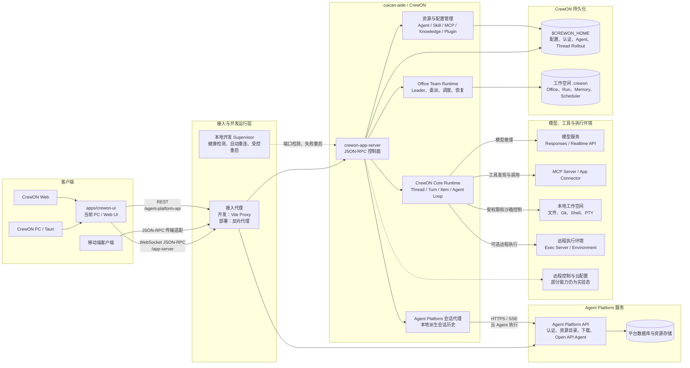
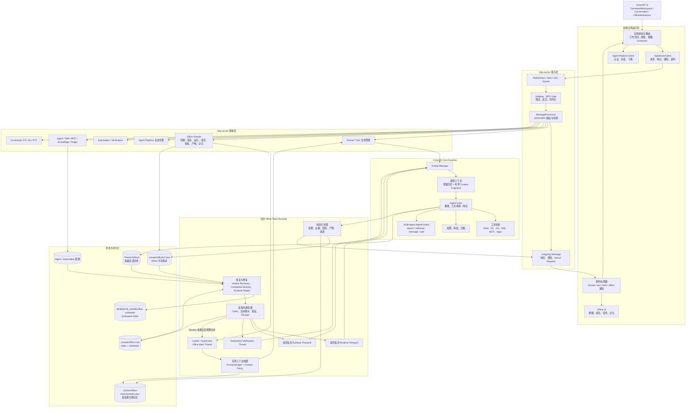
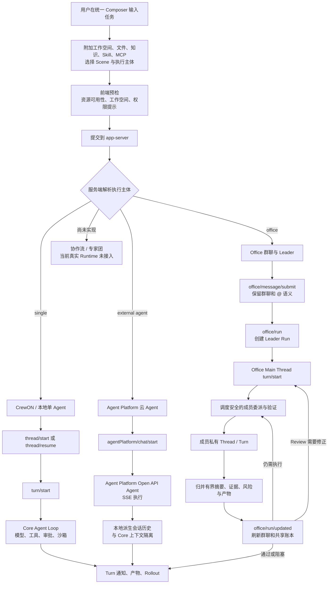
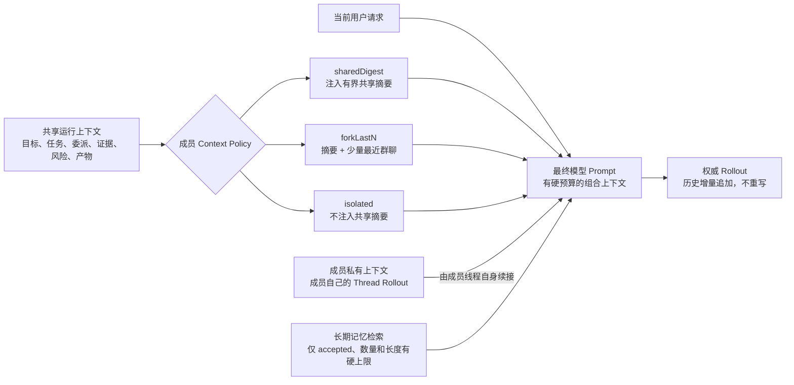
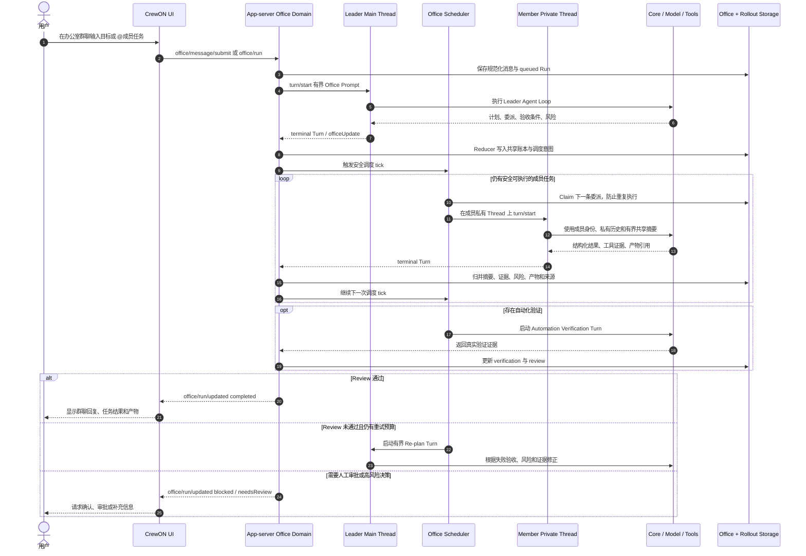
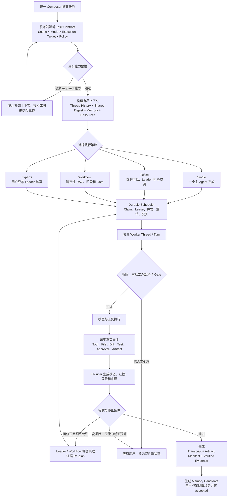
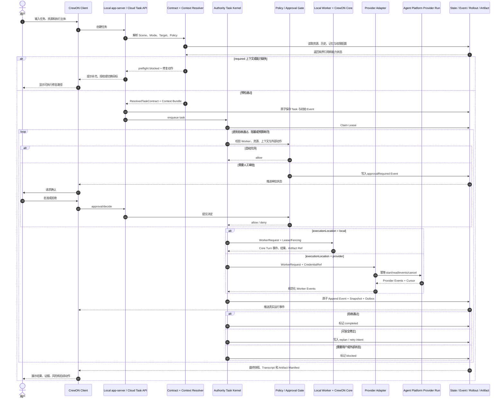
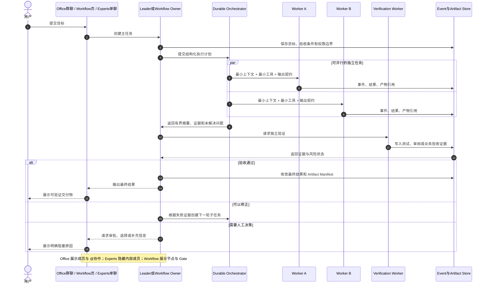

# CrewON 当前与未来总体架构设计

更新时间：2026-07-19

> [!IMPORTANT]
> 本文的“当前”部分仍用于记录 2026-07-19 的实现基线；“未来”部分已被
> `ARCHITECTURE_FINAL.md` 取代。后续目标架构、技术选型和完成 Gate 以最终态文档及
> `artifacts/architecture-next/` 下的 ADR 为准，本文不再作为新增功能的目标设计依据。

Wave、SDD 产物、Harness 和任务提示词见 <code>artifacts/crewon-platform-wave-sdd-execution-guide.md</code>。

本文以当前仓库真实代码为基线，分别描述：

- 当前跨服务总体架构。
- 当前 CrewON 本服务内部架构。
- 当前单 Agent、云 Agent 和办公室的核心执行流程。
- 当前办公室执行泳道。
- 未来目标总体架构与内部模块边界。
- 未来统一任务执行流程与跨服务泳道。

图中“当前”表示已经存在真实代码或真实 RPC；“未来”表示推荐目标设计，不代表已经实现。

完整中台安全与正确性规则以 `artifacts/crewon-platform-security-correctness-baseline.md` 为准；本文件负责说明当前事实、目标结构、执行流程和泳道。

## 一、当前总体架构

### 1.1 当前跨服务架构

当前跨服务边界：

- 前端通过 app-server 执行 Thread、Turn、Office、Automation 和本地工具能力。
- 前端直接通过 Agent Platform REST API 完成登录、目录读取、资源下载和部分平台资源调用。
- 云 Agent 的执行请求由 app-server 代理到 Agent Platform，平台密钥不暴露给前端。
- Agent Platform 云 Agent 的派生会话历史独立保存，不注入 CrewON Core 的本地模型上下文。
- Office 配置与共享运行账本属于工作空间；普通 Thread Rollout 和用户级配置属于 `$CREWON_HOME`。

当前必须优先修正的中台安全缺口：

- Agent Platform Open Agent API 验证 Space API Key 后，Agent 查询仍需绑定同一 tenant/space/resource ownership。
- UI 仍执行部分 Provider MCP/KB Dynamic Tool；服务端接管时必须同时删除 UI 执行路径。
- 新 API 的 Actor、memberId、Workspace Root 和 Credential owner 必须由服务端派生，不能扩散当前客户端 JSON 配置模式。
- Office 迁移前必须给所有旧 dispatch/写入入口增加 migration fence，并处理活动旧 Run。

### 1.2 当前 CrewON 本服务内部架构

当前实现坚持两个重要边界：

1. Office 不创建第二套模型循环，真实执行继续复用 Thread、Turn、Agent Loop、工具、审批和沙箱。
2. Office JSON 是有界共享账本，不是完整聊天记录；Leader 和成员私有线程的 Rollout 才是权威会话历史。

当前图用于说明事实，不代表旧 Office JSON、前端 Agent Platform 直连或 one-shot 会话代理应进入未来架构。未来实现不会围绕这些路径新增 Facade 或双写。

## 二、当前核心功能执行流程

### 2.1 当前统一任务入口与执行分支

### 2.2 当前上下文组装与压缩流程

当前所谓“上下文压缩”不是反复重写完整历史，而是：

- 保留 Thread Rollout 的增量历史。
- 为每次运行构建有硬上限的共享摘要。
- 按成员策略决定是否加入最近群聊片段。
- 从长期记忆中只检索已接受、与当前任务相关的少量事实。
- 长内容通过文件、产物或证据引用传递，不复制到 Office JSON。

## 三、当前办公室执行泳道图

## 四、当前能力完成度

| 能力                    | 当前状态 | 当前边界                                                 |
| ----------------------- | -------- | -------------------------------------------------------- |
| 单 Agent 会话           | 已接入   | 正常 Thread / Turn / Item Runtime                        |
| Agent Platform 云 Agent | 已接入   | app-server 代理执行，本地保存有界派生历史                |
| Office                  | 已接入   | 群聊、Leader、成员委派、审批、产物、记忆、恢复           |
| Office 自动恢复         | 已接入   | app-server 运行时可恢复；进程停止期间模型执行不会继续    |
| 协作流                  | 未接入   | 前端入口禁用，没有真实列表、创建和运行 API               |
| 专家团                  | 未接入   | 定位为单聊 Leader 接口，但没有真实定义和后台成员 Runtime |
| 独立 Durable Worker     | 未接入   | Scheduler 仍由 app-server 进程驱动                       |

## 五、未来目标总体架构

### 5.1 未来跨服务目标架构

```mermaid
flowchart TB
    subgraph Clients["多端客户端"]
        PC["PC / Tauri"]
        Web["Web"]
        Mobile["Mobile"]
        SharedUI["统一任务、会话、办公室、协作流、专家团 UI"]
        PC --> SharedUI
        Web --> SharedUI
        Mobile --> SharedUI
    end

    subgraph ControlPlane["CrewON 控制与领域层"]
        AppServerV2["Local app-server v2<br/>JSON-RPC + localNode authority"]
        CloudTaskAPI["Cloud Task API<br/>Cloud transport + cloudControl authority"]
        ContractResolver["Task Contract Resolver<br/>Scene × Mode × Target × Policy"]
        ResourceFederation["Resource Federation<br/>Provider、Binding、Version"]
        ProviderAdapters["Provider Adapter Registry<br/>Capability、Auth、Event Mapping"]
        ContextAssembler["Context Assembler<br/>Typed Fragment、预算、检索、审计"]
        PolicyGate["Policy / Approval Gate<br/>本地权限、外部动作、人工确认"]
        ArtifactService["Artifact Manifest<br/>产物、版本、来源、校验指纹"]
    end

    subgraph OrchestrationPlane["统一任务编排领域"]
        LocalKernel["Local Task Kernel<br/>SQLite、Lease、恢复"]
        CloudKernel["Cloud Task Orchestrator<br/>Postgres、Queue、Node Lease"]
        Strategy["封闭 StrategyKind<br/>exhaustive match"]
        SingleStrategy["Single Strategy"]
        OfficeStrategy["Office Strategy<br/>可见群聊与 @成员"]
        WorkflowStrategy["Workflow Strategy<br/>DAG、阶段、Gate"]
        ExpertsStrategy["Experts Strategy<br/>Leader 单聊、隐藏内部协作"]
        Verification["Verification / Review Engine<br/>验收、证据、风险、停止条件"]
    end

    subgraph LocalExecution["本地执行平面"]
        LocalWorker["Local Worker Executor"]
        CoreRuntime["CrewON Core<br/>Agent Loop、Tools、MCP、Sandbox"]
        Workspace["Workspace / Git / Files / Shell"]
    end

    subgraph AgentPlatform["Agent Platform Provider"]
        APCatalog["Auth + Agent / Skill / MCP / KB / Workflow Catalog"]
        APProviderRun["Durable Provider Run<br/>幂等、事件、取消、恢复"]
        APRuntime["Cloud Agent / Skill / MCP / KB / Workflow Runtime"]
    end

    subgraph External["其他外部提供方"]
        OtherProviders["Other Agent / MCP / SaaS Providers"]
        ModelProvider["Model Provider"]
        MCPApps["MCP / Apps / Connectors"]
    end

    subgraph DataPlane["持久化与事件平面"]
        LocalState[("crewon-state / state_5.sqlite<br/>Task、Event、Lease、Outbox")]
        CloudState[("Cloud Task / Event / Queue / Outbox")]
        RolloutStore[("Thread Rollout Store")]
        ArtifactStore[("Artifact / Object Store")]
        MemoryStore[("Governed Memory + Retrieval Index")]
        Observability["Trace / Metrics / Audit Log"]
    end

    SharedUI -->|"localNode task"| AppServerV2
    SharedUI -->|"cloudControl task"| CloudTaskAPI
    AppServerV2 --> ContractResolver
    CloudTaskAPI --> ContractResolver
    ContractResolver --> ResourceFederation
    ContractResolver --> ContextAssembler
    ContractResolver --> PolicyGate
    AppServerV2 --> LocalKernel
    CloudTaskAPI --> CloudKernel
    LocalKernel --> Strategy
    CloudKernel --> Strategy
    Strategy --> SingleStrategy
    Strategy --> OfficeStrategy
    Strategy --> WorkflowStrategy
    Strategy --> ExpertsStrategy
    LocalKernel --> Verification
    CloudKernel --> Verification

    LocalKernel --> LocalWorker --> CoreRuntime
    CoreRuntime --> ModelProvider
    CoreRuntime --> MCPApps
    CoreRuntime --> Workspace
    LocalKernel --> ProviderAdapters
    CloudKernel --> ProviderAdapters
    ResourceFederation --> APCatalog
    ResourceFederation --> ProviderAdapters
    ProviderAdapters --> APProviderRun --> APRuntime
    ProviderAdapters --> OtherProviders

    LocalKernel --> LocalState
    CloudKernel --> CloudState
    CoreRuntime --> RolloutStore
    ContextAssembler --> MemoryStore
    ArtifactService --> ArtifactStore
    Verification --> ArtifactService

    AppServerV2 --> Observability
    CloudTaskAPI --> Observability
    LocalKernel --> Observability
    CloudKernel --> Observability
    CoreRuntime --> Observability
    LocalState --> AppServerV2 --> SharedUI
    CloudState --> CloudTaskAPI --> SharedUI
```

未来目标不是拆出多套 Agent 引擎，而是形成三层稳定边界：

1. Local 与 Cloud 共享领域契约和 Strategy，但分别实例化 Identity、Workspace、Context、Policy 和 Authority；单个 Task 两侧不双写。
2. 控制面负责 API、身份、契约、资源、凭据、上下文、权限和审计；编排内核负责状态机、恢复、重试和验证。
3. Local Worker 复用 CrewON Core；Cloud Worker 通过 Provider Adapter 调用 Agent Platform Durable Run，不复制模型循环。
4. State 只通过鉴权后的 app-server/Cloud Task API 和事件协议到达 UI，数据存储不直接连接客户端。

### 5.2 未来本服务内部模块设计

```mermaid
flowchart LR
    Request["Task Request"]
    Identity["RequestIdentity<br/>Tenant、Space、Actor"]
    Workspace["WorkspaceRegistry<br/>Key、Node、Permission"]
    Resource["ResourceBindingResolver"]
    Credential["CredentialRef Resolver"]
    Resolver["TaskContractResolver"]
    Contract["ResolvedTaskContract<br/>scene、mode、target、workspace、policy、deliverable"]
    ContextAssembler["ContextAssembler<br/>有界 Typed Fragments"]
    Policy["Policy + ApprovalDigest"]
    Orchestrator["TaskOrchestrator"]
    EventReducer["Canonical Event Reducer"]
    TaskStorePort["TaskStore Port"]
    StateAdapter["TaskStateStoreAdapter"]
    StateRuntime["crewon-state<br/>single SQLite lifecycle"]
    ProviderPort["Provider Ports"]
    ProviderAdapter["Agent Platform Adapter"]
    Audit["Audit / Trace / Retention"]
    Result["Task Snapshot + Artifact Manifest"]

    subgraph Strategies["封闭 StrategyKind + exhaustive match"]
        Single["DurableSingleStrategy"]
        Office["OfficeExecutionStrategy"]
        Workflow["WorkflowExecutionStrategy"]
        Experts["ExpertsExecutionStrategy"]
    end

    subgraph CommonRuntime["共享运行能力"]
        ThreadRuntime["Thread / Turn Runtime"]
        ToolRuntime["Tool / MCP / Skill Runtime"]
        PermissionRuntime["Permission / Approval / Sandbox"]
        VerificationRuntime["Verification / Review"]
        ArtifactRuntime["Artifact / Evidence"]
        MemoryRuntime["Governed Memory Retrieval"]
    end

    Request --> Identity
    Identity --> Workspace --> Resolver
    Identity --> Credential --> Resource --> Resolver
    Resolver --> Contract
    Contract --> ContextAssembler --> Policy --> Orchestrator
    Orchestrator --> Single
    Orchestrator --> Office
    Orchestrator --> Workflow
    Orchestrator --> Experts

    Single --> ThreadRuntime
    Office --> ThreadRuntime
    Workflow --> ThreadRuntime
    Experts --> ThreadRuntime

    ThreadRuntime --> ToolRuntime
    ThreadRuntime --> PermissionRuntime
    ThreadRuntime --> VerificationRuntime
    ThreadRuntime --> ArtifactRuntime
    ContextAssembler --> MemoryRuntime

    ThreadRuntime --> EventReducer
    ToolRuntime --> EventReducer
    PermissionRuntime --> EventReducer
    VerificationRuntime --> EventReducer
    ArtifactRuntime --> EventReducer
    EventReducer --> Result
    Result --> Audit
    Orchestrator --> TaskStorePort --> StateAdapter --> StateRuntime
    Orchestrator --> ProviderPort --> ProviderAdapter
```

建议通过稳定接口降低耦合：

- `TaskContractResolver` 只负责把用户选择和服务端 Registry 解析成不可变任务契约。
- `RequestIdentity`、Workspace Root、Credential owner 和 Actor 全部由服务端解析，不能信任 Client Params。
- `TaskOrchestrator` 只协调状态，不直接实现模型循环。
- 第一版使用封闭 Strategy enum；普通本地单聊保留 Thread/Turn，但复用相同 Identity、Workspace、Resource、Context、Policy、Artifact 和 Audit。
- 所有运行变化进入统一事件模型，再由 Reducer 生成客户端快照。
- 长内容保存在 Rollout 或 Artifact Store，状态快照只保存摘要、引用、哈希和来源。
- 本地 Task 复用 `crewon-state` 的数据库生命周期；领域 Port 由 app-server Adapter 映射，不让 `crewon-state` 依赖 Task Runtime。
- Provider Adapter 只实现 Provider 协议，不依赖 Task Runtime；Provider Event 到 Task Event 的映射留在组合层。

## 六、未来核心功能执行流程

### 6.1 未来统一任务执行流程

### 6.2 四种执行模式的目标差异

| 模式     | 用户界面    | 编排方式            | 成员可见性            | 典型 Gate                  | 最终收敛者               |
| -------- | ----------- | ------------------- | --------------------- | -------------------------- | ------------------------ |
| Single   | 单聊        | 单主线程            | 无成员概念            | 权限与外部动作             | 主 Agent                 |
| Office   | 群聊        | Leader 动态委派     | 成员、@任务和回复可见 | 审批、高风险委派、外部动作 | Leader                   |
| Workflow | 流程运行页  | 确定性 DAG / 状态机 | 按节点展示执行者      | 节点 Gate、人工确认、验收  | Workflow Reducer / Owner |
| Experts  | Leader 单聊 | Leader 隐式分派专家 | 内部成员默认隐藏      | 高风险结论、外部动作       | Leader                   |

## 七、未来跨服务执行泳道图

## 八、未来 Office / Workflow / Experts 内部协作泳道

## 九、推荐演进顺序

| 阶段                       | 目标                         | 关键交付                                                              | 不做的事情                                      |
| -------------------------- | ---------------------------- | --------------------------------------------------------------------- | ----------------------------------------------- |
| P0 Platform Contract       | 冻结完整中台安全与领域边界   | Identity/Tenant/Actor、Workspace、Credential、Resource、Event、Error  | 不加临时 API、可伪造身份或新执行入口            |
| P1 Local Platform Kernel   | 建立所有消费者共享的本地内核 | app-server v2、Registry、Context、Policy、Artifact、Audit、Task/State | 不复制认证、Context、沙箱或数据库生命周期       |
| P2 Provider Control Plane  | 建立安全的外部资源和执行控制 | Provider Connection、Catalog、CredentialRef、Durable Run、Adapter     | 不包装 one-shot、不让 UI 保存 Secret 或执行资源 |
| P3 First Consumers         | 用真实消费者验证中台         | 普通 Single 共享能力、Durable Cloud Agent、Office fence/迁移          | 不同时铺开 Workflow/Experts/Cloud Authority     |
| P4 Collaboration Consumers | 扩展协作消费者               | Workflow、Experts、Automation/Schedule 复用 Task/Policy/Artifact      | 不复制 Office 状态机或专用安全逻辑              |
| P5 Cloud Authority         | 支持跨设备与后台执行         | Cloud Task Store、Queue、Node Lease、事件流、混合本地/云 Worker       | 无真实需求证据前不创建空服务或空表              |
| P6 Secure Bridge           | 最小化开放本地能力           | Context Export、Tool Bridge、Action Digest、逐次审批和跨边界审计      | 不上传 Workspace、不开放任意 Shell              |

## 十、架构决策摘要

1. Scene 和执行主体继续保持正交，客户端不能通过布尔值伪造 Team Runtime。
2. 单聊工作空间与 Office 群聊工作空间保持独立，Experts 继续属于单聊边界。
3. Office、Workflow、Experts 共享 Thread、Turn、Tool、MCP、Approval、Sandbox 和 Artifact Runtime。
4. Office 使用可见群聊与成员委派；Workflow 使用确定性节点和 Gate；Experts 使用 Leader 单聊与隐藏内部协作。
5. 上下文历史增量追加，不由编排器或子 Agent 重写。
6. Worker 上下文、单项返回、检索记忆和共享摘要都有硬上限。
7. 所有可见运行状态来自真实事件，不生成假阶段、假百分比或假完成消息。
8. 外部动作和高风险操作必须经过服务端 Policy Gate，不能依赖前端提示词约束。
9. Actor、Tenant、Space、Workspace Root、Credential owner 和成员身份全部由服务端解析。
10. 一个 Aggregate 任一时刻只有一个可写权威；Office 迁移必须 quiesce 活动旧 Run，禁止双写与 silent fallback。
11. 本地 Task 复用 `crewon-state`，Cloud Task 使用云 Store；二者共享领域契约，不共享物理数据库或运行时权威。
12. 普通 Single 不强制迁入 Task Runtime，但必须使用完整中台的 Identity、Workspace、Resource、Context、Policy、Artifact 和 Audit。
13. Provider Run 未具备全接口租户授权、幂等、续读、取消和恢复前，不迁移 Cloud Agent。
14. 即使未来拆出执行平面，也不实现第二套模型循环：本地继续复用 CrewON Core，云端复用 Agent Platform Runtime。
