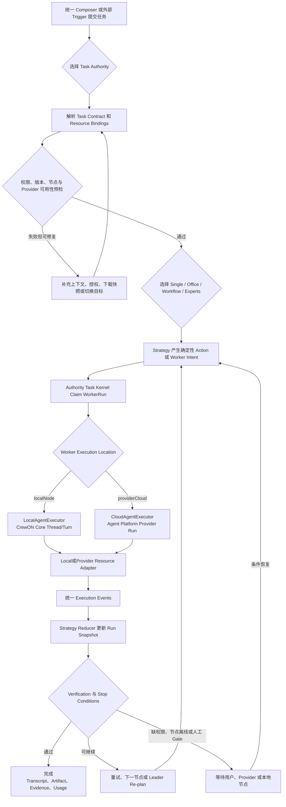
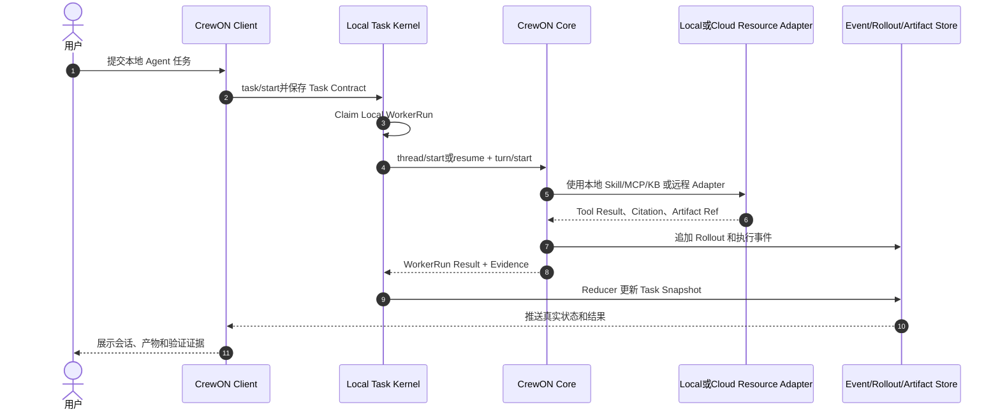
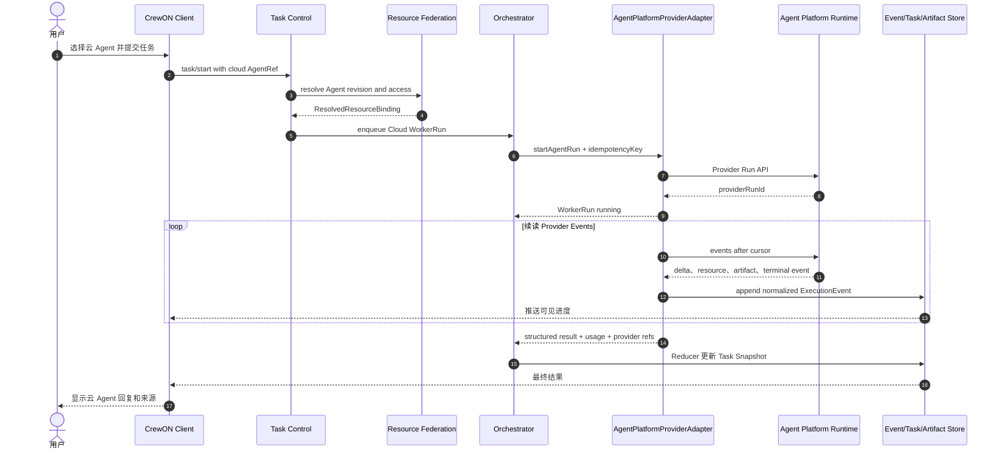
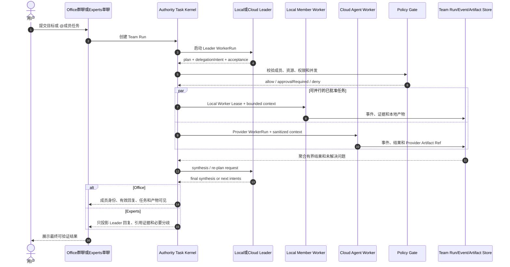
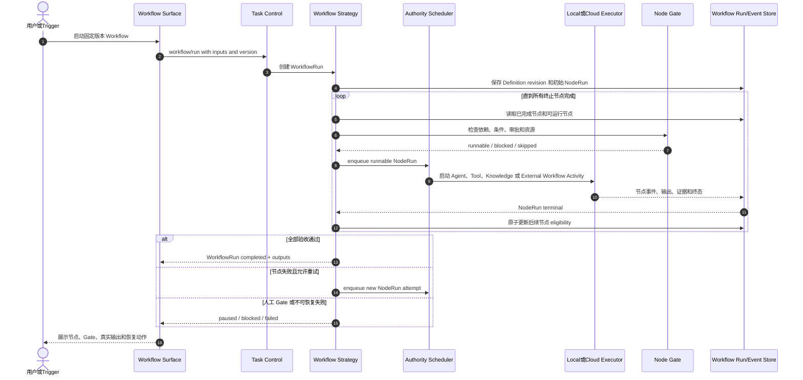

# CrewON 完整 Agent 中台与团队协作终态架构设计

更新时间：2026-07-19  
状态：终态目标设计  
适用范围：CrewON PC、Web、Mobile、本地 app-server、云端任务编排、Agent Platform 资源与托管执行

Wave、SDD 产物、Harness 和任务提示词见 <code>artifacts/crewon-platform-wave-sdd-execution-guide.md</code>。

## 1. 文档目标

本文定义 CrewON 完整 Agent 中台的终态架构，不把 Agent Team 或当前实现当成平台边界。设计覆盖：

- 本地 Agent 与云 Agent 的统一调用模型。
- Agent Platform 中 Agent、Skill、MCP、知识库和 Workflow 的接入方式。
- Single、Office、Workflow、Experts 四种执行策略。
- 本地工作空间与云端执行之间的权限、上下文和数据边界。
- 持久任务编排、故障恢复、事件、产物、记忆和可观测性。
- PC、Web、Mobile 在同一任务模型下的接入方式。
- 身份、租户、Workspace、Provider、Credential、Resource、Policy、Artifact、Audit 和 Retention 等所有消费者共享的中台能力。

安全与正确性规范见 `artifacts/crewon-platform-security-correctness-baseline.md`；当前实现与迁移路径见 `artifacts/crewon-system-architecture-current-future.md`；模块、接口和并行开发拆解见 `artifacts/crewon-terminal-module-detailed-design.md`。本文描述完整终态目标、权威边界和不可破坏的迁移不变量。

## 2. 终态核心结论

1. CrewON 是任务与团队协作控制面，Agent Platform 是云资源与托管执行提供方，两者不互相侵入领域状态。
2. 本地 Agent 和云 Agent 实现同一 `WorkerExecutor` 契约，但模型循环分别由 CrewON Core 和 Agent Platform Runtime 所有。
3. Office、Workflow、Experts 共享任务、事件、权限、上下文、Worker、产物和验证底座，但拥有不同的领域状态机。
4. 用户任务和团队 Run 的权威状态始终属于 CrewON；外部 Agent 只能返回事件、结果和编排意图，不能直接修改 CrewON Run。
5. 资源的“发现位置”“执行位置”和“绑定方式”必须分开建模，不能用一个 `downloaded` 布尔值表达。
6. Skill 可以本地安装或远程执行；MCP 默认在拥有凭据的一侧执行；云知识库默认远程检索；云 Agent 默认远程引用。
7. 云 Agent 默认不能直接读取本地文件或调用本地工具，只能接收经过策略检查的有界 Context Export 或受控 Tool Bridge。
8. 所有外部动作、共享写入、发布、推送和破坏性操作都经过 CrewON Policy Gate。
9. 历史上下文增量追加；Worker 只获得完成子任务所需的有界摘要、资源引用和权限。
10. 终态支持本地权威任务与云端权威任务，但单个 Task 创建后不能在运行中切换权威位置。
11. Provider 必须在启动 Run 的同一授权事务内校验用户、Space、资源和 Scope；服务凭据不能代替用户授权。
12. Lease 接管必须携带 fencing token；Task 事件必须同时具有 Worker 顺序和可续读的 Task Stream Offset。
13. 一个 Aggregate 任一时刻只有一个可写权威；禁止双写、静默降级、重复数据库和无期限兼容层。
14. 单聊与 Office 使用不同 Workspace Binding；Experts 属于单聊边界，即使路径相同也不能复用群聊的上下文和记忆作用域。
15. 普通本地单聊不强制迁入 Task Runtime，但必须使用统一 Identity、Workspace、Resource、Credential、Context、Policy、Artifact 和 Audit。
16. 完整中台按最小纵向闭环实现；没有真实消费者的 Cloud Authority、Tool Bridge 或多 Provider 插件系统不提前开发。

## 3. Agent Platform 参考基线

终态设计参考 Agent Platform 当前真实代码，而不是只参考其微服务规划文档。

### 3.1 当前可复用能力

| Agent Platform 能力 | 当前实现锚点                                                                                        | CrewON 终态用途                     |
| ------------------- | --------------------------------------------------------------------------------------------------- | ----------------------------------- |
| 用户认证与空间隔离  | `/api/v1/auth/me`、Space、资源访问过滤                                                              | Provider 登录、资源授权与审计身份   |
| Agent 配置          | `Agent.system_prompt`、`model_id`、`skill_ids`、`mcp_servers`、`knowledge_base_ids`、`workflow_ids` | 云 Agent Manifest 与依赖关系        |
| Agent Open API      | `/open/agent/{id}/chat`、`chat/stream`、`info`                                                      | 既有临时调用；不接入新 Task Runtime |
| Workflow Open API   | `/open/workflow/{id}/execute`、`execute/stream`                                                     | ExternalWorkflowActivity            |
| Skill               | 多文件目录、`SKILL.md`、脚本、模板、示例、Zip 下载                                                  | 本地不可变快照或远程 Skill Executor |
| MCP Runtime         | local stdio、remote stdio、SSE、WebSocket                                                           | CloudMcpExecutor 与工具目录         |
| 知识库              | 文档、Chunk、Milvus、混合检索、检索日志                                                             | CloudKnowledgeRetriever             |
| CrewON Catalog      | live/snapshot 目录、详情、下载记录、远程代理调用                                                    | AgentPlatformProviderAdapter        |
| 调用链保护          | `X-Call-Chain` cycle detection                                                                      | 跨 Agent、Workflow 嵌套调用防环     |
| 并发控制            | Agent/Workflow semaphore、429、Retry-After                                                          | Provider admission 与退避策略       |

### 3.2 必须纠正的语义

Agent Platform Catalog 的 `download` 表示在 Agent Platform 侧为账号保存资源副本或下载记录，不等同于资源已经安装到 CrewON 本地 Runtime。

终态统一使用以下术语：

- `remoteReference`：保留云资源引用，运行时通过 Provider 调用。
- `localSnapshot`：下载不可变、可校验的资源版本到 CrewON Resource Cache。
- `localFork`：从云资源创建用户可编辑的本地副本，并保留来源信息。
- `providerManaged`：资源只允许在 Provider 内部由云 Agent 使用。

### 3.3 当前接口的终态准入边界

- 当前 Open API 是同步/SSE one-shot 接口，不是 Durable Provider Run；不能承担 Office Leader、Experts Leader、可恢复 Workflow 节点或跨设备任务。
- CrewON 当前发送的历史与 Agent Platform Open API 的实际请求模型不一致，终态不能把现有 `chat` 当作稳定多轮会话权威。
- 当前 Space API Key 与用户资源校验是分离请求。终态 `startAgentRun` 必须在 Provider 内部原子校验 `tenant/space + subject + resource + scopes`。
- Provider 不具备 `durableRun`、`resumableEvents`、`persistentConversation` 能力时，新 Task Admission 必须 fail-closed；不得包装或降级为 one-shot。

终态 User Delegation 至少包含 `issuer`、`audience`、`subject`、`tenantId`、`spaceId`、`resourceId`、`scopes`、`purpose`、`issuedAt`、`expiresAt` 和 `jti`。

Provider 保存实际授权决策和 Delegation `jti`；CrewON 传入的 `accessDecisionId` 只用于关联审计，不能替代 Provider 自己的权限判断。

## 4. 终态总体架构

```mermaid
flowchart TB
    subgraph Clients["客户端"]
        PC["CrewON PC / Tauri"]
        Web["CrewON Web"]
        Mobile["CrewON Mobile"]
        UnifiedUI["Single、Office、Workflow、Experts、Automation UI"]
        PC --> UnifiedUI
        Web --> UnifiedUI
        Mobile --> UnifiedUI
    end

    subgraph SharedPlatform["共享中台领域能力，在 Local 与 Cloud 分别实例化"]
        Identity["Identity / Tenant / Actor"]
        WorkspaceRegistry["Workspace / Node / Environment Registry"]
        ResourceFederation["Provider / Resource / Binding / Revision"]
        ContractResolver["Contract Resolver<br/>Scene × Mode × Target × Policy"]
        ContextService["Typed Context / Memory Governance"]
        PolicyGate["Policy / Approval / Action Digest"]
        Strategies["封闭 Execution Strategies<br/>Durable Single / Office / Workflow / Experts"]
        Verification["Verification / Review Engine"]
        ArtifactService["Artifact / Evidence / Citation"]
        AuditService["Audit / Trace / Cost / Retention"]
        ProviderAdapters["Provider Adapters<br/>Capability、Auth、Event Mapping"]
    end

    subgraph CloudControl["CrewON 云控制面"]
        Gateway["Session Gateway<br/>鉴权、限流、流式事件"]
        TaskAPI["Cloud Task API"]
        Orchestrator["Durable Task Orchestrator<br/>Lease、幂等、重试、恢复"]
        CredentialVault["Credential Vault<br/>用户授权、服务凭据、短期令牌"]
    end

    subgraph LocalNode["CrewON 本地节点"]
        AppServer["crewon-app-server<br/>本地控制与 v2 API"]
        LocalCredentialStore["OS Credential Store"]
        LocalTaskKernel["Local Task Kernel<br/>Event、Reducer、Lease、Recovery"]
        LocalWorker["Local Worker Executor"]
        CoreRuntime["CrewON Core Runtime<br/>Thread、Turn、Agent Loop"]
        LocalTools["Local Tools<br/>FS、Git、Shell、PTY、Local MCP"]
        LocalResourceCache["Local Resource Cache<br/>Skill Snapshot、Manifest、Checksum"]
        LocalWorkspace["Workspace<br/>项目文件与本地产物"]
        LocalStateDb[("crewon-state / state_5.sqlite<br/>Task、Event、Lease、Outbox")]
    end

    subgraph AgentPlatform["Agent Platform Provider"]
        APAuth["Auth / Space / Permission"]
        APCatalog["Agent、Skill、MCP、KB、Workflow Catalog"]
        APProviderRun["Durable Provider Run<br/>幂等、事件、取消、恢复"]
        APAgentRuntime["Cloud Agent Runtime"]
        APSkillRuntime["Cloud Skill Runtime"]
        APMcpRuntime["Cloud MCP Runtime"]
        APKBRuntime["Cloud Knowledge Retrieval"]
        APWorkflowRuntime["Cloud Workflow Runtime"]
    end

    subgraph Providers["其他外部提供方"]
        Models["Model Providers"]
        OtherAgents["Other Agent Providers"]
        ExternalMCP["External MCP / Apps"]
        SaaS["Enterprise SaaS / APIs"]
    end

    subgraph DataPlane["CrewON 数据与事件平面"]
        CloudTaskStore[("Cloud Task / Event / Queue / Outbox")]
        RolloutStore[("Thread Rollout Store")]
        ArtifactStore[("Artifact Store")]
        MemoryStore[("Governed Memory Store")]
        AuditStore[("Audit / Trace / Metrics")]
    end

    UnifiedUI -->|"cloudControl Task"| Gateway --> TaskAPI
    UnifiedUI -->|"localNode / ordinary Turn"| AppServer
    TaskAPI --> Identity
    AppServer --> Identity
    Identity --> WorkspaceRegistry --> ContractResolver
    Identity --> ResourceFederation --> ContractResolver
    ContractResolver --> ContextService --> PolicyGate
    PolicyGate -->|"cloudControl"| Orchestrator
    PolicyGate -->|"local durable task"| LocalTaskKernel
    PolicyGate -->|"ordinary local Turn"| CoreRuntime
    Orchestrator --> Strategies
    LocalTaskKernel --> Strategies
    Strategies --> Verification --> ArtifactService --> AuditService

    Gateway <--> AppServer
    Orchestrator -->|"Local Worker Lease"| AppServer
    LocalTaskKernel --> LocalWorker --> CoreRuntime
    AppServer -->|"cloudControl lease"| LocalWorker
    LocalTaskKernel --> LocalStateDb
    CoreRuntime --> LocalTools
    CoreRuntime --> LocalWorkspace
    CoreRuntime --> LocalResourceCache
    CoreRuntime --> Models

    Identity --> LocalCredentialStore --> ProviderAdapters
    Identity --> CredentialVault --> ProviderAdapters
    ResourceFederation --> APCatalog
    ResourceFederation --> APAuth
    ResourceFederation --> ProviderAdapters
    Orchestrator -->|"Cloud Worker Request"| ProviderAdapters
    LocalTaskKernel -->|"Cloud Worker Request"| ProviderAdapters
    ProviderAdapters --> APProviderRun --> APAgentRuntime
    ProviderAdapters --> APSkillRuntime
    ProviderAdapters --> APMcpRuntime
    ProviderAdapters --> APKBRuntime
    ProviderAdapters --> APWorkflowRuntime

    ResourceFederation --> OtherAgents
    ProviderAdapters --> OtherAgents
    CoreRuntime --> ExternalMCP
    PolicyGate --> SaaS

    Orchestrator --> CloudTaskStore
    CoreRuntime --> RolloutStore
    ArtifactService --> ArtifactStore
    ContextService --> MemoryStore
    TaskAPI --> AuditStore
    Orchestrator --> AuditStore
    AppServer --> AuditStore
    CloudTaskStore --> TaskAPI --> Gateway --> UnifiedUI
    LocalStateDb --> AppServer --> UnifiedUI
```



## 5. 任务权威位置与部署模式

### 5.1 Task Authority

每个 Task 创建时固定 `authority`：

| Authority      | 权威状态位置                 | 使用场景                            | 云 Agent               | 跨设备 | app-server 停止后的行为                    |
| -------------- | ---------------------------- | ----------------------------------- | ---------------------- | ------ | ------------------------------------------ |
| `localNode`    | 本地 app-server 与本地状态库 | 离线、隐私、本机项目和本机 Team Run | 可调用，但调度依赖本机 | 否     | 整体暂停，恢复后继续                       |
| `cloudControl` | CrewON Cloud Task Store      | 跨设备 Office、Workflow、Experts    | 完整支持               | 是     | 云 Worker 可继续；本地步骤阻塞等待节点恢复 |

约束：

- Task 运行中不切换 authority。
- 需要切换时创建新 Task，只携带有界摘要和 Artifact Ref。
- 绑定本地工作空间的云权威 Task，不上传整个工作空间；本地节点只执行明确的 Worker Lease。
- `localNode` 使用 app-server 内的 Local Task Kernel、Local Task Store 和 Local Event Store，断网时不依赖 CrewON Cloud。
- `cloudControl` 使用云端 Task Kernel；此时 app-server 只是 Node Executor，不能修改云端 Run 的权威状态。

### 5.2 逻辑组件与物理部署

- `TaskKernel`、`TaskAPI`、`ResourceFederation`、`ContextService` 和 `Orchestrator` 是逻辑边界；TaskKernel 以同一领域契约部署到本地或云端。
- 初期可以部署在同一服务进程，终态可以独立伸缩，但 API 和数据所有权不变。
- 本地 app-server 是 Local Node Agent，不是云端 Team Run 的第二个权威控制面。
- Agent Platform 不保存 CrewON Office、Experts 或 Task Run 主状态。

## 6. 统一资源联合模型

### 6.1 Provider 与 ResourceRef

```text
ResourceProvider
  providerId
  providerType
  providerProtocolVersion
  manifestSchemaVersions
  eventSchemaVersions
  discoveryEndpoint
  authScheme
  capabilities

ResourceRef
  providerId
  resourceType
  resourceId
  displayName
  sourceRevision
  sourceVersion
  providerScopeRef

ResolvedResourceBinding
  bindingId
  resourceRef
  bindingMode
  executionLocation
  versionPolicy
  resolvedRevision
  checksum
  credentialRef
  requiredScopes
  accessDecisionId
  manifestSchemaVersion
  capabilitySnapshot
```

`resourceType` 分成稳定核心类型和命名空间扩展类型。核心代码对核心类型保持 exhaustive match；未知扩展只能由声明支持它的 Provider Adapter 处理。

```text
Core: agent | skill | mcpServer | mcpTool | knowledgeBase | workflow | application
Extension: <providerNamespace>/<type>, 例如 agent-platform/dataset
```

### 6.2 三个相互独立的维度

| 维度               | 可选值                                                                | 含义                   |
| ------------------ | --------------------------------------------------------------------- | ---------------------- |
| Discovery Location | `local` / `provider`                                                  | 资源在哪里被发现和管理 |
| Execution Location | `localNode` / `providerCloud`                                         | 资源真正在哪里执行     |
| Binding Mode       | `remoteReference` / `localSnapshot` / `localFork` / `providerManaged` | CrewON 如何绑定该资源  |

不能再通过名字前缀、`downloaded`、前端布尔值或是否存在本地文件推断执行位置。

### 6.3 资源类型的终态策略

| 资源      | 本地方式                                          | 云端方式                                       | 默认策略                                           |
| --------- | ------------------------------------------------- | ---------------------------------------------- | -------------------------------------------------- |
| Agent     | CrewON Agent Manifest + Core Runtime              | Agent Platform Managed Agent                   | 云 Agent 默认 `remoteReference`                    |
| Skill     | 校验后的不可变 Skill Bundle，在本地沙箱读取或执行 | Provider Skill Executor，或由云 Agent 内部使用 | 有脚本的 Skill 默认显式选择执行位置                |
| MCP       | app-server 管理 stdio/SSE/WS 连接                 | Agent Platform MCP Gateway 执行 Tool           | 凭据留在拥有方，不复制 Secret                      |
| Knowledge | 本地文件/索引检索                                 | Agent Platform Knowledge Search                | 云知识库默认远程检索                               |
| Workflow  | CrewON WorkflowDefinition + Durable Scheduler     | Agent Platform Workflow Open API               | 作为本地定义或 External Activity，不能混为同一 Run |

### 6.4 Resource Binding 解析流程

固定解析顺序为：用户选择资源 → Federation 读取版本化 Manifest → 原子验证用户、Space、资源与 Scope → 选择允许的 Binding Mode → 下载/扫描/固定版本或保存远程引用 → 生成 `ResolvedResourceBinding` → 写入不可变 Task Contract。任何步骤失败都不能生成可执行 Binding。

### 6.5 版本和更新规则

- Task 创建时解析资源版本，Run 内固定，不自动升级。
- `pinned` 使用精确 revision/checksum；`latestCompatible` 只在新 Task 解析。
- Skill Snapshot 必须包含 manifest、文件列表、总大小、SHA-256 和来源签名。
- Provider 资源被更新时只显示 `updateAvailable`，不能修改正在运行的 Task。
- Provider 访问被撤销时，未启动 Worker fail-closed；已经完成的结果仍保留审计引用。
- Provider、Manifest 或 Event Schema 不兼容时，Binding 解析失败；Adapter 不能通过丢字段或猜测默认值继续执行。

## 7. 本地 Agent 与云 Agent

### 7.1 统一 WorkerExecutor 契约

```text
WorkerExecutor
  describeCapabilities(workerRef, bindings)
  startRun(workerRequest, idempotencyKey)
  streamEvents(workerRunId, cursor)
  cancelRun(workerRunId)
  readRun(workerRunId)
```

重试只由 Orchestrator 决策并创建新的 Attempt；Executor 不拥有重试策略。Provider 能力至少声明 `oneShotRun`、`durableRun`、`resumableEvents`、`persistentConversation`、`cancellation`、`structuredOutput`、`approvalSuspension` 和 `toolBridge`。

`WorkerRequest` 至少包含：

- `taskId`、`runId`、`workerRunId`、`attempt`。
- 有界任务说明和输出 Schema。
- `ResolvedResourceBinding[]`。
- Context Bundle 引用，不携带无限历史。
- 权限 Profile、外部动作策略和截止时间。
- Trace、Call Chain 和 Idempotency Key。

### 7.2 LocalAgentExecutor

- 在 CrewON Core 中启动正常 Thread/Turn。
- 本地 Thread Rollout 是完整会话权威历史。
- 可以使用本地 Workspace、Skill Snapshot、Local MCP 和远程资源适配器。
- 所有文件和命令操作继续经过现有权限、审批和沙箱。
- Worker 完成时只向权威 Task Kernel 返回结构化结果、Artifact Ref、Evidence 和风险。

### 7.3 CloudAgentExecutor

- Agent Platform Runtime 拥有云 Agent 的模型循环和内部资源调用。
- CrewON 保存 Provider Run Ref、流式事件镜像、有界结果、Usage 和 Artifact Ref，不复制完整私有推理历史。
- Agent Platform 侧绑定的 Skill、MCP、知识库和 Workflow 属于 `providerManaged`，由平台负责权限和执行。
- Cloud Agent 返回的委派、完成或记忆内容只是候选事件，必须由 CrewON 验证后归并。
- Provider Run 必须支持幂等启动、事件续读、取消、状态查询和明确的终态。
- 不满足 Durable Provider Run 契约的云 Agent 不进入统一 Task Runtime，也不能成为 Team Leader、Team Member 或 Workflow 节点；既有临时调用保持在旧产品路径，直到切换删除。

### 7.4 本地与云资源组合矩阵

| Worker      | 本地资源                                             | 云端资源                                           |
| ----------- | ---------------------------------------------------- | -------------------------------------------------- |
| Local Agent | 直接在本地权限边界内使用                             | 通过 Provider Tool/Knowledge/Skill Adapter 调用    |
| Cloud Agent | 默认不可直接访问；需要 Context Export 或 Tool Bridge | 由 Agent Platform 内部使用或通过 Provider API 调用 |

### 7.5 Cloud Agent 访问本地能力

默认策略是拒绝。终态提供两个受控机制：

1. `Context Export`：本地节点把用户明确允许的文件片段、摘要或 Artifact 上传为短期加密对象，带大小、用途、有效期和审计记录。
2. `Tool Bridge`：云 Agent 发出 Tool Intent，权威 Task Kernel 校验 allowlist 和 Policy Gate，再由本地节点执行。首选只读工具；写操作逐次审批。

Cloud Agent 永远不能获得本地 Workspace Root、原始 Credential 或任意 Shell 通道。

Tool Bridge 使用显式暂停/恢复协议：`tool.intent -> approval.required? -> run.suspended -> tool.result -> run.resumed`。每次调用固定 `toolCallId`、`providerRunId`、`attemptId`、`toolSchemaRevision`、`argumentsHash`、`nonce`、`expiresAt`、审批要求和输出上限；结果按 `toolCallId` 幂等提交，Provider 只能恢复一次。

## 8. Agent Platform Provider Adapter

### 8.1 终态 Provider 接口

```text
CatalogProvider
  listResources
  readManifest
  resolveRevision
  verifyAccess
  downloadBundle

AgentProvider
  startAgentRun
  streamAgentEvents
  cancelAgentRun
  readAgentRun

ToolProvider
  listTools
  callTool

KnowledgeProvider
  search

WorkflowProvider
  startWorkflowRun
  streamWorkflowEvents
  cancelWorkflowRun
```

Agent Platform Adapter 可以把 Catalog、Skill、MCP 和 Knowledge 接口映射到现有开放 API；Agent/Workflow 执行接口只映射到新的 Durable Provider Run API。

Adapter 必须先进行能力协商。当前 `chat/chat/stream` 不实现 `AgentProvider`；只有 Provider 原生实现持久 Run、状态查询、事件续读、取消和幂等启动后，才可声明 `durableRun`。

### 8.2 Agent Platform API 的目标演进

终态必须增加幂等 Provider Run API：Agent 与 Workflow 都提供 `runs/start`、`run/read`、`events/list?cursor=...` 和 `run/cancel`，并统一返回 `providerRunId`。现有同步/SSE API 可继续服务独立既有调用者，但 CrewON 新代码不得依赖；切换到 Provider Run 时删除 CrewON 侧旧会话、取消和 SSE 适配。

事件最少包含 `run.started`、`message.delta`、`resource.called`、`artifact.produced`、`approval.required`、`tool.intent`、`run.suspended`、`tool.result`、`run.resumed`、`structured.output`、`run.completed`、`run.failed` 和 `run.cancelled`。

每个 Provider 事件包含 `providerRunId`、单调递增 `sequence`、`schemaVersion`、`occurredAt`、`traceId` 和可选 `resourceRef`。CrewON 接收后分配自己的 `eventId` 与 `taskStreamOffset`，不把 Provider sequence 当作 Task 全局游标。

### 8.3 凭据模型

- 用户通过 Agent Platform 登录获得用户身份，Catalog 和权限查询使用用户授权。
- CrewON Cloud 使用 Provider Service Credential 调用 Open Runtime，不把服务密钥下发客户端。
- `CredentialVault` 保存加密凭据，只向 Adapter 发放短期 Credential Handle。
- Worker Request 只携带 `credentialRef`，不携带明文 Token。
- Provider 调用同时带 User Delegation、Space、Scope、Trace 和 Call Chain。
- Provider 在启动 Run 的同一事务中验证 Service Credential、User Delegation、Space、资源归属、Scope、过期时间和防重放 `jti`；任何一步失败都不得创建 Provider Run。
- Provider Run 的 read/events/cancel/tool-results/approval 也必须重新验证 tenant、space、subject、Credential owner 和 Run ownership；Run ID 不能代替授权。
- Provider 地址只来自可信配置或 Registry，默认 HTTPS，禁止 URL 内凭据、未授权私网、link-local、云 metadata、危险重定向和 DNS rebinding。

## 9. 四种执行策略

### 9.1 共享执行内核

```text
ExecutionStrategy
  initializeRun
  determineNextActions
  buildWorkerRequest
  handleExecutionEvent
  evaluateCompletion
  cancel
  recover
  projectClientView
```

共享对象：

- Task、Run、WorkerRun、Attempt。
- Execution Event、Approval Gate、Artifact、Evidence、Risk。
- Resource Binding、Context Bundle、Verification Check。
- Durable Queue、Lease、Idempotency、Retry、Cancellation。

### 9.2 核心状态机与重试所有权

- Task：`draft → queued → running ↔ blocked → completed | failed | cancelled`。
- Run：`pending → running ↔ blocked | reconciling → completed | failed | cancelled`。
- WorkerRun：`pending → claimed → running → suspended | reconciling → terminal`。
- Attempt：`created → started → succeeded | failed | cancelled | unknown`。
- Approval：`pending → approved | denied | expired | cancelled`。

- 权威 Task Kernel 内的 Orchestrator 是 Attempt、重试预算、退避、成本上限和终态裁决的唯一所有者；Executor 不得自行创建重试。
- Provider 超时但结果未知时进入 `reconciling/unknown`，先查询原 Provider Run，不能直接创建新 Attempt。
- 取消与完成并发时，以已持久化 terminal event、当前 fencing token 和状态转换表裁决；客户端断线不等于取消。
- 包含不可逆外部写入的 Attempt 默认不自动重试，除非下游动作接受同一 idempotency key。

### 9.3 策略差异

| 策略     | 主交互      | 状态机核心                      | Worker 可见性                  | 最终收敛                 |
| -------- | ----------- | ------------------------------- | ------------------------------ | ------------------------ |
| Single   | 单聊        | 主 Agent Turn                   | 无子成员或按需隐藏 Tool Worker | 主 Agent                 |
| Office   | 群聊        | Leader 动态委派和共享账本       | 成员、@任务和有效回复可见      | Office Leader            |
| Workflow | 流程页      | Versioned DAG、Node、Edge、Gate | 节点与执行者可见               | Workflow Reducer / Owner |
| Experts  | Leader 单聊 | Leader 隐式专家委派             | 内部专家默认隐藏               | Expert Leader            |

### 9.4 Leader 的执行位置

- Office 和 Experts 的 Leader 可以是 Local Agent 或 Cloud Agent。
- 无论 Leader 在哪里执行，CrewON Orchestrator 都是委派和 Run 状态权威。
- Cloud Leader 返回 `delegationIntent[]`；Orchestrator 验证成员、资源、权限和并发后才创建 WorkerRun。
- Workflow 不要求 Agent Leader，下一节点由确定性 DAG 状态机决定。

## 10. 统一执行流程



## 11. 本地 Agent 执行泳道



## 12. 云 Agent 执行泳道



## 13. 混合 Office / Experts 协作泳道



## 14. Workflow 执行泳道



## 15. 上下文与跨边界数据

### 15.1 Context Bundle

`Context Bundle = BudgetPolicy(UserInput + MainHistory + SharedDigest + WorkerPrivate + AcceptedMemory + ResourceMetadata/Citations + ApprovedExport)`。输出是带 Manifest、内容 Hash 和硬预算的不可变 Bundle，再交给本地或云 Worker。

### 15.2 不变量

- 主会话历史只增量追加，不由 Worker 或压缩器重写。
- Office/Experts 共享账本不保存成员完整私有 Transcript。
- Cloud Worker 不接收本地路径，只接收内容摘要、临时对象或 Artifact Ref。
- 单项 Context Fragment 不超过 10K tokens；总预算由 Task Contract 固定。
- 云知识库检索结果必须包含 Provider、KB、Document、Chunk、Score 和版本引用。
- 模型生成的长期记忆默认 `pending`，只有治理流程可设为 `accepted`。
- 所有模型可见 Fragment 必须在 `core/context` 中定义为类型并实现 `ContextualUserFragment`；Provider、Office 或 Experts 不能直接拼接任意字符串绕过注册。
- Fragment Manifest 固定 `source`、`trustLevel`、`sensitivity`、`tokenCap`、`retention`、`contentHash` 和 `provenance`；Provider、Tool、Knowledge 和用户文件默认是 untrusted data，不能拼接为 system/developer 指令。除单项上限外，还必须限制 Worker 总预算、共享摘要和检索结果数量。

## 16. 权威数据与一致性

| 数据                         | 权威来源                    | CrewON 客户端看到的内容            |
| ---------------------------- | --------------------------- | ---------------------------------- |
| 用户、Tenant、Space、Actor   | Auth Session / Delegation   | 服务端派生身份和允许的作用域       |
| Provider Connection          | Provider Registry           | Provider、Capability、连接状态     |
| Workspace / Node Binding     | Workspace Registry          | workspaceKey、scope 和可用状态     |
| Credential                   | OS Credential Store / Vault | CredentialRef 和授权状态           |
| Task、Team Run、Workflow Run | CrewON Task Store           | Reducer 生成的 Snapshot            |
| 执行事实                     | Append-only Event Store     | 过滤后的真实事件                   |
| Local Agent 完整会话         | Thread Rollout              | 主会话或授权的成员会话             |
| Cloud Agent 完整会话         | Agent Platform Provider Run | 有界镜像、结果和 Provider Ref      |
| Office 群聊                  | Office Message Store        | 可见群聊消息                       |
| Workflow Definition          | Versioned Workflow Store    | 固定 revision 的图                 |
| Skill 本地副本               | Resource Snapshot Store     | Manifest、版本、Checksum、文件     |
| 知识库内容                   | 本地 KB 或 Provider         | Citation 和有界检索结果            |
| 文件与实体成果               | Workspace / Artifact Store  | Artifact Manifest                  |
| 长期记忆                     | Governed Memory Store       | accepted / pending / rejected 状态 |

一致性规则：

`ExecutionEvent` 固定包含 `eventId`、`schemaVersion`、`taskId`、`runId`、`aggregateType`、`aggregateId`、`aggregateVersion`、`taskStreamOffset`、`workerRunId`、`attemptId`、`producerSequence`、`leaseEpoch`、`fencingToken`、`causationId`、`correlationId`、`occurredAt` 和 `receivedAt`。

- 每次启动使用 `idempotencyKey = taskId + runId + workerRunId + attemptId`；Provider 对同一键必须返回同一 Provider Run。
- Event 按 `(workerRunId, attemptId, producerSequence)` 去重；CrewON 为每个 Task 分配单调递增 `taskStreamOffset`，客户端只用它补读。
- Scheduler 原子 Claim 时递增 `leaseEpoch` 并签发 `fencingToken`；Reducer 拒绝旧 token 的状态变更和 terminal result。
- Snapshot 可重建；Event、Rollout 和 Artifact 是不可被 Snapshot 覆盖的事实来源。
- Provider terminal result 和 CrewON Reducer 更新之间通过 Inbox/Outbox 保证至少一次处理和幂等归并。

## 17. CrewON app-server v2 API 目标面

终态领域协议只在 app-server v2 扩展，不向 v1 增加新能力。v2 DTO 是 transport-neutral 的客户端契约；Local app-server 使用 JSON-RPC，Cloud Gateway 使用云传输并显式映射到同一语义，Cloud Service 不依赖本地 app-server 的路由实现。

| API 组     | 方法范围                                                                        |
| ---------- | ------------------------------------------------------------------------------- |
| Session    | `session/read`                                                                  |
| Workspace  | `workspace/list`、`read`                                                        |
| Provider   | `provider/list`、`connect`、`disconnect`、`readStatus`                          |
| Resource   | `resource/list`、`read`、`importSnapshot`、`fork`、`resolveBinding`             |
| Task       | `task/start`、`read`、`cancel`、`retry`、`listEvents`                           |
| Approval   | `approval/decide`                                                               |
| Artifact   | `artifact/list`、`read`                                                         |
| Office     | `office/create`、`submitMessage`、`run`、`addMember`                            |
| Workflow   | `workflow/createDefinition`、`readDefinition`、`run`、`retryNode`、`decideGate` |
| Experts    | `expertTeam/create`、`read`、`run`、`addMember`                                 |
| Automation | `automation/list`、`read`、`run`、`cancel`                                      |

API 边界规则：

- ID 使用 String，时间使用 Unix seconds。
- 列表默认 cursor pagination。
- 客户端提交 execution target ID，服务端解析 `localAgent`、`cloudAgent` 或 Team Strategy。
- 客户端不能提交最终 execution strategy、资源凭据或 Provider Secret。
- 所有 Run API 返回稳定 `taskId`、`runId` 和初始 Snapshot；后续通过事件更新。
- 所有修改 Aggregate 的命令携带 `aggregateId`、`expectedRevision`、`commandId` 和 `purpose`；`actor/tenant/space/memberId` 由认证 Session 或 Delegation 在服务端派生，服务端返回 `newRevision` 与 `acceptedCommandId`。
- Office 的 `recordId`、`recordRevision`、`memberId`、runtime thread binding 和 WorkerRun identity 由服务端拥有；陈旧 revision 必须拒绝并要求客户端重载，不能最后写入覆盖。
- Workspace 参数只接受服务端注册的 `workspaceKey`；Root Path、Node、权限快照和 symlink-safe canonical path 由服务端解析。
- Approval 绑定 Tool/Resource revision、argumentsHash、workspaceKey、CredentialRef、executionLocation、actor、purpose、expiry 和 nonce 的不可变 Action Digest；字段变化必须重新审批。

## 18. 失败与恢复

| 故障                         | 终态行为                                                 |
| ---------------------------- | -------------------------------------------------------- |
| Client 断线                  | Run 继续；重连后按 Event Cursor 补齐                     |
| app-server 重启              | Local Lease 失效；本地节点恢复后重新 Claim 或恢复 Thread |
| Cloud Provider 超时          | 状态查询后决定继续等待、取消或创建新 attempt             |
| Provider Event 重复          | 由 workerRunId + attemptId + producerSequence 去重       |
| Provider 结果未知            | 进入 reconciling；查询原 Run，禁止立即重试               |
| 旧 Lease Worker 迟到         | fencing token 失效；事件保留审计但不进入权威 Snapshot    |
| Worker 已完成但 Reducer 崩溃 | Inbox 重新归并同一 terminal event                        |
| Local Node 离线              | 本地 NodeRun blocked；云端独立 Worker 可继续             |
| MCP 断开                     | Tool call failed；按 Tool Policy 重连或阻塞，不伪造结果  |
| Skill 更新                   | 当前 Run 继续固定 Snapshot；新 Task 提示升级             |
| 知识库权限撤销               | 后续检索 fail-closed；既有 Citation 保留审计引用         |
| Workflow Definition 更新     | 运行中的 WorkflowRun 固定旧 revision                     |
| Office 部分成员失败          | 保留成功结果，只重试失败 WorkerRun                       |
| Experts 部分专家失败         | Leader 使用现有证据或请求补充专家，不丢弃成功结果        |
| Approval 等待超时            | Approval expired；Provider Run 保持可查询终态或安全取消  |

## 19. 安全与治理

- Provider、资源、Task、Worker 和 Tool 调用全部携带用户、Space、Trace 和 Purpose。
- 本地文件、环境变量、Credential 和完整 Transcript 默认禁止向云端导出。
- Skill Snapshot 安装前进行 Zip 安全检查、文件数/大小限制、Manifest 校验和脚本风险扫描。
- MCP Tool Schema 与真实调用目标分离；模型只能看到允许的 Tool Schema。
- Cloud MCP 调用由 Agent Platform 权限系统和 CrewON Policy Gate 双重检查。
- Context Export 使用短期 URL、内容加密、最小范围和自动过期。
- Tool Bridge 使用 allowlist、参数校验、输出上限和逐次审计。
- 外部写入、发送、发布、推送和破坏性动作默认需要显式 Gate。
- Call Chain 必须跨 CrewON 和 Agent Platform 传播，防止 Agent/Workflow 递归调用环。
- Event Store 只保存必要结构化事实和 Payload Ref；大文本、文件、敏感 Tool 输入进入可加密删除的 Payload Store。
- Task Contract 固定内容保留与删除策略。用户清理、租户合规删除或 Provider 撤回时，可以删除 Payload 或销毁加密密钥，同时保留不含正文的审计事实与不可逆 Hash。

## 20. 可观测性与成本

统一 Trace 层级为 `Task → Run → Strategy Action → WorkerRun/ProviderRun → Model/Tool/Knowledge/Artifact/Approval Span`。

必须记录：

- 本地与云 Worker 的状态、时延、Token、费用和重试次数。
- Provider、Agent、Skill、MCP、KB、Workflow 的版本引用。
- Tool 与知识检索的输入摘要、输出摘要、Citation 和错误。
- Context 输入预算、截断原因和 Export 审计。
- Artifact 来源、Hash、生产者和验证状态。
- Office、Workflow、Experts 的验收通过率、阻塞原因和人工 Gate 时间。

## 21. 分阶段落地

| 阶段                       | 交付目标                                                                                                  |
| -------------------------- | --------------------------------------------------------------------------------------------------------- |
| P0 Platform Contract       | Identity/Tenant/Actor、Authority、Workspace、Credential、Resource、Event、Error、Retention 和安全测试基线 |
| P1 Local Platform Kernel   | app-server v2、Workspace Registry、Resource Binding、Context、Policy、Artifact、Audit、Task/State 基础    |
| P2 Provider Control Plane  | Provider Connection、Catalog、CredentialRef、Durable Provider Run、Adapter 和真实授权                     |
| P3 First Consumers         | 普通 Single 接入共享能力、Durable Cloud Agent 切换、Office 单权威迁移                                     |
| P4 Collaboration Consumers | Workflow、Experts、Automation/Schedule 复用统一 Task、Context、Policy、Artifact                           |
| P5 Cloud Authority         | Cloud Task Store、Queue、Task Stream、Postgres、跨设备、Local Node Lease                                  |
| P6 Secure Bridge           | Context Export、只读 Tool Bridge、写操作 Gate 和跨边界完整审计                                            |

阶段约束：

- P0 到 P4 以领域模块和 app-server 组合实现，不为了部署形态提前拆微服务。
- P0 必须先修复现有跨 Space Agent 调用授权、server-derived actor、Workspace 和 Approval Digest 边界。
- 新代码不包装旧 one-shot；P2 未完成前不迁移 Cloud Agent，旧路径只冻结运行。
- 每个 Aggregate 迁移时原子切换权威，禁止双写、shadow write 和失败后回旧路径。
- `crewon-state` 复用既有数据库生命周期；没有充分收益和原子迁移方案前不拆第二个本地数据库。
- P5 完成前协作消费者只承诺 `localNode` authority；P6 完成前 Cloud Agent 不得调用本地资源。
- 普通本地单聊保留 Thread/Turn 执行，但必须在 P1 接入统一 Identity、Workspace、Resource、Context、Policy、Artifact 和 Audit。
- 每阶段完成时删除已替代的调用点、开关和写入代码；不能把“以后清理”作为验收通过条件。

## 22. 终态验收标准

1. Agent、Skill、MCP 和知识库明确标注来源、绑定方式与实际执行位置。
2. Office 和 Experts 可以安全混合本地 Agent 与云 Agent；Workflow 节点可以使用本地或云端 Executor。
3. 云 Agent 无法绕过 CrewON 直接访问本地 Workspace、Credential 或任意 Shell。
4. Provider、app-server 或客户端重启后，不重复启动已 Claim 的 WorkerRun。
5. 所有用户可见状态来自真实 Event；资源在 Run 内固定版本。
6. 本地和云端结果进入统一 Artifact、Evidence、Risk 和 Verification 模型。
7. Office 保留群聊和 @语义；Experts 保持 Leader 单聊；Workflow 保持确定性 DAG 和 Gate。
8. 上下文有硬上限；Secret 不到达客户端；全链路可以通过统一 Trace 串联。
9. Provider 在创建 Run 前原子校验用户、Space、资源和 Scope；任一租户凭据不能调用其他租户资源。
10. Task Event 可以按全局 Cursor 确定性续读；旧 Lease Worker 无法覆盖新 Attempt 的结果。
11. Office 所有修改遵守 recordId/revision CAS；服务端身份不能被陈旧客户端覆盖。
