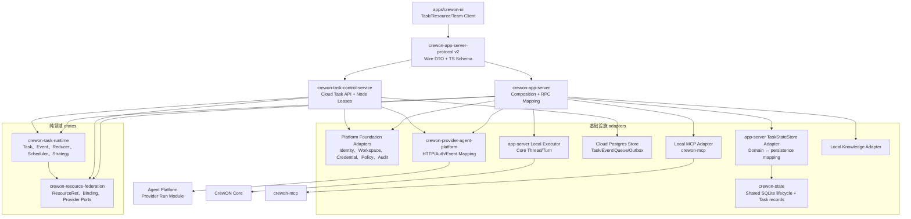
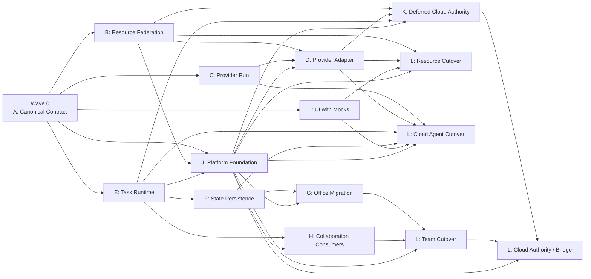

# CrewON 终态模块详细设计与并行开发拆解

更新时间：2026-07-22  
Wave 与 SDD 执行手册：<code>artifacts/crewon-platform-wave-sdd-execution-guide.md</code>  
状态：实施设计基线  
上位设计：`artifacts/crewon-terminal-architecture-design.md`  
安全基线：`artifacts/crewon-platform-security-correctness-baseline.md`  
适用仓库：`cuican-aide`、`agent-platform`

## 1. 目标

本文把完整 Agent 中台终态架构下沉为可实施、可分工、可独立测试的模块设计。Agent Team 是消费者之一，所有模块必须先遵守统一中台安全基线。

- 根据当前真实代码确定保留、包裹、抽取和替换边界。
- 固定 Rust crate、app-server、Agent Platform 和 CrewON UI 的职责与依赖方向。
- 固定跨模块数据、端口、事务、事件和迁移契约。
- 把工作拆成文件所有权清晰的并行 Workstream，减少多人同时修改中心文件。
- 给出合并波次、集成 Gate、测试矩阵和回滚边界。

本文不授权无验证的大爆炸重写，也不允许以“双写、临时 Facade、静默降级、重复数据库”换取短期进度。每个迁移切片必须形成完整纵向闭环：新权威可用、数据一次迁移、调用点切换、旧实现删除或冻结为只读导入器。现有 Thread/Turn、本地工具和 Office CAS 继续保持，但不成为永久兼容层。

## 2. 当前实现盘点

### 2.1 当前高耦合热点

| 区域                   | 当前真实入口                                                 | 现状                                                      | 终态处理                                                      |
| ---------------------- | ------------------------------------------------------------ | --------------------------------------------------------- | ------------------------------------------------------------- |
| app-server 总分发      | `codex-rs/app-server/src/message_processor.rs`，约 4740 行   | Agent Platform、Office、Knowledge、MCP 等请求集中分发     | 只保留组合和路由；新逻辑进入独立 Processor/Service            |
| 接入与身份             | `app-server-transport`、initialize/session state             | 已有 Origin/Auth/RPC Gate，但新领域身份语义尚未统一       | 复用传输安全；增加 server-derived Actor/Tenant/Space Context  |
| Workspace 与权限       | Thread/Turn processor、Config Permission Profile             | 路径、Node、运行时 roots 分散在多个入口                   | 建立服务端 Workspace Registry 和统一 Binding Resolver         |
| Credential             | Agent Platform token、MCP OAuth、Account auth                | 凭据生命周期和 UI/服务端边界不统一                        | 统一 CredentialRef，Desktop OS Store、Web Cloud Vault         |
| CrewON 领域存储        | `request_processors/crewon_domain_processor.rs`，约 2750 行  | Agent、Office、Automation、Tool 配置聚合在单文件          | API 路由留在 Processor，领域规则和存储一次迁入独立模块        |
| Office Run             | `crewon_domain_office_run.rs`，约 7850 行                    | Run、调度、重试、取消、验证、存储协调集中                 | 一次迁移为 Typed Office Aggregate + Office Strategy           |
| Office 自动调度        | `office_auto_dispatch.rs`，约 1000 行                        | 监听 Thread 终态并推进成员/验证/重规划                    | 迁移为 Office Strategy + Local Scheduler Adapter              |
| Agent Platform 调用    | `agent_platform_processor/*`                                 | app-server 内存 Run、连接级取消、本地 JSON 会话、远端 SSE | 旧路径冻结；Durable Provider Run 完成后原子切换并删除旧执行链 |
| 本地 MCP               | `crewon-mcp/src/connection_manager.rs`                       | 已有 stdio/HTTP、认证、连接和 Tool 调用能力               | 作为 LocalMcpExecutor，不重新实现连接管理                     |
| 本地知识               | `knowledge_processor.rs`                                     | 读取 Workspace 与 `.crewon` 文件，非向量检索              | 作为 LocalKnowledgeProvider 的第一版实现                      |
| UI AppServer Client    | `apps/crewon-ui/src/lib/app-server/appServer.ts`，约 3030 行 | 请求、通知和 Agent Platform Run Promise 集中              | 新增领域 Client，底层传输仍复用 AppServer                     |
| UI Agent Platform      | `agentPlatformClient.ts`，约 890 行                          | 浏览器直接登录、目录读取、资源调用                        | 新路径直接使用 server-owned connection；切换时删除直连        |
| UI 动态 PIM Tool       | `pimDynamicTools.ts`                                         | 前端生成 Tool Schema 并直接调用云 MCP/KB                  | 由 Resource Binding + app-server Tool Adapter 替代            |
| Agent Platform Runtime | `services/agent_runtime.py`，约 2770 行                      | 云 Agent Loop 与 Skill/MCP/KB/Workflow 调用集中           | 保留 Agent Loop，外包持久 Run 生命周期给 Provider Run 模块    |
| Agent Platform Catalog | `api/v1/crewon_catalog.py`，约 900 行                        | 目录、下载记录和远程调用混合                              | Catalog 只负责发现；执行迁到 Provider Run/Tool/Knowledge API  |

### 2.2 必须保留的现有能力

- CrewON Core Thread/Turn 是本地 Agent Loop 和本地私有会话权威。
- Office `recordId`、`recordRevision` CAS、服务端 member/runtime identity 必须保留。
- Office 成员私有 Thread、共享有界 Ledger、长期记忆检索三层上下文不变。
- `crewon-mcp` 继续拥有本地 MCP 连接和 Tool 调用，不在 Task Runtime 复制 MCP Client。
- Agent Platform Runtime 继续拥有云 Agent Loop，不在 CrewON 实现第二套云 Agent Loop。
- app-server v2 是新增客户端 API 的唯一版本；不向 v1 增加接口。
- UI 不成为 Task Reducer、权限决策者或资源执行器。

## 3. 模块拆分原则

1. 领域模块不依赖 UI、JSON-RPC、HTTP Client 或具体数据库。
2. Transport DTO 与领域类型分离，在 app-server 边界显式映射。
3. Provider 抽象不包含 Agent Platform 专属字段；专属字段放 Adapter 扩展 Metadata。
4. Task Runtime 不依赖 `crewon-core`；Local Executor Adapter 才依赖 Core Thread/Turn。
5. 不向 `crewon-core` 添加 Task、Office、Workflow 或 Provider 编排逻辑。
6. 动态 Provider 端口使用显式 `BoxFuture` 保持对象安全，不使用 `#[async_trait]`。
7. 静态 Store/Reducer 端口优先使用带 `Send` 的 RPITIT。
8. 每个新 Rust 模块目标少于 500 行；超过约 800 行必须继续拆分。
9. 中心文件只由集成 Workstream 修改，功能 Workstream 通过新文件提交。
10. 一个 Aggregate 在任一时刻只有一个可写权威；禁止双写和失败后跨权威回退。
11. 迁移代码只能单向、幂等、可审计，并带完成标记；迁移完成后不能继续写旧格式。
12. 不新增计划未来删除的 API、DTO、数据库或兼容外观；旧路径在新路径就绪前保持隔离，新代码不得依赖它。
13. Actor、Tenant、Space、memberId、Credential owner 和 Workspace Root 只能由服务端解析，不能信任 Client Params。
14. 普通本地单聊保留 Thread/Turn，但共享 Identity、Workspace、Resource、Context、Policy、Artifact 和 Audit。
15. 第一版 Strategy 使用封闭 enum 和 exhaustive match；没有第三方扩展需求时不建设动态 Registry 或 Strategy trait object。

## 4. 目标模块总体结构



### 4.1 依赖硬规则

```text
crewon-resource-federation  -> serde/schemars only, no reqwest/sqlx/core
crewon-task-runtime         -> resource-federation, no app-server/core/sqlx
crewon-provider-agent-platform -> resource-federation + reqwest, no task-runtime/core/sqlx
crewon-state                -> persistence records + sqlx, no task-runtime/provider
app-server TaskStateStore Adapter -> task-runtime + crewon-state
crewon-app-server           -> all adapters + core + app-server-protocol
crewon-task-control-service -> task-runtime + federation + provider adapters, never core
crewon-core                 -> must not depend on any task/provider crate
apps/crewon-ui              -> generated protocol types + app-server client only
```

`PlatformFoundation` 是 app-server 与 Cloud Control 都必须实现的组合层职责，不新增一个万能领域 crate。Local 与 Cloud 可共享纯类型和 Policy 规则，但分别从自己的认证 Session、Workspace Registry 和 Credential Store 构造请求上下文。

## 5. Rust crate 详细设计

### 5.1 `crewon-resource-federation`

建议路径：`codex-rs/resource-federation/`  
包名：`crewon-resource-federation`

职责：

- 定义 `ResourceProvider`、`ResourceRef`、`ResolvedResourceBinding`。
- 定义核心资源类型和命名空间扩展类型。
- 定义 Provider Capability、Manifest 和版本协商。
- 解析 Binding Mode、Execution Location、Revision 和 Scope。
- 生成跨语言 Provider Contract JSON Schema。

建议文件：

```text
src/lib.rs
src/model.rs
src/resource_kind.rs
src/capability.rs
src/manifest.rs
src/binding.rs
src/resolver.rs
src/provider_port.rs
src/schema.rs
tests/resolver_tests.rs
tests/schema_compat_tests.rs
```

核心端口：

```text
CatalogProvider: list_resources, read_manifest, resolve_revision, verify_access
BundleProvider: download_bundle
ToolProvider: list_tools, call_tool
KnowledgeProvider: search
```

不负责：

- HTTP、Token 刷新、数据库、UI 标签。
- Task 调度、Worker Retry、Office 状态。
- 本地 Skill 脚本执行。

### 5.2 `crewon-task-runtime`

建议路径：`codex-rs/task-runtime/`  
包名：`crewon-task-runtime`

职责：

- 定义 Task、Run、WorkerRun、Attempt、Approval、Artifact Ref。
- 定义命令、ExecutionEvent、状态转换、Reducer 和 Snapshot。
- 定义 Lease、Fencing、Idempotency、Retry 和 Reconciliation 规则。
- 定义 Single、Office、Workflow、Experts `ExecutionStrategy`。
- 定义 Store、Executor、Policy、Context、Clock、IdGenerator 端口。

建议文件：

```text
src/lib.rs
src/model/{mod,task,run,worker,approval,artifact}.rs
src/command.rs
src/event.rs
src/state_machine.rs
src/reducer.rs
src/kernel.rs
src/scheduler.rs
src/retry.rs
src/ports/{mod,store,executor,policy,context,clock}.rs
src/strategy/{mod,single,office,workflow,experts}.rs
tests/state_machine_tests.rs
tests/reducer_tests.rs
tests/kernel_integration_tests.rs
```

`TaskKernel` 只接收领域命令：

```text
start_task
cancel_task
retry_task
submit_message
claim_worker
append_worker_event
decide_approval
reconcile_provider_run
```

不负责：

- 创建 Core Thread、发 HTTP、读本地文件、解析 JSON-RPC。
- 直接读写 Office JSON。
- 持有 Agent Platform Secret。

### 5.3 `crewon-provider-agent-platform`

建议路径：`codex-rs/provider-agent-platform/`  
包名：`crewon-provider-agent-platform`

职责：

- 实现 Agent Platform Catalog/Agent/Tool/Knowledge/Workflow Provider Ports。
- 完成 Service Credential 和 User Delegation 发送。
- 进行 Provider Capability 协商和 Schema 版本检查。
- 把 Provider Wire Event 映射为 transport-neutral Provider Event；Task 事件映射由组合层完成。
- 对 429、Retry-After、超时和不确定状态进行分类，不拥有 Task 重试策略。
- 新执行链只接 Durable Provider Run；当前 one-shot API 不进入本 crate。

建议文件：

```text
src/lib.rs
src/client.rs
src/config.rs
src/auth.rs
src/catalog.rs
src/agent_run.rs
src/tool.rs
src/knowledge.rs
src/workflow.rs
src/event_mapper.rs
src/error.rs
tests/catalog_contract_tests.rs
tests/run_contract_tests.rs
tests/auth_tests.rs
```

现有 `request_processors/agent_platform_processor/*` 和本地 JSON Session 在切换前保持原样、禁止新增依赖。Provider Run、Adapter 和 Cloud Worker Executor 全部通过 Gate 后，UI 与 RPC 调用点一次切换到新链路，并在同一迁移单元删除旧执行 Processor、Run Promise 和 Session 写入；旧 rollout 只通过明确的只读导入工具恢复。

### 5.4 本地 Task 持久化

不新增 SQLite crate 或第二个数据库。`crewon-state` 已拥有 `state_5.sqlite` 的初始化、WAL、迁移、完整性检查、损坏恢复、备份与遥测；Task 持久化必须复用这一生命周期。

职责：

- `crewon-state` 定义数据库记录和原子 SQL 操作，不依赖 `crewon-task-runtime`。
- app-server `TaskStateStoreAdapter` 同时依赖领域 Port 与 `crewon-state`，负责 Domain ↔ Record 映射。
- Task Event、Snapshot、Lease、Inbox 和 Outbox 在同一个 `state_5.sqlite` 事务提交。
- Thread Rollout 与 Task Event 仍是不同事实源，但共享数据库恢复和备份边界。

建议文件：

```text
state/src/runtime/task_records.rs
state/src/runtime/task_store.rs
state/migrations/00xx_task_runtime.sql
state/src/runtime/task_store_tests.rs
app-server/src/task_control/task_state_store_adapter.rs
app-server/src/task_control/task_state_store_adapter_tests.rs
```

禁止向 `crewon-state` 暴露领域 Reducer、Strategy 或 Provider 类型；禁止为 Task 再复制数据库初始化、恢复或遥测代码。若未来确实需要拆库，应先抽取通用 SQLite lifecycle crate 并完成原子迁移，不能复制实现。

### 5.5 `crewon-task-control-service`

达到跨设备和 app-server 停止后继续运行的真实触发条件时，建议路径 `codex-rs/task-control-service/`、包名 `crewon-task-control-service`，在 P5 启用。此前只维护协议 fixture，不创建空 crate。它提供 Cloud Task API、Postgres Task/Event Store、Durable Queue、Node Registry/Heartbeat、Local Worker Lease、Provider Worker 调度和跨设备事件续读。

建议模块：`api`、`auth`、`kernel`、`store/postgres`、`queue`、`node_registry`、`lease_delivery`、`event_stream`、`outbox`、`recovery`。它复用 `crewon-task-runtime`，不依赖 CrewON Core、不访问本地 Workspace、不保存 Agent Platform 私有 Transcript；Cloud Gateway 只做会话鉴权和流式转发。

### 5.6 app-server 组合模块

建议新增：

```text
app-server/src/platform_control/mod.rs
app-server/src/platform_control/request_identity.rs
app-server/src/platform_control/workspace_registry.rs
app-server/src/platform_control/credential_store.rs
app-server/src/platform_control/provider_endpoint_policy.rs
app-server/src/platform_control/approval_digest.rs
app-server/src/platform_control/audit.rs
app-server/src/task_control/mod.rs
app-server/src/task_control/local_kernel.rs
app-server/src/task_control/local_executor.rs
app-server/src/task_control/context_adapter.rs
app-server/src/task_control/policy_adapter.rs
app-server/src/task_control/event_publisher.rs
app-server/src/task_control/provider_tool_router.rs
app-server/src/task_control/cloud_worker_executor.rs
app-server/src/task_control/task_state_store_adapter.rs
app-server/src/task_control/legacy_office_import.rs
app-server/src/request_processors/provider_processor.rs
app-server/src/request_processors/resource_processor.rs
app-server/src/request_processors/task_processor.rs
```

`request_identity` 从连接 Session 派生 Actor/Tenant/Space/memberId；Params 不接受权威身份。`workspace_registry` 只按 workspaceKey 解析 canonical Root/Node/Permission，拒绝客户端绝对路径。`provider_endpoint_policy` 复用现有 HTTPS 与无 URL Credential 规则，并补充私网、link-local、metadata、redirect 和 DNS rebinding 防护。

`message_processor.rs` 只新增 Processor 字段、构造和 match 转发。`provider_tool_router` 在 app-server 内处理由 Binding 生成的稳定 Provider Namespace，并直接向 Core 返回 `DynamicToolResponse`；未被服务端 Provider 声明的 Dynamic Tool 才可走通用客户端注册路径。切换 Provider MCP/KB 时必须同时删除 `pimDynamicTools.ts` 的执行代码，禁止维护两套路由。`cloud_worker_executor` 是 Provider Event 与 Task Event 的唯一映射点。

### 5.7 app-server protocol v2

建议新增：

```text
app-server-protocol/src/protocol/v2/identity.rs
app-server-protocol/src/protocol/v2/workspace.rs
app-server-protocol/src/protocol/v2/provider.rs
app-server-protocol/src/protocol/v2/resource.rs
app-server-protocol/src/protocol/v2/credential.rs
app-server-protocol/src/protocol/v2/task.rs
app-server-protocol/src/protocol/v2/approval.rs
app-server-protocol/src/protocol/v2/artifact.rs
app-server-protocol/src/protocol/v2/team.rs
app-server-protocol/src/protocol/v2/automation.rs
```

规则：

- Params/Response/Notification 遵循现有 v2 命名和 camelCase。
- Optional Params 字段使用 `#[ts(optional = nullable)]`。
- 列表统一 cursor/limit 与 data/nextCursor。
- 所有 ID 在 Wire 层使用 String，时间使用 Unix seconds。
- Wire DTO 不暴露数据库字段、Secret、内部 Lease Token 原文。
- 生成 TypeScript 和 Schema 后，UI 不再手写重复的 Agent Platform DTO。

## 6. Agent Platform Provider Run 模块

建议在 `agent-platform` 新增：

```text
backend/app/modules/provider_run/__init__.py
backend/app/modules/provider_run/models.py
backend/app/modules/provider_run/schemas.py
backend/app/modules/provider_run/auth.py
backend/app/modules/provider_run/repository.py
backend/app/modules/provider_run/service.py
backend/app/modules/provider_run/events.py
backend/app/modules/provider_run/executor.py
backend/app/modules/provider_run/api.py
backend/tests/provider_run/
```

### 6.1 数据表

| 表                         | 关键字段和约束                                                                                                                                   |
| -------------------------- | ------------------------------------------------------------------------------------------------------------------------------------------------ |
| `provider_runs`            | `id`、tenant/space/subject/credential/resource、status、idempotencyKey、conversationId、lastSequence；`(tenantId,spaceId,idempotencyKey)` unique |
| `provider_run_events`      | tenantId、spaceId、providerRunId、sequence、schemaVersion、type、payloadRef、occurredAt；`(providerRunId,sequence)` unique                       |
| `provider_run_tool_calls`  | toolCallId、runId、argumentsHash、status、approval、resultRef、expiresAt                                                                         |
| `provider_run_delegations` | jti、issuer、subject、space、resource、scope、expiresAt、decisionId；jti unique                                                                  |
| `provider_run_outbox`      | eventId、topic、payload、publishedAt、attempts                                                                                                   |

### 6.2 原子授权

`runs/start` 的同一事务必须完成：

1. 校验 CrewON Service Credential audience。
2. 校验 User Delegation 签名、jti、防重放和过期时间。
3. 校验 subject 对 Space 和 Agent/Workflow 的权限。
4. 校验资源已开放对应 Scope。
5. 按 idempotencyKey 查询或创建唯一 Provider Run。
6. 写 `run.started` 和 Outbox。

任何一步失败都不能创建 Run。

所有 read/events/cancel/tool-results/approvals 请求同样验证 Service Credential、tenant/space、subject、Credential owner、Run ownership 和所需 Scope；Provider Repository 的每个查询都显式携带 tenant/space 条件，不能只按 Run ID 查询。无权访问统一返回 not-found，避免资源枚举。

### 6.3 Provider API

```text
POST /api/v1/provider/runs
GET  /api/v1/provider/runs/{providerRunId}
GET  /api/v1/provider/runs/{providerRunId}/events?cursor=&limit=
POST /api/v1/provider/runs/{providerRunId}/cancel
POST /api/v1/provider/runs/{providerRunId}/tool-results
POST /api/v1/provider/runs/{providerRunId}/approvals
GET  /api/v1/provider/capabilities
```

`executor.py` 只能调用现有 `AgentRuntime`/Workflow Runtime，不拥有资源目录和 CrewON Task 状态。当前 `agent_open_api.py` 可以继续服务既有外部调用者，但 CrewON 新代码禁止引用；CrewON 切换到 Provider Run 后删除自身对该接口的会话、取消和 SSE 适配逻辑。

## 7. UI 模块拆解

建议新增：

```text
apps/crewon-ui/src/lib/provider/providerClient.ts
apps/crewon-ui/src/lib/resource/resourceClient.ts
apps/crewon-ui/src/lib/resource/resourceBinding.ts
apps/crewon-ui/src/lib/resource/resourcePresentation.ts
apps/crewon-ui/src/lib/task/taskClient.ts
apps/crewon-ui/src/lib/task/taskProjection.ts
apps/crewon-ui/src/lib/task/taskEventCursor.ts
apps/crewon-ui/src/lib/team/teamTaskAdapter.ts
```

职责：

- `providerClient`：通过 `provider/connect` 建立 server-owned connectionId 与 secret-free Provider projection；Task/Resource 请求不再反复携带 Token，也不在 UI 执行云资源。
- `resourceClient`：资源列表、详情、Binding 解析和 Snapshot 状态。
- `taskClient`：start/read/cancel/retry/events/approval。
- `taskProjection`：消费后端给出的 Projection，不自行重放领域状态机。
- `taskEventCursor`：检测 gap，触发 `task/read` 或 `task/listEvents` 补读。
- `teamTaskAdapter`：Office/Experts/Workflow UI 与统一 Task API 的映射。

切换限制：

- 新 UI 只依赖生成的 app-server v2 类型，不包装旧 AgentPlatformChat 为 Task。
- 新连接建立后，Credential 只由本地受控凭据存储或云端 Vault 保存；UI 只持有 connectionId 与状态。
- Provider Run、Task Cursor 和 Tool Router 的集成 Gate 全部通过后，一次切换并删除 UI 的 Agent Platform 执行、Token 持久化和 Run Promise。
- `pimDynamicTools.ts` 的 Provider MCP/KB 执行代码与服务端 Tool Router 在同一切换提交中删除/启用。
- `appServerEventHandlers.ts` 不再处理 PIM HTTP Tool 回调。
- `threadMessageActions.ts` 只选择 execution target 并调用 `taskClient`，不判断 Provider URL。
- `App.tsx` 只由集成 Workstream 修改，功能代码放入上述独立模块。

## 8. 核心领域数据

### 8.1 Task Contract

`TaskContract` 固定包含 `taskId`、`schemaVersion`、`authority`、`strategyKind`、创建者与时间、`inputRef`、输出 Schema、验收条件、可选 Workspace Binding、执行目标、Resource Bindings、Context/Permission/Retry Policy、Deadline、Budget、Retention 和 `contractHash`。

创建后不可原地修改；修改目标或 Authority 创建新 Task，并记录 `derivedFromTaskId`。

`WorkspaceBinding` 固定 `workspaceKey`、`scope=single|office`、`nodeId`、服务端 Root Ref 和权限快照。Client 只提交 workspaceKey；Workspace Registry 负责 canonicalize、symlink escape 检查、Node/Permission 绑定。单聊与 Office 即使指向同一路径也使用不同 Binding；Experts 使用 `single`，Workflow 按 Definition 明确选择。数据库按 `(workspaceKey, scope, aggregateId)` 隔离，模型上下文和云端 DTO 永远不注入原始 Root Ref。

### 8.2 Worker Request

`WorkerRequest` 固定包含 Task/Run/WorkerRun/Attempt ID、Lease Epoch、Fencing Token Ref、Idempotency Key、服务端 Actor、Worker Ref、Execution Location、指令、输出 Schema、Context Bundle、Bindings、Permission、Deadline、Trace 和 Call Chain。

### 8.3 Execution Event

```text
ExecutionEvent
  eventId, schemaVersion
  taskId, runId, aggregateId, aggregateVersion
  taskStreamOffset
  workerRunId?, attemptId?, producerSequence?
  leaseEpoch?, fencingTokenHash?
  type, payloadRef, causationId, correlationId
  occurredAt, receivedAt
```

事件正文超过上限或含敏感数据时只保存加密 Payload Ref。

Wire/API 统一使用 `revision`；领域 Event 和 Store 使用 `aggregateVersion`，边界 Adapter 负责映射。Office `recordRevision` 是 Office Aggregate 的 Wire revision，不与 Task aggregateVersion 共用。

### 8.4 Provider Capabilities

`ProviderCapabilities` 固定声明 Provider Protocol、Manifest/Event Schema 版本、Resource Kinds、Binding Modes，以及 Durable Run、续读、持久会话、取消、结构化输出、审批暂停和 Tool Bridge 能力。同步/SSE 临时调用不进入新 Task Capability，也不能被解析为 `WorkerExecutor`。

## 9. 本地 Task 持久化事务设计

建议表：

```text
tasks
runs
worker_runs
attempts
task_events
task_snapshots
resource_bindings
approvals
artifact_refs
inbox
outbox
```

关键事务：

### 9.1 接收命令

1. 按 `commandId` 去重。
2. 校验 aggregate expectedRevision。
3. 运行状态机并生成 Event。
4. 原子递增 `taskStreamOffset` 和 aggregateVersion。
5. 写 Event、Snapshot、Outbox 和 command receipt。

### 9.2 Claim Worker

1. 查询 eligible WorkerRun。
2. 原子递增 `leaseEpoch`。
3. 生成随机 fencing token，只保存 Hash。
4. 写 `worker.claimed` 事件和 Lease 截止时间。
5. 返回明文 token 给 Executor 一次。

### 9.3 接收 Worker Event

- 校验 attemptId、leaseEpoch、fencing token。
- 按 producerSequence 去重。
- 旧 Lease 事件写入审计 Inbox，但不更新 Snapshot。
- terminal event 与后续 Outbox 在同一事务提交。

### 9.4 Provider 不确定状态

- 超时后 Attempt 进入 `unknown`，Run 进入 `reconciling`。
- Scheduler 只排入 `readProviderRun`，不创建新 Attempt。
- Provider 明确 not-found 且 idempotency window 已结束后，策略才能决定新 Attempt。

## 10. Execution Strategy 模块

终态包含四种语义，但第一版使用 `StrategyKind` 封闭 enum 和 exhaustive match，不建立动态 Strategy Registry。普通本地单聊继续直接使用 Thread/Turn；表中的 Single 只表示需要持久恢复的 Durable Single Task，例如 Cloud Agent。

| Strategy | 输入                            | Next Action                | Completion                | UI Projection            |
| -------- | ------------------------------- | -------------------------- | ------------------------- | ------------------------ |
| Single   | 用户消息、主 Agent              | 一个主 WorkerRun           | 主 Worker terminal + 验收 | 单聊 Transcript          |
| Office   | 群聊消息、@成员、Leader Intent  | Leader/成员/验证 WorkerRun | Leader 收敛并通过验收     | 群聊、成员、任务、产物   |
| Workflow | 固定 Definition Revision 与输入 | 确定性 runnable NodeRun    | 所有终止节点满足 Gate     | DAG 节点和输出           |
| Experts  | 用户与 Leader 单聊              | 隐式专家 WorkerRun         | Leader 综合结果           | 只显示 Leader 和必要证据 |

### 10.1 Office 单权威迁移

Office 使用 `legacy → quiescing → importing → active` 单向状态机，禁止双写：

1. 先定义 Typed Office Aggregate、Office Event 和新 UI Projection，并用历史 fixture 做行为对等测试；所有旧写入入口先接入 migration fence。
2. 无活动 Run 的 Office 可以 lazy migrate；有活动 Run 时先进入 quiescing，阻止新 dispatch，并等待、取消或 reconcile Leader、成员和验证 Worker。
3. `legacy_office_import` 只读稳定旧 JSON，校验 `recordId/recordRevision`，在一个 `state_5.sqlite` 事务中写入 Office Aggregate、关联 Task、migration marker、旧数据 Hash 和 per-aggregate journal。
4. active 后只写新 Aggregate，旧写入必须 fail-closed。迁移失败从 journal 和旧归档前向修复，不能通过恢复整个 `state_5.sqlite` 回滚单个 Office。
5. 全量迁移验证完成后删除旧 scheduler JSON、旧 Run Reducer、旧写入和 importer；旧文件只作为受 Retention 约束的归档。

`recordId` 和 `recordRevision` 继续表示 Office Aggregate ID 与版本；Task 拥有独立 `taskId/aggregateVersion`，因为它是不同 Aggregate。`office/run` 在同一数据库事务中追加 `office.taskLinked` 并创建 Task，Office 不再复制 Attempt、Lease 或调度状态。

### 10.2 Workflow 与 Experts

- Workflow 从新模块开始，不复用 Office JSON 状态机，只复用 Task Kernel 和 WorkerExecutor。
- Experts 复用 Office 的 Leader/Member Worker 组合，但使用独立 Projection，不能通过隐藏 Office UI 实现。
- Strategy 之间只能共享领域 Port 和通用类型，不能互相调用内部 Reducer。

## 11. app-server v2 API 分组

### 11.1 Session 与 Workspace

```text
session/read
workspace/list
workspace/read
```

Session/Workspace 响应只返回服务端派生 Identity Scope、workspaceKey、scope、node 和可用状态，不返回 Secret 或本地 Root Path。

### 11.2 Provider 与 Resource

```text
provider/list
provider/connect
provider/disconnect
provider/readStatus
resource/list
resource/read
resource/resolveBinding
resource/importSnapshot
```

### 11.3 Task、Approval 与 Artifact

```text
task/start
task/read
task/cancel
task/retry
task/listEvents
approval/decide
artifact/list
artifact/read
```

### 11.4 通知

```text
task/event
task/updated
provider/updated
resource/updated
```

`provider/connect` 只消费已经由 server-side provisioning 生成的 Provider Access Grant。Agent Platform 首版的一次性 Auth Proof 在 principal-session exchange 中消费，`provider/connect` 客户端只提交 `providerId`，服务端从 verified principal + fresh identity mapping 解析唯一 active grant；真实云模型 Secret 始终由 Agent Platform 服务端解析，不进入 CrewON Vault。其他未来 Provider 若需要 OAuth/code，必须先通过各自的 bounded server-side proof exchange 生成 Secret-free grant。`task/read` 返回 Projection、aggregateRevision 和 lastStreamOffset；客户端发现 Cursor Gap 时停止应用增量并补读。

当前落地边界（2026-07-23）：Secret-free grant、durable Workspace/Provider Connection/Resource Binding State，principal-session provisioning，Grant + fresh mapping composite lifecycle resolver，live Catalog，deterministic secret-free projection，startup readiness，以及 experimental `provider/connect/read/resource list/read/bind/unbind` v2 schema/TestAppServer 已完成。bind 使用 session-owned Workspace proof + exact Provider Resource + Federation capability resolver；durable projection 不含 path、Secret 或客户端 authority，binding notification 只发给 initiating connection。UI、Dynamic Tool Router、Task consumer 和 Wave 2 中心 composition 仍未完成；不得把 W2-04 implementation Gate 扩大解释为 Cloud Agent 生产切换。

所有修改 Params 只接收 aggregateId、expectedRevision、commandId 和 purpose；Actor/Tenant/Space/memberId、Workspace Root、Credential owner 和最终 Strategy 由服务端解析。Wire `revision` 在 Adapter 内映射为领域 `aggregateVersion`。

`office/*` 作为正式领域 API 可以保留，但切换后必须直接读写新 Office Aggregate。`agentPlatform/chat*` 不包装为新 Task API；新 UI 直接调用 `task/*`，旧 UI 在切换提交中删除。任何公共 API 保留都必须基于稳定产品语义，而不是为了掩盖两套内部实现。

## 12. 上下文、安全和审批模块

### 12.1 Context Adapter

- 把 Task、Office Ledger、Worker Private State、Memory Retrieval、Resource Citation 转成注册过的 `ContextualUserFragment`。
- 每类 Fragment 单独声明 Token/Byte/Item 上限、trustLevel 和 sensitivity。
- Context Bundle 生成 Manifest、Hash、Sensitivity 和 Provenance。
- Provider Export 只能使用已批准 Fragment 或 Artifact，不能上传本地路径。
- Provider、Tool、Knowledge 和用户文件内容默认是 untrusted data，不能拼接为 system/developer 指令。

### 12.2 Policy Adapter

- 输入 Task Contract、服务端 Actor/Tenant/Space、Worker、Workspace、Resource Binding、Credential、Tool Intent 和 Purpose。
- 输出 allow、deny 或 approvalRequired，并生成 accessDecisionId。
- Provider 必须再次执行自己的资源权限判断。
- Approval 绑定 Tool/Resource revision、argumentsHash、workspaceKey、CredentialRef、executionLocation、actor、purpose、expiry 和 nonce 的 Action Digest；字段变化必须重新审批。

### 12.3 Tool Bridge

- P6 前保持关闭。
- Provider Run 进入 suspended 后才能请求本地 Tool。
- ToolCallId、argumentsHash、nonce 和 result submission 全部幂等。
- 写操作逐次审批；Shell 不进入默认 allowlist。

## 13. 迁移开关与权威切换

建议 Admission Flag：`provider_resource_api`、`provider_durable_run_admission`、`task_runtime_local_admission`、`office_migration_admission`、`task_runtime_cloud_authority_admission`、`secure_tool_bridge_admission`。

规则：

- Flag 只决定新命令是否进入新路径，不能在命令已接受或 Aggregate 已迁移后切换权威。
- 不双写、不 shadow write、不在错误后改走旧实现；失败保持真实失败并允许安全重试或恢复。
- 迁移前可关闭 Admission；迁移后只允许前向修复。单 Aggregate 使用 migration journal 和旧数据归档修复，不能恢复整个共享数据库或让旧代码覆盖新状态；全库备份只用于灾难恢复。
- Durable Provider Run 不存在或能力不匹配时 fail-closed，不能降级成 one-shot。
- 每个开关必须有删除版本；切换稳定后删除开关与旧分支，避免永久条件路径。

## 14. 并行 Workstream

| WS  | 工作内容                    | 独占文件/目录                                                                                | 前置输入              | 主要输出                                       |
| --- | --------------------------- | -------------------------------------------------------------------------------------------- | --------------------- | ---------------------------------------------- |
| A   | Protocol 与 Schema          | v2 `identity/workspace/provider/resource/credential/task/artifact/team` DTO、Schema fixtures | 安全基线              | Rust/TS DTO、错误与稳定 fixtures               |
| B   | Resource Federation         | `codex-rs/resource-federation/`                                                              | A                     | Resource/Binding/Capability 领域 crate         |
| C   | Agent Platform Provider Run | `agent-platform/backend/app/modules/provider_run/`、迁移和测试                               | A 的 Provider fixture | Durable Run、原子授权、事件存储                |
| D   | Agent Platform Adapter      | `codex-rs/provider-agent-platform/`                                                          | B、C、J               | Catalog/Tool/KB/Durable Run Adapter            |
| E   | Task Runtime                | `codex-rs/task-runtime/`                                                                     | A、B                  | Kernel、Reducer、Scheduler、Strategy           |
| F   | Local Task Persistence      | `codex-rs/state/{migrations,src/runtime}`、app-server Store Adapter                          | E Store Port          | 单库事务、恢复、Fencing、Inbox/Outbox          |
| G   | Office Aggregate Migration  | 新 Office Aggregate/Strategy/Importer；独占旧 Office 热点                                    | E、F、J               | Typed Aggregate、fence/quiesce、旧代码删除     |
| H   | Collaboration Consumers     | Workflow/Experts Strategy、Automation/Schedule Adapter                                       | E、J                  | Workflow、Experts、Automation 接入             |
| I   | UI Task/Resource 层         | `apps/crewon-ui/src/lib/{provider,resource,task,team}/`                                      | A、Mock fixtures      | 新 Client、Projection、Cursor                  |
| J   | Platform Foundation         | `app-server/src/platform_control/`、Context/Policy/Trace Adapter                             | A、B、E               | Identity、Workspace、Credential、Policy、Audit |
| K   | Deferred Cloud Authority    | 达到跨设备/后台执行触发条件后才创建 `task-control-service`                                   | B、D、E、真实负载证据 | Cloud API、Postgres、Queue、Node Lease         |
| L   | Composition 与切换          | `message_processor.rs`、`request_processors.rs`、`App.tsx`、workspace Cargo                  | 已通过 Gate 的模块    | 构造、路由、删除旧链、端到端验收               |

### 14.1 文件所有权规则

- 只有 WS-A 修改 `protocol/common.rs`、`v2/mod.rs` 和 Schema export。
- 只有 WS-L 修改中心分发、`App.tsx` 和 workspace `Cargo.toml`。
- 只有 WS-F 修改 `crewon-state` migrations；它不修改 Task Reducer。
- 只有 WS-G 修改 `crewon_domain_office_run.rs`、`office_auto_dispatch.rs` 和旧 Office 写入热点。
- WS-C 不修改 `AgentRuntime` 模型循环，只从 `executor.py` 调用稳定入口。
- WS-I 不修改旧 Agent Platform/Office 实现；切换删除由 WS-L 完成。
- WS-J 复用现有 Transport、Permission Profile、MCP Credential 和 Context 类型，不创建第二套认证、沙箱或 Context Manager。
- WS-K 在跨设备、app-server 停止后继续运行等需求未验证前只维护 Contract fixture，不创建空 crate、空表或部署脚手架。
- 公共契约变化必须回到 WS-A，禁止私自增加同义字段或临时 DTO。

## 15. 并行波次



### 15.1 Wave 0：冻结正确契约

- 固定 Identity/Tenant/Actor、Workspace、Credential、Resource、Event、Error、Retention、Capability、上限和 Authority 规则。
- 修复 Agent Platform 现有 Space API Key 与 Agent 资源未绑定的跨空间授权缺口。
- 固定 `crewon-state` Task records 与事务边界，但不实现业务 Reducer。
- 生成 Rust/TS/JSON Schema fixtures；后续模块只依赖 fixture。

### 15.2 Wave 1：独立实现

- J 先实现 server-derived Identity、Workspace Registry、CredentialRef、Provider Endpoint Policy、Approval Digest 和 Audit 基础。
- B 实现 Resource Federation；C 实现 Durable Provider Run；E 实现纯 Task Runtime。
- I 使用 Mock AppServer 完成 UI Client、Projection、Cursor Gap 与断线恢复。
- 旧执行链继续运行但被冻结；不加 Facade、不做双写、不让新模块调用旧路径。

### 15.3 Wave 2：基础设施与策略

- D 只对接 Durable Provider Run、Catalog、Tool 与 Knowledge；F 复用 `crewon-state` 完成 Store。
- G 完成带 quiescing/fence 的 Office importer、Typed Aggregate 和对等 fixture；H 在 Office 稳定后分别接入 Workflow、Experts、Automation/Schedule。
- K 只维护 Cloud Authority Contract fixture；未达到真实触发条件前不实现 Store、Queue 或 Node Registry。

### 15.4 Wave 3：按 Gate 原子切换

- L 先切 Resource/Credential/Provider Tool 路径，并删除 UI 执行型 PIM 直连。
- Durable Provider Run 与本地 Task Store 均通过恢复测试后，切 Cloud Agent 并删除旧 CrewON chat/session 适配。
- Office 逐 Aggregate 单向导入；导入完成的记录只走新 Runtime。全量完成后删除旧写入与导入器。
- 普通 Single 在不迁移 Thread/Turn 的前提下接入 J 的共享中台能力。
- Team Runtime 稳定且跨设备/后台执行需求验证后再实现 Cloud Authority；Tool Bridge 安全 Gate 通过后独立开放。

## 16. 合并和发布 Gate

### Gate A：契约与依赖

- app-server schema、生成 TS、Provider fixture 和 breaking-change review 通过。
- Actor/Tenant/Space 不出现在可伪造的 Client Params；所有 Repository Port 要求显式 Scope。
- Cargo 依赖图满足硬规则；`crewon-core` 无新增 Task/Provider 依赖。
- 没有临时 API、重复 DTO、第二个 SQLite lifecycle 或未设删除版本的开关。

### Gate B：Provider 与 Task

- Provider 创建 Run 时授权、幂等键、`run.started` 和 Outbox 原子提交。
- Provider read/events/cancel/tool-results/approval 全部验证 tenant/space/subject/Credential owner/Run ownership。
- Capability 不匹配 fail-closed；新链路没有 one-shot fallback。
- Reducer、Cursor、Lease/Fencing、Inbox/Outbox、unknown reconcile 和重启恢复通过集成测试。

### Gate C：权威切换

- 切换前无新链路写入；切换事务后无旧链路写入。
- UI、RPC 和后台任务均没有旧执行调用点；旧代码删除清单为空。
- Provider Tool Router 启用时，UI PIM 执行器同步删除。

### Gate D：Office

- 导入幂等、Hash 可审计，迁移标记阻止旧写入。
- 活动旧 Run 必须先 quiesce；迁移 fence 覆盖所有旧 dispatch 和状态写入。
- `recordId/revision` CAS、成员身份、私有 Thread、共享 Ledger 和部分失败语义对等。
- 重启、重复 dispatch、取消和旧 Lease 迟到均不能破坏新 Aggregate。

### Gate E：UI 与安全

- UI 不保存 Provider Secret，不直接调用 Agent/MCP/KB 执行 API。
- Workspace 只接受 workspaceKey；Actor/Member/Root Path 均由服务端解析。
- Cursor Gap 补读；用户可见变化有 snapshot；Web 与本地凭据实现分别验证。
- 跨 Space、过期 Delegation、重放 jti、越权资源、未批准 Context Export 全部拒绝。
- Provider Endpoint Policy 覆盖 HTTPS、私网/link-local/metadata、redirect、DNS rebinding 和响应上限。
- Approval Action Digest 防止 TOCTOU；重复 result 不能重复外部副作用或恢复 Provider Run。

## 17. 测试分层

| 层                  | 测试                                                                      |
| ------------------- | ------------------------------------------------------------------------- |
| 领域 crate          | 全对象 equality、状态机、Reducer、策略、属性与模型检查                    |
| `crewon-state`      | 单事务提交、并发 Claim、CAS、Fencing、恢复、迁移、备份恢复                |
| Store Adapter       | Domain/Record 往返、错误映射、事务不变量                                  |
| Provider Adapter    | Mock HTTP、Schema、429、超时、重复事件、unknown                           |
| Agent Platform      | pytest API/DB/授权/事件顺序/幂等/取消/暂停恢复                            |
| Platform Foundation | Actor/Tenant 派生、Workspace 逃逸、Credential 脱敏、SSRF、Approval Digest |
| app-server          | v2 RPC、通知、Dynamic Tool 路由、Authority admission、切换后无旧调用      |
| CrewON Core         | Local Executor 使用现有 core suite helper 做 Thread/Turn 集成测试         |
| UI                  | Vitest、组件 snapshot、Cursor Gap、断线重连、凭据不落 UI                  |
| 跨仓库              | Provider Contract fixture + 真实 Durable Provider Run smoke test          |

Agent 逻辑、Office Strategy 或上下文变化必须增加集成测试；不为静态常量或已删除逻辑添加测试。

## 18. 可立即执行的任务包

### P0-A Platform Contract

- 新增 identity/workspace/provider/resource/credential/task/artifact/team v2 DTO、错误分类和生成 Schema。
- 冻结 Actor/Tenant/Space、Authority、Event、Cursor、Idempotency、Binding、CredentialRef、Retention 和 Action Digest 语义。
- 写 dependency-boundary 与 Client Params 安全检查，禁止伪造 actor、root path、Credential owner 和最终 Strategy。

### P0-B Security Correction

- 修复 Agent Platform Space API Key 未绑定 Agent space/resource 的跨空间调用风险。
- Provider Contract fixture 覆盖 start/read/events/cancel/tool-results/approval 的同一授权矩阵。
- app-server 复用现有 Transport Auth，补 Workspace Registry、Provider Endpoint Policy 和 Credential 脱敏测试。

### P1-A Local Platform Foundation

- 实现 server-derived RequestIdentity、Workspace Registry、CredentialRef、Resource Binding、Context、Policy、Approval Digest、Artifact 和 Audit。
- 普通 Single 保留 Thread/Turn，但通过这些统一模块解析 Workspace、资源、权限和审计。
- UI 只使用生成 DTO，不保存 Secret、不提交权威路径或身份。

### P1-B Durable Task Foundation

- 建立 `crewon-task-runtime` 纯领域骨架、封闭 StrategyKind、Store Port 和 Fake Store。
- 在 `crewon-state` 增加 Task records/migration/原子操作；在 app-server 实现映射 Adapter。
- 第一批只实现 Durable Single 与 Office 所需状态，不产生第二个数据库或动态插件 Registry。

### P2 Provider Control

- 建立最小 `crewon-resource-federation`、Agent Catalog 和 server-owned Provider Connection。
- Agent Platform 实现原子授权、幂等 Run、事件续读、取消、Outbox 和恢复；Rust Adapter 只接新 API。
- Task/State/Provider/UI 过 Gate 后切 Durable Cloud Agent，并删除旧 CrewON chat/session/Run Promise。

### P3 First Consumers

- Office 使用 migration fence、quiescing 和单 Aggregate 导入接入 Task Kernel。
- 普通 Single、Durable Cloud Agent、Office 共享 Identity、Workspace、Resource、Context、Policy、Artifact 和 Audit。
- Office 稳定后再分别实现 Workflow、Experts 和 Automation/Schedule；Cloud Authority 与 Tool Bridge 暂不创建实现。

## 19. Definition of Done

一个模块只有满足以下条件才能交给下游并行开发：

1. Public API、身份/租户、错误、上限、Authority、Retention 与迁移删除条件有文档。
2. 不依赖中心文件未合并逻辑，也不依赖冻结的旧执行链。
3. 有 Mock/Fake/Fixture，消费者无需等待真实服务。
4. 有正常、重试、取消、越权、重复、不确定状态和恢复测试。
5. 事件和模型可见数据都有硬上限，Context Fragment 符合注册规则。
6. ID、Revision、Cursor、Idempotency Key、Trace 和迁移 Hash 可追踪。
7. 一个 Aggregate 只有一个可写权威；不存在双写、静默 fallback 或无期限开关。
8. 迁移提交同时包含旧调用点/旧写入删除，或明确证明该旧路径是独立产品能力。
9. 模块规模符合仓库限制，未向 `crewon-core` 增加新领域概念。
10. 未为无真实消费者的 Cloud Authority、Tool Bridge、多 Provider 或动态 Strategy 新增空实现。

本拆解冻结后从 Wave 0 开始；安全修复先于新执行流量，B、C、E、I、J 可在 Contract Fixture 稳定后按依赖并行，所有中心文件和生产切换统一由 WS-L 收口。
